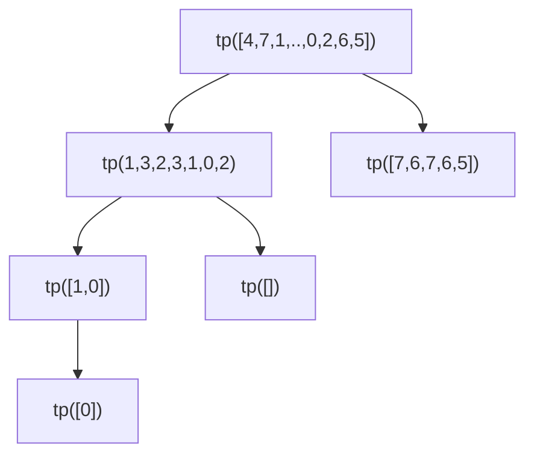

## Tri par sélection

- On trouve le minimum
- On l'échange avec l'élément à l'indice 0
- On refait la même chose
	- en démarrant la recherche à l'indice 1
	- En échangeant le `min` avec l'élément d'indice 1
- On refait ça jusqu'à l'avant dernier indice.


## Tri par insertion

- On crée une nouvelle liste
- On parcourt la liste de départ pour chaque $e$
	- On veut insérer $e$ dans la nouvelle liste « àl a bonne place »
### Insertion de $e$ dans la nouvelle liste

- On compare $e$ avec les éléments de la liste à partir de la fonction
- Si on rencontre un élément < $e$ , on insère
  
# Tri rapide / par pivot

- On choisit un pivot au hasard dans la liste
- On sépare en deux listes les éléments restants
	- la liste des éléments ≤ am pivot
	- la liste des éléments >
- on trie (récursivement) ces deux listes

# Tri par pivot

```python
def quicksort(arr):
    # Si le tableau a 1 élément ou moins, il est déjà trié
    if len(arr) <= 1:
        return arr
    
    # Choix du pivot (ici, le dernier élément)
    pivot = arr[0]
    # Partition : éléments plus petits à gauche, plus grands à droite
    gauche = [x for x in arr[:-1] if x <= pivot]
    droite = [x for x in arr[:-1] if x > pivot]
    
    # Récursion sur les sous-tableaux + inclusion du pivot
    return quicksort(gauche) + [pivot] + quicksort(droite)

# Exemple d'utilisation
tableau = [64, 34, 25, 12, 22, 11, 90]
tableau_trié = quicksort(tableau)
print(tableau_trié)  # Résultat : [11, 12, 22, 25, 34, 64, 90]
```


... et j'ajoute les appels sous les differentes cases

**Complexité**: $n\ln(n)$

|                   | TB       | TS       | TI       | TP            | TF  |
| ----------------- | -------- | -------- | -------- | ------------- | --- |
| Complexité min    | $O(n^2)$ | $O(n^2)$ | $O(n)$   | $O(n\log(n))$ |     |
| Complexité (pire) | $O(n^2)$ | $O(n^2)$ | $O(n^2)$ | $O(n^2)$      |     |
| Stabilité         | oui      | oui      | oui      | non           |     |

# Tri par fusion

**Algorithme** : 
- On sépare la liste à la moitié
- On trie chaque moitié (récursivement)
**Complexité**
- $O(n\log(n))$ dans le pire cas

# Listes récursives

## Exercice 2

```python
def tri_insertion(arr):
    for i in range(1, len(arr)):
        key = arr[i]
        j = i - 1
        while j >= 0 and key < arr[j]:
            arr[j + 1] = arr[j]
            j -= 1
        arr[j + 1] = key
	return arr

def insertion(e, lst):
	if est_vide(lst):
		return ajout_debut(e, liste_vide())
	elif e <= tete(lst):
		
```
