> [!info]
> Cours présenté par **N. Francis**
# 0 - Introduction

## 1. Panorama des bases de données

| Catégorie                           | Bases de données                                                                                                                     |
| :---------------------------------- | :----------------------------------------------------------------------------------------------------------------------------------- |
| **Bases de données relationnelles** | Oracle, Microsoft SQL Server, PostgreSQL, Teradata, MariaDB, MySQL, IBM DB2, Sybase, H2, Acess, Apache Derby, Hive, SQLite, HyperSQL |
| **XML**                             | MarkLogic, eXistdb, Tamino, BaseX                                                                                                    |
| **Objet**                           | GemStone, Objectivity/DB, Versant                                                                                                    |
| **Graphes de données**              | sones, InfiniteGraph, dex, Neo4j, OrientDB, RDF, AllegroGraph, HyperGraphDB                                                          |
| **Clef-valeur**                     | redis, memcached, Riak                                                                                                               |
| **Orientée colonne**                | Cassandra, Apache HBase, Hypertable, Amazon DynamoDB                                                                                 |
| **Orientée document**               | MongoDB, CouchDB, RavenDB                                                                                                            |

## 2. Les bases de données sont partout

- **Moteurs de recherche** - Google, Qwant, Bing
- **Réseaux sociaux** - Facebook, Twitter, WhatsApp
- **Audiovisuel** - Spotify, YouTube, Netflix, IMDb
- **Photo** - Picasa, Instagram, Flickr
- **Commerce** - Amazon, eBay
- **Voyage** - Expedia, Trip advisor, AirBnB
- **Encyclopédies** - Wikipéda, DBpedia
- **Données scientifiques** - GenBank

### 3. 60 secondes sur internet

* **Netflix**: 28 000 abonnés en ligne
* **Twitch**: 2 M de vues
* **Achats en ligne**: 1,36 M € dépensés en lignes
* **Tinder**: 2 M de Swipes
* **Emails**: 197,6 M de mails envoyés
* **YouTube**: 500 heures de contenu mises en ligne
* **TikTok**: 5 000 téléchargements
* **WhatsApp/Facebook Messenger**: 69 M de messages envoyés
* **LinkedIn**: 9 132 de connexions faites
* **Instagram**: 695 000 stories partagées

> [!info] Source
> Statista - https://fr.statista.com
> Ces chiffres sont des estimations pour l'année 2021 et peuvent varier.

# I. Vocabulaire lié aux DB

## 1. Définition - Base de donnée

> [!check]
> Collection d’informations structurées sur des entités et leurs relations
dans un contexte applicatif particulier

## 2. Enjeux principaux

* **Volume** : gestion d'une importante quantité de données
* **Performance** : rapidité du traitement des données (lecture, écriture)
* **Fiabilité** : cohérence et pertinence des données dans le temps
* **Sécurité** : protection contre la fuite de données, reprise sur panne
* **Partage** : données distribuées, gestion d'accès concurrents
* **Indépendance** : implémentation physique séparée du schéma logique

> [!tips]
> Les données que l'on manipule aujourd'hui sont colossales. Le catalogue d'Amazon contient des centaines de milliers d'articles. Si vous êtes capables en tant qu'ingénieur de faire gagner 50 ms sur le temps d'affichage des réponses, le chiffre d'affaire d'Amazon est augmenté de 2%. (énorme)

> **Question:** un fichier est-il une base de donnée?

Ce n'est pas une base de donnée.
- Limité en taille
- Peu performant
- Pas fiable
- Aucune concurrence
## 3. Systèmes de gestion de base de données (SGBD)

### 3.1 Définition

Un SGBD est un ensemble de logiciels permettant la création, l'utilisation et la maintenance de bases de données.

### 3.2 Fonctions d'un SGBD

- Représentation abstraite de la structure des données
- Description et vérification des contraintes sur les données
- Manipulation des données, recherche, lecture, écriture
- Réorganisation virtuelle (vue) des données.
- Gestion de la concurrence et reprise sur panne
- Organisation et gestion des données sur la mémoire physique.

## 4 Indépendance des données

Les SGBD permettent deux formes d'indépendance des données.

### 4.1 Indépendance physique des données

Les utilisateurs n'intéragissent pas directement avec les données au niveau physique:
- Utilisation simplifiée du système
- Organisation physique spécifique pour l'optimisation de requêtes
- **Isolation des changements physiques** :
	- la réorganisation physique des données est invisible aux programmes utilisant la base de données.
### 4.2 Indépendance logique des données

Les utilisateurs intéragissent avec une vue externe du schéma logique de la base de données:
- Adaptation du schéma logique pour un besoin spécifique
- Protection contre la fuite de données, accès réstreint aux données
- Isolation des changements conceptuels: la réorganisation logique des données est invisible aux programmes utilisant la base de données.

## 5 Différentes utilisations pour différents utilisateurs
### 5.1 Utilisateur

Accès aux données par des interfaces applicatives spécifiques ou des requêtes `ad hoc` (utilisateur expert).

### 5.2 Développeur

- Traduction des besoins de l'utilisateur en un schéma conceptuel
- Définition du schéma logique et des vues
- Conception et implémentation des applications utilisant la BD

### 5.3 Administrateur

- Gestion du schéma physique et des performances
- Organisation physique et chargement des données
- Gestion de la sécurité et de la fiabilité

## 6. Langages et interfaces des bases de données

- **Langages de conception**
	- Schéma entité-association
	- UML
		- Conception haut-niveau d'applications (données et traitement)
- **Langages de requêtes**
	- SQL, XQuery, SPARQL, Cypher...
	- Langages **déclaratifs** - spécifie le résultat attendu, mais pas la manière de l'obtenir
	- Puissance d'expression limitée, utilisation simplifiée
	- Définition de schémas, interrogation et mises à jour, administration
- **Langages de programmation**
	- PL / SQL, Java, PHP, Python
	- Langages **impératifs** avec une interface SQL
	- Programmation d'applications intéragissent avec LA BD

## 7. Étapes de développement

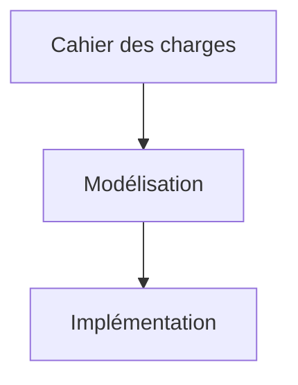

- **Cahier des charges**
	- Ce que doit contenir et gérer la base de données.
		- Besoin des utilisateurs
		- Fonctionnalités attendues
- **Modélisation**
	- Conception d'une base de données répondant aux besoins
		- Schéma entité-association
		- Schéma relationnel
- **Implémentation**
	- Organisation physique de la base de données
		- Optimisation
		- Indexation
		- Sécurisation
	- Développement d'applications interfaçant la base de données.

# II - Schéma entité-association

## 1. Modèle conceptuel de base de données (MCD)

- Définition de schémas conceptuels de bases de données
- Représentations graphique des trois constituants du schéma
	- Entités, attributs, associations entre entités

## 2. Objectifs

- Présentation visuelle de l'organisation de la base de données
- Détection d'erreurs de conception avant l'implémentation
- Traduction directe vers le modèle logique de données (MLD)

## 3. Exemple - Un premier schéma entité-association


## 4. Entités, attributs, identifiants

- **Types d'identités**
	- Définit la structure commune à un ensemble de "choses"
	- **Ex** - Personne, film, musée
- **Attributs** (ou **props**)
	- Caractéristiques dont les **valeurs** décrivent les entités
	- Les entités du même type ont les mêmes propriétés (pas nécessairement les mêmes valeurs)
	- **Ex** - Les films ont un titre, un numéro IMDb et une année de sortie.
- **Identifiants**
	- Propriétés dont la valeur désigne une entité de manière univoque
	- Les types d'entité **doivent obligatoirement** avoir un identifiant.
	- **Ex** - Le numéro IMDb d'un film peut servir d'identifiant.
		- Le titre non; plusieurs films s'intitulent "The Game".

## 5. Représentations des types d'entités

On accepte deux représentations suivantes:
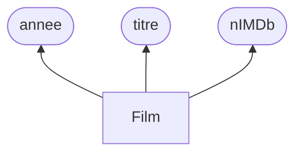

- Type d'entité dans un rectangle
- Attributs dans les ellipses
- Identifiant souligné.

| Film      |
| --------- |
| **nIMBb** |
| titre     |
| année     |
- Type d'entité en tête de la boîte
- Attributs listés en dessous
- Identifiant souligné.

## 6. Association, cardinalités

> [!check]
> **Objectif** - Représenter un "fait" concernant plusieurs "choses"

Le fait est décrit comme un lien (une **association**) entre plusieurs entités.
- **Ex** - $\ub{\text{La Joconde}}{\text{entité}} \ub{\text{est exposée depuis 1974 dans}}{\text{association}}\ub{\text{Le Louvre}}{\text{entité}}$
- **Le type d'association**
	- Définit la structure commune d'un ensemble d'associations similaires
	- Relie des types d'entités $E_1, ..., E_k$ de sorte que chaque association du type défini relie des entités $e_1 \in E_1, .., e_k \in E_k$
	- Peut posséder ses propres attributs
	- **Ex** - Le type "être exposé dans" relie `œuvre` et `musée` et a l'attribut `depuis`
- **Cardinalités**
	- Le type d'association **doit obligatoirement** indiquer pour **chaque** $E_i$ sa cardinalité : un couple $\min, \max$ avec $\min \in \{0,1\}$ et $\max\in\{1, n\}$
	- Indique le nombre de fois qu'une entité $e_i$ de type $E_i$ peut être liée par une association du type défini.
### 6.1 Association ternaire

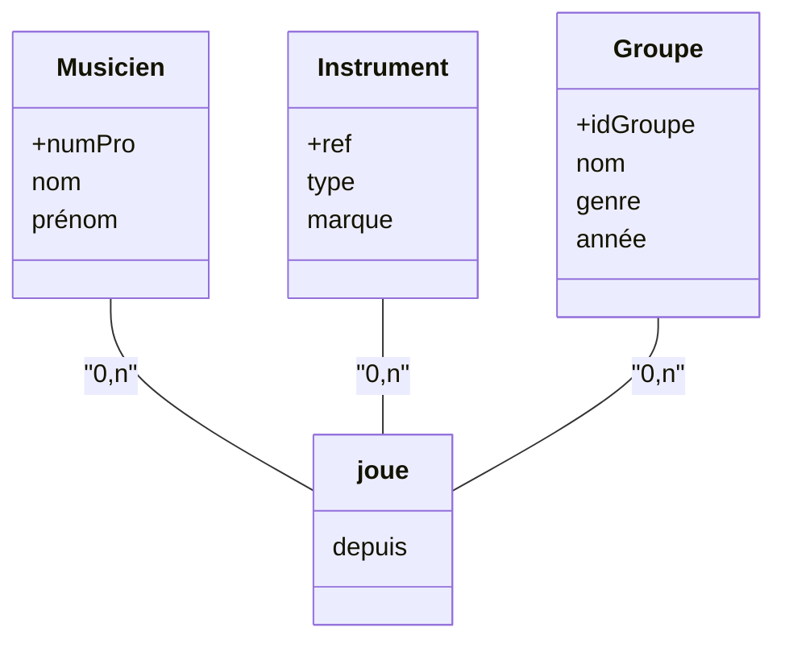

> [!tips]
> Quelque part, le "depuis" est une fonction qui créé l'association entre ces trois tableaux impliquant nécessairement une instance de chaque.

- Quelle est la signification de l'attribut porté `depuis` ?
	- Indique le début de l'association entre un musicien, un instrument et un groupe
- Que signifient les cardinalités:
	- Les cardinalités placées sur les relations (ici $0,n$ autour de `joue`) signifient:
		- **Musicien** - un musicien peut jouer $0$ ou plusieurs instruments dans $0$ ou plusieurs groupes.
		- **Instrument** - Instrument peut être joué par $0$ ou plusieurs musiciens dans $0$ ou plusieurs groupes
		- **Groupe** - Un groupe peut avoir $0$ ou plusieurs musiciens jouant $0$ ou plusieurs instruments.

### 6.1.1 Schéma alternatif
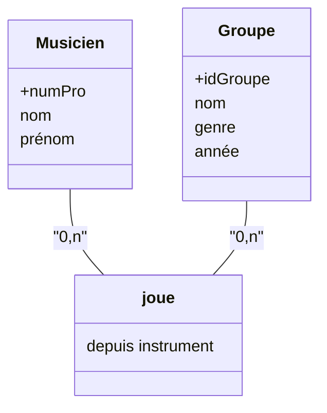

> Quelle est la différence principale entre ces deux schémas.

Ce schéma ne permet pas de jouer plusieurs instruments dans un même groupe, la relation 
étant binaire l'instrument est fixe.

### 6.1.2 Bi-relation

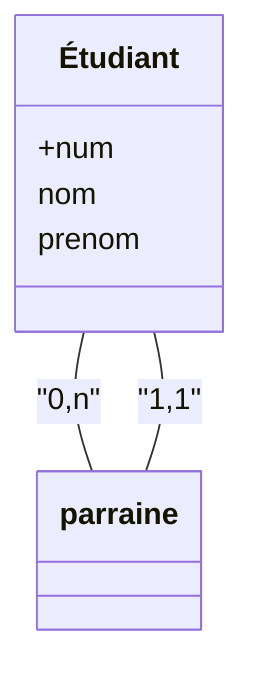

- Chaque étudiant peut ou non parrainer un ou plusieurs étudiants
- Chaque étudiant est parrainé par exactement un étudiant
- On peut préciser les rôles (parrain / filleul) le long des arrêtes.

## 7. Construire un schéma entité - association

1. Déterminer les entités et pour chacune
	- Établir la liste de ses attributs
	- Déterminer un attribut identifiant
2. Déterminer les associations entre entités et pour chacune:
	- Établir la liste des attributs propres à l'association
	- Vérifier la dimension de l'association (binaire, ternaire, n-aire?)
	- Définir les cardinalités de l'association
3. Vérifier le schéma obtenu, notamment:
	- Supprimer les transitivités et les redondances
	- Comparer aux cahiers des charges

## 8. Erreurs et horreur

- Erreur
	- Le correcteur doit connaître l'énoncé pour voir que c'est faux.
	- Perte de points
- Horreur
	- Syntaxe fausse, inutile de lire l'énoncé pour voir que c'est faux
	- Aucun sens dans aucun context

### 8.1 Exemples d'horreurs

- Entité sans identifiants ou avec deux identifiants
- Cardinalités manquantes ou valeurs interdites, par ex: (3,12)
- Entités connectées sans association
- Identifiant dans une association
- Association entre deux associations
- Autres...


### 8.2 Surestimer la dimension

> Les journalistes peuvent écrire des articles pour rapporter des événements. Un article peut a un seul auteur et peut concerner plusieurs événements.

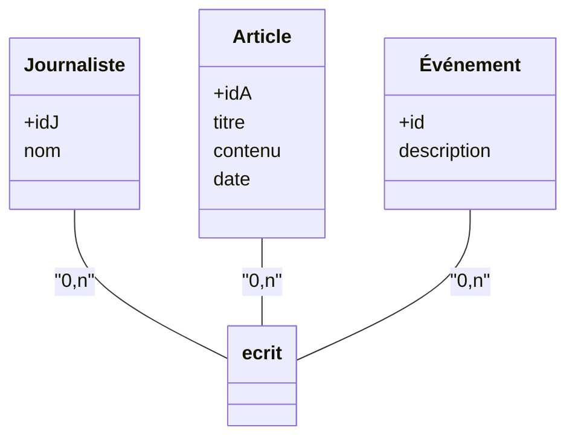
x

> Dans quelle scénario le premier schéma est-il la réponse attendue?

Dans le cahier des charges on dira: on veut connaître la répartition des tâches.

#### 8.2.1 Correction

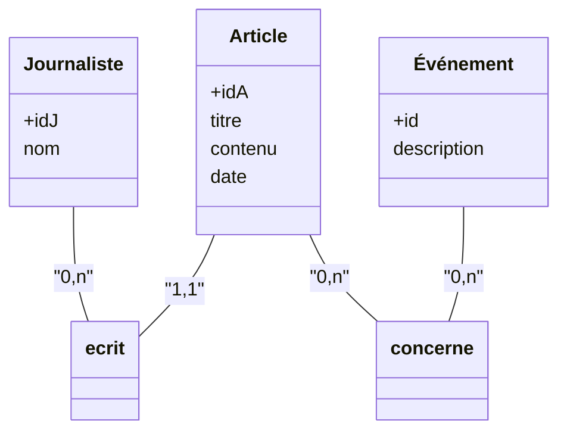

### 8.3 Erreur - Redondances et transitivités

> Les musées présentent des collections qui contiennent une ou plusieurs œuvres. Une collection appartient à un unique musée, et une œuvre fait toujours partie d'une unique collection.

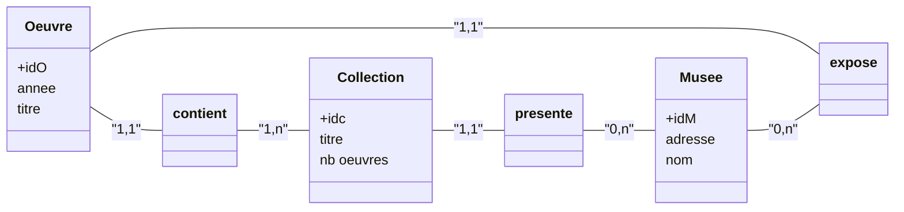

- L'attribut nombre d'œuvres est redondant car on a déjà une entité œuvres.
- Expose est redondant car œuvre appartient à une unique collection qui est présentée dans un unique musée (transitif)
- Ca prendrait sens si les musées peuvent se prêter des œuvres (comme la tapisserie de Bayeux).
- `nb oeuvres` prendrait sens dans le cas où l'on dénombre les tableaux présentés. 
	- On peut aussi s'en servir pour des œuvres mineures (sur lesquels on ne dispose pas d'informations) ou des œuvres anonymes (ne disposant pas de leur entité dans `Oeuvre`).

## 9. Bilan du modèle entité association

- Avantages
	- Uniquement trois concepts : entités, associations et attributs
	- Représentation graphique intuitive et rapide
	- Détection d'erreurs de conception
- Inconvénients
	- Pas de règle absolue pour déterminer ce qui est une entité, un attribut ou une association ; parfois sujet à interprétation de l'intention du client ou du cahier des charges
	- Absence de contraintes d'intégrité ou de structures complexes (On ne couvre pas tous les types de contraintes sur les données).

# III - Modèle relationnel

## 1. Définition

### 1.1 Modèle logique de données (MLD)

- Définition de schémas logiques de bases de données
- Basé sur les notions mathématiques d'ensemble et de relation

### 1.2 Objectifs

-  Fondement théoriques des systèmes de gestion de base de données relationnelle (SGBDR) - relational database management systems (RDBMS)
- description formelle de l'organisation structurelle de la base
- Spécification des opération sur les données (calcul relationnel)

## 2. Une première table

| idF | titre | année | nomDir | prénomDir | annéeNaissDir |
| :--- | :--- | :--- | :--- | :--- | :--- |
| 1 | Alien | 1979 | Scott | Ridley | 1943 |
| 2 | Reservoir Dogs | 1992 | Tarantino | Quentin | 1963 |
| 3 | The Thing | 1982 | Carpenter | John | 1948 |
| 4 | Volte-face | 1997 | Woo | John | 1946 |
| 5 | Pulp Fiction | 1995 | Tarantino | Quentin | 1963 |

> Quelles sont les informations structurelles de cette table?


> Relation sur quel domaine

- Relation sur entiers $\times$ entiers $\times$ chaines $\times$ entiers $\times$ chaines $\times$ chaines $\times$ chaines $\times$ entiers
- Attributs: iDF, titre ... anneeNaissDir
- Enregistrements
	- (1, Alien, 1979, Scott, Ridley,  1943)
	- ...
	- (5, Pulp Fiction, 1995, Tarantino, Quentin, 1963)

## 3. Domaines, relations

- **Domaine**
	- Ensemble de valeurs, intuitivement du même "type"
	- *exemple: les entiers, les éels, es mots de trois lettres... l'ensemble {bleu, rouge... noir}*
	- Le **produit cartésien** des domaines $D_1, D_2, ..., D_n$ noté $D_1 \times D_2 \times ... \times D_n$ est l'ensemble de toutes les combinaisons $(a_1, ..., a_n)$ où $a_1 \in D_1, a_2 \in D_2...$
	- **Ex** : si $D_1 = \{a,b,c\}$ et $D_2= \{1,2\}$ alors $D_1 \times D_2 = \{(a,1)(a,2)(b,1)(b,2), (c,1)(c,2)\}$
- **Relations**
	- Sous-ensemble du produit cartésien d'une liste de domaines
	- Représentée sous forme d'un tableau à double entrée
	- En colonne : les attributs identifiés par un nom
	- En ligne : les **enregistremens** (ou $n$-uplets)

> [!warn]
> **Attention**, les relations sont des ensembles pas de duplication ni d'ordre sur les enregistrements.

### 3.1 Deux relations et une clef étrangère

On reprend l'exemple $\fbox2$. Redondance + risque d'incohérence + impossibilité de gérer indépendamment réalisateur des films. Ainsi, on optera pour un schéma relationnel avec des clefs étrangères.

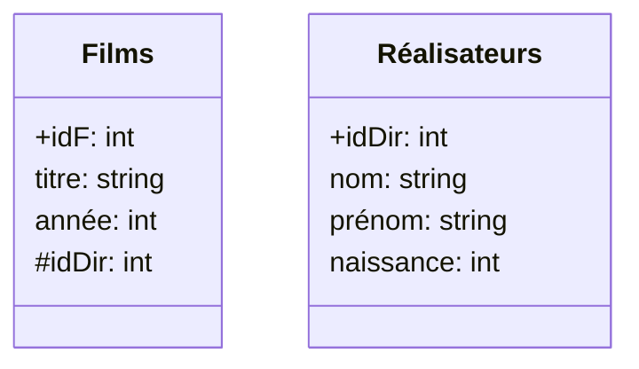

## 4. Schéma d'une relation (ou d'une DB)

- **Schéma d'une relation**
	- Donnée du nom de la relation, de ses attributs (avec leurs domaines) et de la clef primaire (soulignée)
	- **Ex** - `films(*idF, titre, année, idDir)`
- **Schéma d'une base de donnée**
	- Ensemble des schémas des relations de la base de donnée
	- Donnée des clfs primaires et étrangères de chaque relation.
	- **Ex**:
		- `films(*idF, titre, annee, idDir)`
		- `realisateurs(*idDir, nom, prenom, naissance)`
		- FK : `fils(idDir)` fait référence à `réalisateurs(idDir)`
	- On notera `#` pour les clefs étrangers mais il est nécessaire de préciser vers quoi cela pointe en toutes circonstances.

## 5. Traductions


### 5.1 Cardinalité $n$ vers $n$

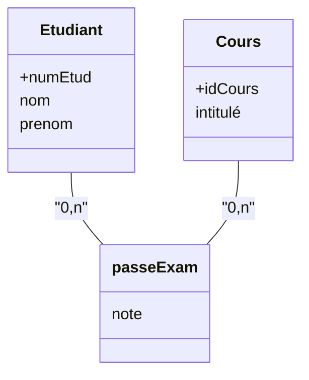

**Traduction**
- `etudiant(*numEtud, nom, prenom)`
- `cours(*idCours, intitulé)`
- `passeExamen(numEtud, idCours, note)`
- FK : `passeExamen(numEtud)` fait référence à `étudiant(numEtud)`
- FK : `passeExamen(idCours)` fait référence à `cours(idCours)`


### 5.2 Cas des arités ≥ 3

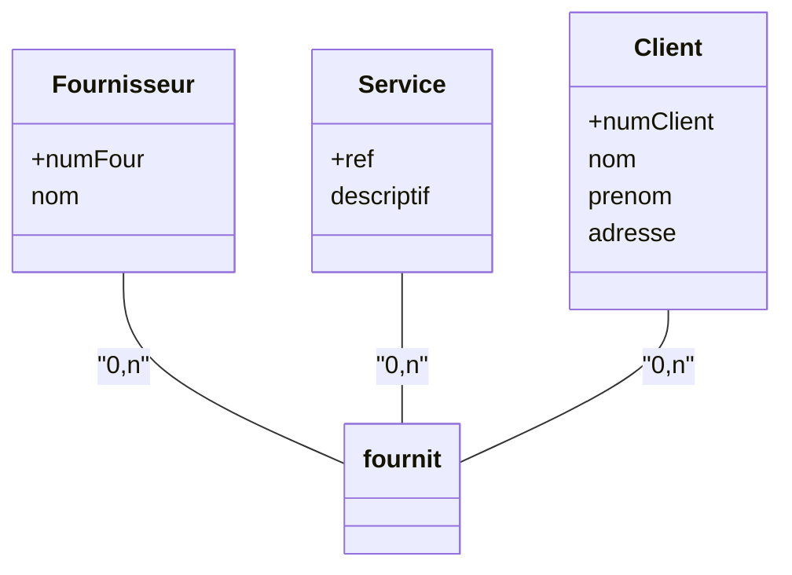

**Traduction**
- `fournisseur(*numFour, nom)`
- `client(*numClient, nom, prenom, adresse)`
- `service(*ref, descriptif)`
- `fournit(*[numFour, numClient, ref], prix)`
- FK : `numFour` `numClient` et `ref` de fournit font références à `fournisseur(numFour), client(numClient), service(ref)`

> [!info]
> Chaque enregistrement de fournit correspond à l'abonnement, à un prix donné, d'un client à un service d'un fournisseur

### 5.3 Exemple


> Traduire ce schéma

- `Groupe(*idGroupe)`
- `Professeur(*numProf, nom, prenom, idGroupe)`
- `enseigne(heures, *[professeur, idCours, groupe])`
- `passExamen(*[numEtud, idCours], note)`
- `requiert(note min, *[idCours])`


> [!warn]
> À compléter

# IV - Langage SQL

## 1. Définition

SQL - Structure Query Language : langage d'interrogation structuré.
- Langage **déclaratif** inspiré du modèle relationnel de Codd (1970)
- Langage normalisé mais les implémentations diffèrent légèrement
	- Oracle, MySQL, PostgreSQL, Acess...
- Permet de consulter, créer et mettre à jour une base de données
- Contient deux sous-langages
	- LDD - Langage de définition de données. 
		- Définition des structures relationnelles et de leurs contraintes
	- LMD : Langage de manipulation de données.
		- Interrogation des données, suppressions, mise à jour.

Ici, implémentation de référence est PostgreSQL.


# 2. Cheatsheet

## 2.1 `SELECT`

### 2.2 Conditions utiles

### 2.2.1 Égalité et différence

```sql
SELECT * FROM
-- egalite
WHERE prenom = 'John'
-- pas égal / différence
WHERE prenom <> 'John' -- outersection d'une antisymétrie = ø
```

- **Opérateurs de comparaison**
	- `=` égalité
	- `<>` inégalité
	- `<=` inférieur ou égal
	- `>=` supérieur ou égal
	- `>, <` supérieur, inférieur

### 2.2.2 `BETWEEN`

Compatible avec nombres, flottant et lettres. Exemple:

```sql
SELECT * FROM realisateur
WHERE nom BETWEEN 'C' and 'L';
```

### 2.2.3 Filtres de chaînes : `LIKE`


### 2.2.4 Appartenance, `IN`, `NOT`, `IN`


## 3. `NULL` : Valeurs manquantes

- `NULL` représente une valeur **manquante** ou inconnue.
- Sous PostgreSQL, les `NULL` sont représentés par des cases vides.
- Comparaisons et opérations avec `NULL` renvoient null
- `IS NULL` / `IS NOT NULL` servent à tester si une valeur est `NULL`
	- `(a = NULL)` et `(a <> NULL)` ne fonctionnent pas.

> [!warn]
> `NULL` n'est ni zéro, ni la chaine vide, ni un espace blanc... Comparable à `NaN` en JS d'où `NULL+1 = NULL`


## 4. `DISTINCT` : suppression des doublons

- `SELECT DISTINCT` empêche les doublons (selon la ligne entière) selon les arguments fournis.

```sql
SELECT DISTINCT prenom FROM realisateur;
```

## 5. Jointures

### 5.1 Le `WHERE` sans jointure

> Les usines qui fabriquent des bureaux

- `produit(*ref, libelle, couleur, prix)`
- `usine(*id, nom, adresse, ville)`
- `fabrique(*[id, ref], cout)`
- FK : `ref` and *fabrique* fait référence à `ref` dans *produit*
- FK : `id` dans *fabrique* fait référence à `id` dans usine

```sql
SELECT DISTINCT id FROM fabrique, produit
WHERE fabrique.ref = produit.ref AND libelle = 'bureau';
```

### 5.2 `NATURAL JOIN`

- Jointure avec égalité d'attributs de même nom
- Une seule occurrence de colonne conservée
- Forme la plus fréquente de jointure

```sql
SELECT DISTINCT id FROM fabrique
NATURAL JOIN produit 
WHERE libelle = 'bureau';
```

> [!check]
> Le tableau est fusionné à la restriction de similarité d'attributs communs des tables. On peut donc utiliser `WHERE` avec des attributs spécifiques à une table individuelle.

### 5.2.1 Un exemple d'erreur

> Les produits fabriqués à Paris ou à Lon

```sql
SELECT DISTINCT ref FROM produit
NATURAL JOIN usine
WHERE ville = 'Lyon' OR ville = 'Paris';
```

Ici on aura le produit cartésien indépendamment de si le produit est fait dans cette usine, on obtient donc toutes les combinaisons incluant une usine respectant les conditions, à fortiori tous les produits. 

L'erreur se corrige en vérifiant les relations entre usine et produit par ajout d'une double jointure avec `fabrique`.

```sql
SELECT DISTINCT ref
FROM produit
NATURAL JOIN fabrique
NATURAL JOIN usine
WHERE ville IN ('Lyon', 'Paris');
```

### 5.2.2 Un autre exemple d'erreurs

> Les libellés de produits qui existent à la fois en rouge et en bleu.

```sql
SELECT libelle FROM produit
WHERE couleur = 'rouge' AND couleur = 'bleu';
```

Cette écriture est comparable avec $\{n \in \N | n = 1 \text{ et }n=2\}$ donc $\varnothing$.
Ça se corrige comme suit:

```sql
SELECT DISTINCT p1.libelle
FROM produit p1
NATURAL JOIN produit p2
WHERE
	p1.libelle = p2.libelle 
	AND p1.couleur = 'rouge'
	AND p2.couleur = 'bleu';
```

> [!tips]
> Le `DISTINCT` est nécessaire autrement on obtient toutes les paires d'une même combinaison (dépendamment de l'ordre) donc, en l'occurence ici des doublons.
#### 5.2.3 Jointure externe

- La **jointure** (`tab1 JOIN tab2 ON condition`) ne contient pas les lignes de `tab1` qui n'ont pas de correspondance dans `tab2`.
- La **jointure externe** les met mais en complétant ces lignes avec `NULL`
	- `LEFT OUTER JOIN` conserve les lignes de `tab1`
	- `RIGHT OUTER JOIN` conserve les lignes de `tab2`
	- `FULL OUTER JOIN` - conserve les lignes entre les deux tables
- Le mot clef `OUTER` est implicite donc optionnel. Valeur historiques seulement.


### 5.4 Utilités

#### 5.4.1. `INSERSECT`

Très intuitif. On peut enchaîner des requêtes et obtenir l'intersection des deux requêtes respectives. 

```sql
SELECT libelle FROM produit WHERE couleur = 'rouge'
INTERSECT
SELECT libelle FROM produit WHERE couleur = 'bleu';
```

#### 5.4.2. `UNION ALL`

Plus coûteux mais permet d'avoir les doublons, si nécessaire.

```sql
SELECT * FROM panier1
UNION ALL
SELECT * FROM panier2
-- le contenu total des deux paniers
```

### 5.5 Tri et limite

- `DESC` pour décroissant
- `LIMIT` pour limiter selon les $n$-premiers résultats
- `OFFSET` ignore les $m$ premières lignes du résultat
	- Très utile pour faire de la pagination
	- Typiquement ce que fait Google avec ses résultats de recherche

```sql
SELECT * FROM
ORDER BY <attribut utilisé pour le tri> <croissant ? DESC : ''>
LIMIT <n premieres lignes>
```
## 6. Opérations ensemblistes

Pour combiner deux requêtes $Q_1$ et $Q_2$
- $Q_1$ UNION $Q_2$ $\iff$  $Q_1 \cup Q_2$ (requêtes renvoyées soit par 1 soit par 2)
- $Q_1$ INTERSECT $Q_2 \iff Q_1 \cap Q_2$  (requêtes envoyées à la fois par 1 et 2)
- $Q_1$ EXCEPT $Q_2 \iff Q_1 \Delta Q_2$

### 6.1 Remarques
- $Q_1$ et $Q_2$ doivent être compatibles
	- $Q_1$ et $Q_2$ doivent renvoyer autant de colonnes
	- les types des colonnes correspondantes doivent être compatibles
- Suppressions des doublons
	- Non seulement par soucis de logique
	- Mais aussi par soucis de complexité, des doublons impliquant une complexité de $o(n^2)$ contre $o(n\log(n))$
	- Il y a cependant `UNION ALL` pour s'y faire.

## 7. Types de données fréquents

- **Entiers**
	- Entiers signés (4 octets ) : `integer`, `int`, `int4`
	- Entier signé long (8 octets) : `bigint`, `int8`
	- Entiers auto-incrémenté : `serial`
- **Chaîne de caractères**
	- Chaîne de longueur $n$ fixée : `character(n), char(n)`
		- Par soucis de performance, utile car permet d'effectuer des optimisations de performance
	- Chaîne de longueur au plus $n$ : `character varying(n), varchar(n)`
	- Chaîne de longueur arbitraire : `text`
- **Nombres non-entiers**
	- Flottants simple précision (7 chiffres) : `real`
	- Flottant double précision (15 chiffres) : `float, double precision`
	- Décimaux en précision arbitraire : `numeric`, `decimal`
	- Décimaux sur $p$ chiffres, dont $s$ après la virgule : `numeric(p, s)`
- **Autres**
	- Booléens : `boolean`
	- Dates sans / avec l'heure : `date / timestamp [with timezone]`
	- Heures / intervalles de temps : `time [with time zone] / interval`
	- Données binaires brutes : `bytea`
		- « byte array »


Il y a des types plus spécifiques, comme des numéros de téléphone avec indicateurs du pays etc...
Pour voir plus https://postgresql.com/docs/

### 7.1 Exemple

- Numéro étudiant : `int` ou `serial`
- Numéro de téléphone
	- N'a pas de sens en tant qu'entier
	- Commence par 0 etc...
	- On utilise donc `char(10)` (du moins en France)
- Prénom
	- Quelle taille on peut réserver à un nom?
		- Utilisé dans un cadre applicatif particulier.
		- Si c'est une appli et le nom n'est que symbolique, on peut couper comme on veut
		- Autrement, pour la sécurité sociale il faut un nom complet
	- `varchar(~n)` 
	- avec un $n$ suffisant selon le contexte
- Température
	- `numeric(3,1)`
- Résumé d'un article de journal
	- `text`
- Code alphanumérique d'un produit
	- `varchar(~n)`
	- avec $n$ la taille des codes dans le catalogue.
- Un code postal
	- `char(5)`
- Une adresse
	- `varchar(~n)`
	- Taille raisonnable, `varchar(200)` par exemple
- Une date de naissance
	- `date`
- Une photo de profil
	- Le bon type de donné serait `bytea`
	- Or, on a pas envie de traîner des photos dans toutes nos tables c'est très inefficace.
	- On se contente de stocker un lien représenter un URL vers la photo
	- Le seule type de cas où ce serait utile serait 
		- pour un éventuel service de traitement d'image par exemple.


## 8. Modification de la base de données

Objectifs
- Création des tables, définition des contraintes structurelles
- Insertion de nouvelles données, suppression, mise à jour

### 8.1 Création de table

- Choix des **noms** des colonnes de leurs **types** et leurs **contraintes**
- Les contraintes s'appliquent soit sur une colonne spécifique soit sur l'ensemble de la table.
- On peut choisir des valeurs par défaut avec `default`
- On note ci-dessous tout ce qui est entre crochets comme étant optionnel.

```sql
CREATE TABLE nomTable (
	nomColonne1 typeColonne1 [default val1] [contraintesColonne1]
	...
	[CONSTRAINT nomContrainte1] definitionContrainte1
)
```

**Exemple**

```sql
CREATE TABLE produit (
	ref int PRIMARY KEY,
	libelle varchar(25) NOT NULL,
	poids int,
	poidsPaquet int,
	CONSTRAINT capacitePaquet CHECK (poids <= poidsPaquet)
);
```

Qui produira la table ci-dessous:

- produit

| ref | libelle | poids | poidsPaquet |
| --- | ------- | ----- | ----------- |
| ... | ...     | ..    | ..          |

On rappelle les types de la section précédente.

### 8.2 Contraintes

- `PRIMARY KEY`
	- Déclare une ou plusieurs colonnes comme **clef primaire** de la table.
	- `numEtud int PRIMARY KEY` 
- `FOREIGN KEY ... REFERENCES ...`
	- Déclare une colonne comme **clef étrangère** faisant référence à une autre colonne d'une autre table.
	- `FOREIGN KEY (numEtud) REFERENCES etudiant(numEtud)` 
	- La colonne référencée doit avoir une contrainte `UNIQUE`
- `UNIQUE`
	- Contrainte d'unicité des lignes (combinaison de colonne)
	- `nom varchar(25) UNIQUE`
	- `CONSTRAINT uniqueNomPrenom UNIQUE (nom, prenom)`
- `NOT NULL`
	- la colonne doit nécessairement être renseignée.
	- `libelle varchar(25) NOT NULL`
- `CHECK` (condition)
	- Les valeurs de la table doivent respecter une condition données.
	- `CONSTRAINT capacitePaquet CHECK (poids <= poidsPaquet)`

## 9. Lors de suppression / mise à jour


## 10. Modification de la structure d'une table existante

## 10.1 Ajouter une colonne

```sql
ALTER TABLE nomTable
ADD COLUMN nomCol typeCol;
```

### 10.2 Supprimer une colonne

```sql
ALTER TABLE nomTable
DROP COLUMN nomCol;
```

### 10.3 Renommer une colonne

```sql
ALTER TABLE nomTable
RENAME COLUMN nomCol TO nouvNom;
```

### 10.4 Changer le type d'une colonne

```sql
ALTER TABLE nomTABLE
ALTER COLUMN nomCol TYPE nouvType;
```

### 10.5 Ajouter une valeur par défaut

```sql
ALTER TABLE nomTable
ALTER COLUMN nomCol SET DEFAULT val;
```

### 10.6 Retirer une valeur par défaut

```sql
ALTER TABLE nomTable
ALER COLUMN nomCol DROP DEFAULT;
```


## 11 Insertion d'enregistrement

- Clause `INSERT` : ajoute une nouvelle ligne à une table existance
	- En renseignant dans l'ordre toutes les colonnes de la table:
		- `INSERT INTO nomTable VALUES (val1, val5, val2);`
	- En spécifiant les colonnes à remplir
		- `INSERT INTO nomTable(col1, col5, col2) VALUES (val1, val5, val2)`
		- Les autres colonnes sont alors remplies avec
			- une valeur automatique (cas `default` ou `serial`)
			- avec un `NULL` sinon.
- Clause `RETURNING` : spécifie les valeurs à renvoyer après insertion -  utilisé pricnipalement pour récupérer les valeurs automatiques.

```sql
INSERT INTO etudiant()
```

> [!warn]
> **Erreur grave** : on n'obtient pas un numéro étudiant avec un `SELECT` mais on le stocke à l'enregistrement autrement il sera perdu et confus avec d'autres élèves si plusieurs instances du même prénom existent.


## 12. Mise à jour des enregistrements

```sql
UPDATE nomTable SET noCol = valeur WHERE condition;
```

Modifie **toutes** les lignes satisfaisant la condition. Sans condition **toutes les lignes** sont modifiées.

Après modification, les lignes modifiées **doivent** satisfaire les contraintes du schéma.
- Si une ligne enfreint une contrainte, toutes les modifications sont annulées.


## 13. Suppression d'enregistrement

### 13.1 Tout supprimer

On n'utilisera pas:

```sql
DELETE from TABLE;
```


Mais plutôt:

```sql
TRUNCATE TABLE nomTable [CASCADE] [RESTRAT IDENTITY];
```

- **cascade** : agit sur les attributs interdépendants.
- **restart identity** : réinitialise `serial`

