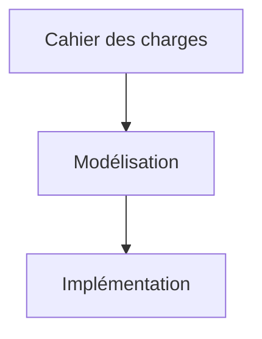
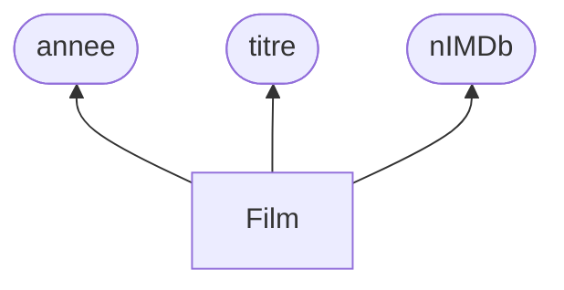
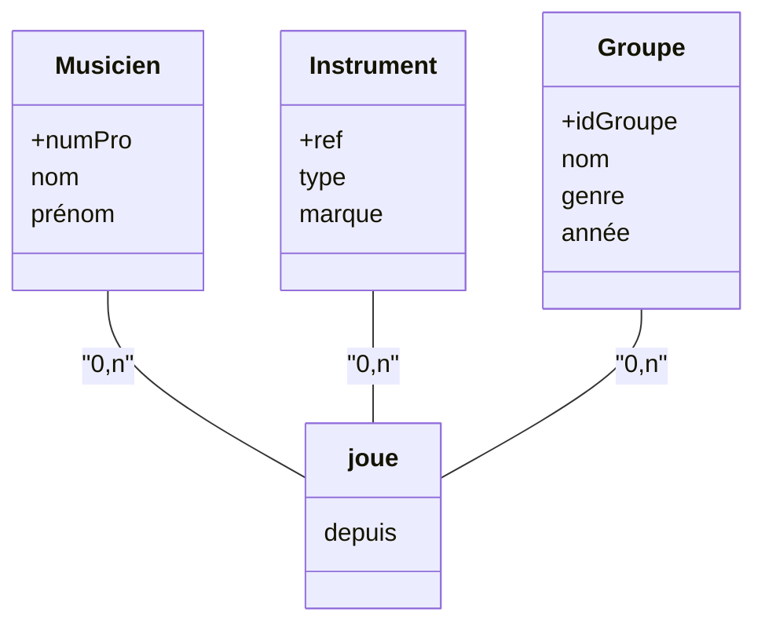
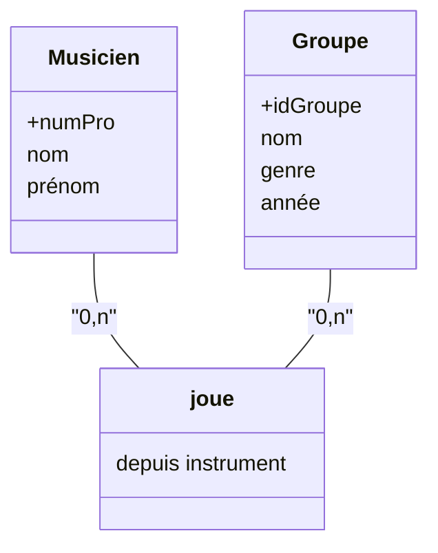
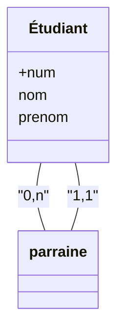

> [!info]
> Cours présenté par **N. Francis**
# 0 - Introduction

## 1. Panorama des bases de données

| Catégorie                           | Bases de données                                                                                                                     |
| :---------------------------------- | :----------------------------------------------------------------------------------------------------------------------------------- |
| **Bases de données relationnelles** | Oracle, Microsoft SQL Server, PostgreSQL, Teradata, MariaDB, MySQL, IBM DB2, Sybase, H2, Acess, Apache Derby, Hive, SQLite, HyperSQL |
| **XML**                             | MarkLogic, eXistdb, Tamino, BaseX                                                                                                    |
| **Objet**                           | GemStone, Objectivity/DB, Versant                                                                                                    |
| **Graphes de données**              | sones, InfiniteGraph, dex, Neo4j, OrientDB, RDF, AllegroGraph, HyperGraphDB                                                          |
| **Clef-valeur**                     | redis, memcached, Riak                                                                                                               |
| **Orientée colonne**                | Cassandra, Apache HBase, Hypertable, Amazon DynamoDB                                                                                 |
| **Orientée document**               | MongoDB, CouchDB, RavenDB                                                                                                            |

## 2. Les bases de données sont partout

- **Moteurs de recherche** - Google, Qwant, Bing
- **Réseaux sociaux** - Facebook, Twitter, WhatsApp
- **Audiovisuel** - Spotify, YouTube, Netflix, IMDb
- **Photo** - Picasa, Instagram, Flickr
- **Commerce** - Amazon, eBay
- **Voyage** - Expedia, Trip advisor, AirBnB
- **Encyclopédies** - Wikipéda, DBpedia
- **Données scientifiques** - GenBank

### 3. 60 secondes sur internet

* **Netflix**: 28 000 abonnés en ligne
* **Twitch**: 2 M de vues
* **Achats en ligne**: 1,36 M € dépensés en lignes
* **Tinder**: 2 M de Swipes
* **Emails**: 197,6 M de mails envoyés
* **YouTube**: 500 heures de contenu mises en ligne
* **TikTok**: 5 000 téléchargements
* **WhatsApp/Facebook Messenger**: 69 M de messages envoyés
* **LinkedIn**: 9 132 de connexions faites
* **Instagram**: 695 000 stories partagées

> [!info] Source
> Statista - https://fr.statista.com
> Ces chiffres sont des estimations pour l'année 2021 et peuvent varier.

# I. Vocabulaire lié aux DB

## 1. Définition - Base de donnée

> [!check]
> Collection d’informations structurées sur des entités et leurs relations
dans un contexte applicatif particulier

## 2. Enjeux principaux

* **Volume** : gestion d'une importante quantité de données
* **Performance** : rapidité du traitement des données (lecture, écriture)
* **Fiabilité** : cohérence et pertinence des données dans le temps
* **Sécurité** : protection contre la fuite de données, reprise sur panne
* **Partage** : données distribuées, gestion d'accès concurrents
* **Indépendance** : implémentation physique séparée du schéma logique

> [!tips]
> Les données que l'on manipule aujourd'hui sont colossales. Le catalogue d'Amazon contient des centaines de milliers d'articles. Si vous êtes capables en tant qu'ingénieur de faire gagner 50 ms sur le temps d'affichage des réponses, le chiffre d'affaire d'Amazon est augmenté de 2%. (énorme)

> **Question:** un fichier est-il une base de donnée?

Ce n'est pas une base de donnée.
- Limité en taille
- Peu performant
- Pas fiable
- Aucune concurrence
## 3. Systèmes de gestion de base de données (SGBD)

### 3.1 Définition

Un SGBD est un ensemble de logiciels permettant la création, l'utilisation et la maintenance de bases de données.

### 3.2 Fonctions d'un SGBD

- Représentation abstraite de la structure des données
- Description et vérification des contraintes sur les données
- Manipulation des données, recherche, lecture, écriture
- Réorganisation virtuelle (vue) des données.
- Gestion de la concurrence et reprise sur panne
- Organisation et gestion des données sur la mémoire physique.

## 4 Indépendance des données

Les SGBD permettent deux formes d'indépendance des données.

### 4.1 Indépendance physique des données

Les utilisateurs n'intéragissent pas directement avec les données au niveau physique:
- Utilisation simplifiée du système
- Organisation physique spécifique pour l'optimisation de requêtes
- **Isolation des changements physiques** :
	- la réorganisation physique des données est invisible aux programmes utilisant la base de données.
### 4.2 Indépendance logique des données

Les utilisateurs intéragissent avec une vue externe du schéma logique de la base de données:
- Adaptation du schéma logique pour un besoin spécifique
- Protection contre la fuite de données, accès réstreint aux données
- Isolation des changements conceptuels: la réorganisation logique des données est invisible aux programmes utilisant la base de données.

## 5 Différentes utilisations pour différents utilisateurs
### 5.1 Utilisateur

Accès aux données par des interfaces applicatives spécifiques ou des requêtes `ad hoc` (utilisateur expert).

### 5.2 Développeur

- Traduction des besoins de l'utilisateur en un schéma conceptuel
- Définition du schéma logique et des vues
- Conception et implémentation des applications utilisant la BD

### 5.3 Administrateur

- Gestion du schéma physique et des performances
- Organisation physique et chargement des données
- Gestion de la sécurité et de la fiabilité

## 6. Langages et interfaces des bases de données

- **Langages de conception**
	- Schéma entité-association
	- UML
		- Conception haut-niveau d'applications (données et traitement)
- **Langages de requêtes**
	- SQL, XQuery, SPARQL, Cypher...
	- Langages **déclaratifs** - spécifie le résultat attendu, mais pas la manière de l'obtenir
	- Puissance d'expression limitée, utilisation simplifiée
	- Définition de schémas, interrogation et mises à jour, administration
- **Langages de programmation**
	- PL / SQL, Java, PHP, Python
	- Langages **impératifs** avec une interface SQL
	- Programmation d'applications intéragissent avec LA BD

## 7. Étapes de développement

- **Cahier des charges**
	- Ce que doit contenir et gérer la base de données.
		- Besoin des utilisateurs
		- Fonctionnalités attendues
- **Modélisation**
	- Conception d'une base de données répondant aux besoins
		- Schéma entité-association
		- Schéma relationnel
- **Implémentation**
	- Organisation physique de la base de données
		- Optimisation
		- Indexation
		- Sécurisation
	- Développement d'applications interfaçant la base de données.

# I - Schéma entité-association

## 1. Modèle conceptuel de base de données (MCD)

- Définition de schémas conceptuels de bases de données
- Représentations graphique des trois constituants du schéma
	- Entités, attributs, associations entre entités

## 2. Objectifs

- Présentation visuelle de l'organisation de la base de données
- Détection d'erreurs de conception avant l'implémentation
- Traduction directe vers le modèle logique de données (MLD)

## 3. Exemple - Un premier schéma entité-association

## 4. Entités, attributs, identifiants

- **Types d'identités**
	- Définit la structure commune à un ensemble de "choses"
	- **Ex** - Personne, film, musée
- **Attributs** (ou **props**)
	- Caractéristiques dont les **valeurs** décrivent les entités
	- Les entités du même type ont les mêmes propriétés (pas nécessairement les mêmes valeurs)
	- **Ex** - Les films ont un titre, un numéro IMDb et une année de sortie.
- **Identifiants**
	- Propriétés dont la valeur désigne une entité de manière univoque
	- Les types d'entité **doivent obligatoirement** avoir un identifiant.
	- **Ex** - Le numéro IMDb d'un film peut servir d'identifiant.
		- Le titre non; plusieurs films s'intitulent "The Game".

## 5. Représentations des types d'entités

On accepte deux représentations suivantes:

- Type d'entité dans un rectangle
- Attributs dans les ellipses
- Identifiant souligné.

| Film      |
| --------- |
| **nIMBb** |
| titre     |
| année     |
- Type d'entité en tête de la boîte
- Attributs listés en dessous
- Identifiant souligné.

## 6. Association, cardinalités

> [!check]
> **Objectif** - Représenter un "fait" concernant plusieurs "choses"

Le fait est décrit comme un lien (une **association**) entre plusieurs entités.
- **Ex** - $\ub{\text{La Joconde}}{\text{entité}} \ub{\text{est exposée depuis 1974 dans}}{\text{association}}\ub{\text{Le Louvre}}{\text{entité}}$
- **Le type d'association**
	- Définit la structure commune d'un ensemble d'associations similaires
	- Relie des types d'entités $E_1, ..., E_k$ de sorte que chaque association du type défini relie des entités $e_1 \in E_1, .., e_k \in E_k$
	- Peut posséder ses propres attributs
	- **Ex** - Le type "être exposé dans" relie `œuvre` et `musée` et a l'attribut `depuis`
- **Cardinalités**
	- Le type d'association **doit obligatoirement** indiquer pour **chaque** $E_i$ sa cardinalité : un couple $\min, \max$ avec $\min \in \{0,1\}$ et $\max\in\{1, n\}$
	- Indique le nombre de fois qu'une entité $e_i$ de type $E_i$ peut être liée par une association du type défini.
### 6.1 Association ternaire

> [!tips]
> Quelque part, le "depuis" est une fonction qui créé l'association entre ces trois tableaux impliquant nécessairement une instance de chaque.

- Quelle est la signification de l'attribut porté `depuis` ?
	- Indique le début de l'association entre un musicien, un instrument et un groupe
- Que signifient les cardinalités:
	- Les cardinalités placées sur les relations (ici $0,n$ autour de `joue`) signifient:
		- **Musicien** - un musicien peut jouer $0$ ou plusieurs instruments dans $0$ ou plusieurs groupes.
		- **Instrument** - Instrument peut être joué par $0$ ou plusieurs musiciens dans $0$ ou plusieurs groupes
		- **Groupe** - Un groupe peut avoir $0$ ou plusieurs musiciens jouant $0$ ou plusieurs instruments.

### 6.1.1 Schéma alternatif

> Quelle est la différence principale entre ces deux schémas.

Ce schéma ne permet pas de jouer plusieurs instruments dans un même groupe, la relation 
étant binaire l'instrument est fixe.

### 6.1.2 Bi-relation

- Chaque étudiant peut ou non parrainer un ou plusieurs étudiants
- Chaque étudiant est parrainé par exactement un étudiant
- On peut préciser les rôles (parrain / filleul) le long des arrêtes.

## 7. Construire un schéma entité - association

1. Déterminer les entités et pour chacune
	- Établir la liste de ses attributs
	- Déterminer un attribut identifiant
2. Déterminer les associations entre entités et pour chacune:
	- Établir la liste des attributs propres à l'association
	- Vérifier la dimension de l'association (binaire, ternaire, n-aire?)
	- Définir les cardinalités de l'association
3. Vérifier le schéma obtenu, notamment:
	- Supprimer les transitivités et les redondances
	- Comparer aux cahiers des charges

## 8. Erreurs et horreur

- Erreur
	- Le correcteur doit connaître l'énoncé pour voir que c'est faux.
	- Perte de points
- Horreur
	- Syntaxe fausse, inutile de lire l'énoncé pour voir que c'est faux
	- Aucun sens dans aucun context

### 8.1 Exemples d'horreurs

- Entité sans identifiants ou avec deux identifiants
- Cardinalités manquantes ou valeurs interdites, par ex: (3,12)
- Entités connectées sans association
- Identifiant dans une association
- Association entre deux associations
- Autres...

