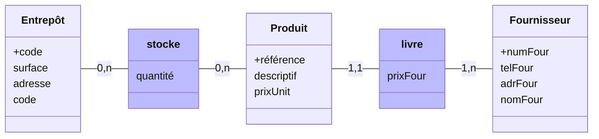
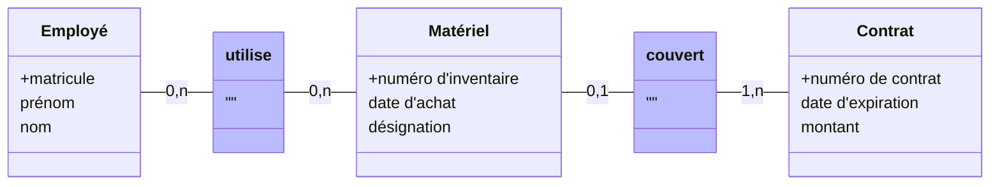

> Schéma entité-association

> [!info]
> Enseignant: **M.Boussidan Aaron** (aaron.boussidan@univ-eiffel.fr)

# Exercice 1 - Lecture du schéma

> On considère le schéma entité-association ci-dessous
> 
> 1 -  Identifiez les différents constituants du schéma : entités, associations, attributs.
> 2 -  Le schéma donné permet-il les situations suivantes ?
> - a) Un comédien joue plusieurs personnages dans la même représentation
> - b) Deux comédiens jouent le même personnage dans la même représentation
> - c) Un comédien n'appartient à aucune troupe
> - d) Un comédien appartient à plusieurs troupes
> - e) Un personnage intervient dans plusieurs pièces.
> - f) Un comédien change de personnage entre deux représentations d'une pièce.
> - g) Plusieurs troupes jouent la même pièce.
> - h) Deux représentations ont lieu au même endroit le même jour.
> - i) Deux pièces ont le même titre.
> - j) Une représentation est donnée alors qu'un rôle de la pièce n'est pas pourvu.
> 3 -  Comment de plus modifier le schéma  pour permettre à un même personnage d'intervenir dans plusieurs pièces?
> 4 - Comment de plus modifier le schéma pour représenter les informations suivantes:
> - a) La date à laquelle un comédien a rejoint une troupe.
> - b) Le nombre de scènes de chaque pièce dans lesquelles un personnage intervient.
> - c) Le ourant littéraire de chaque pièce.
> - d) Les informations (périodes, style, chef de file) de chaque courant littéraire.
> 5 - Quelles contraintes naturelles ne sont pas assurées par le schéma ainsi construit?

## Question 1

> Identifiez les différents constituants du schéma : entités, associations, attributs.

- **Rectangles** - associations
- **Rond** - Associations
- **Soulignés** - Identifiants (clés primaire), 
	- toujours en premier dans la liste des attributs.
	- Identifie de façon unique chaque élément de la DB.

## Question 2

 > Le schéma donné permet-il les situations suivantes ?

### Sous-question a

> a) Un comédien joue plusieurs personnages dans la même représentation

Oui car c'est une association ternaire. 

### Sous-question b

> b) Deux comédiens jouent le même personnage dans la même représentation

Idem.

### Sous-question c

> c) Un comédien n'appartient à aucune troupe

Oui, la cardinalité le permet $0,n$.
### Sous-question d

> d) Un comédien appartient à plusieurs troupes

Oui car la cardinalité de `appartient` est $0,n$.

### Sous-question e

> e) Un personnage intervient dans plusieurs pièces.

Faux, la cardinalité de `personnage` - `invervient` est de $1,1$, signifiant l'unicité de l'intervention par personnage.

### Sous-question f

> f) Un comédien change de personnage entre deux représentations d'une pièce.

Oui car ternaire. 

### Sous-question g

> g) Plusieurs troupes jouent la même pièce.

oui

### Sous-question h

> h) Deux représentations ont lieu au même endroit le même jour.

Oui car ces attribuants ne sont pas des identifiants.

### Sous-question i

> i) Deux pièces ont le même titre.

Non car **titre** est un identifiant unique de la pièce.

### Sous-question j

>  j) Une représentation est donnée alors qu'un rôle de la pièce n'est pas pourvu.

## Question 3

> Comment de plus modifier le schéma  pour permettre à un même personnage d'intervenir dans plusieurs pièces?

On change la cardinalité à $1,n$, pas à $0,n$ car il faut au moins qu'un personnage intervienne dans une pièce autrement cela irait à l'encontre de sa condition de personnage.

### Question 4

> 4 - Comment de plus modifier le schéma pour représenter les informations suivantes:

### Sous-question a
> - a) La date à laquelle un comédien a rejoint une troupe.

`appartient` ne serait plus une relation binaire mais gagnerait un attribut `depuis` (en d'autres termes, une pondération de l'association décrivant une date - avec `time()`).
### Sous-question b
> - b) Le nombre de scènes de chaque pièce dans lesquelles un personnage intervient.

On ajoute `nb_de_scene` dans `intervient`
### Sous-question c
> - c) Le courant littéraire de chaque pièce.

Pour le courant littéraire, on peut ajouter un attribut dans `pièce`. 
### Sous-question d
> - d) Les informations (périodes, style, chef de file) de chaque courant littéraire.

On ajoute une association `s'inscrit` et une identité courant littéraire telle que:
- **Courant littéraire**(+nom, chef de file, période, style)
- On retire donc l'attribut pièce (pas de clé étrangère pour le moment)

## Question 5

> Quelles contraintes naturelles ne sont pas assurées par le schéma ainsi construit?

- Comédien peut jouer plusieurs pièces non-temporellement distinctes les dates n'étant pas un identifiant unique.
- Une troupe peut donner deux représentations non-temporellement distinctes
- Un personnage peut intervenir dans une pièce mais aucun comédien ne joue ce personnage dans la représentation

# Exercice 2

## Question 1

> Placez les attributs suivants dans le schéma ci-dessus. L'identifiant de chaque entité doit être souligné et placé en 1er.
> - **nomFour** : le nom du fournisseur
> - **adrFour** : l'adresse du fournisseur
> - **telFour** : le numéro de téléphone du fournisseur
> - **numFour** : le numéro du fournisseur
> - **descriptif** : le descriptif d'un produit
> - **référence** : la référence d'un produit
> - **prixUnit** : le prix unitaire d'un produit
> - **surface** : la surface de stockage d'un entrepôt
> - **code** : le code d'un entrepôt
> - **adresse** : l'adresse d'un entrepôt
> - **quantité** : le nombre d'exemplaires d'un produit disponible dans un entrepôt
> - **prixFour** : le prix auquel un produit est acheté au fournisseur

## Question 2

> Donner un exemple de valeur possible de quelques-uns des attributs du schéma.

> [!tips]
> L'objectif étant de comprendre qu'il y a typage des valeurs stockées.

## Question 3

> Ajoutez les cardinalités minimales et maximales entre chaque entité et association du schéma.
> - **Un produit** est livré par **un fournisseur et un seul**.
> - **Un fournisseur** livre **un ou plusieurs produits**.
> - **Un produit** peut être stocké dans des **entrepôts différents**.
> - **Un entrepôt** sert à stocker **plusieurs produits**.

> [!check]
> Ajoutées sur le schéma

# Exercice 3

> Une entreprise souhaite mettre en place une base de données pour gérer le matériel informatique (ordinateurs, imprimantes, ...) utilisé par ses employés. 
> Ce matériel peut être couvert par un contrat de maintenance. Un contrat peut concerner plusieurs matériels informatiques à la fois. 
> On connaît le matricule, le prénom et le nom des employés, le numéro d'inventaire, la désignation et la date d'achat de chaque matériel, et finalement le numéro, le montant et la date d'expiration de chaque contrat.
>
> **Proposez un schéma entité-association modélisant ce scénario.**

# Exercice 4

> Pour la prochaine fois voir le 5

# Exercice 5

> 1. Expliquez la différence entre les deux schémas ci-dessus
> 2. Pour chaque schéma, où pouvez-vous ajouter les attributs "note" et "nb heures". Expliquez comment leur signification diffère dans chacun des cas.

## Question 1

Les deux façons dépendent du contexte d'application.

## Question 2