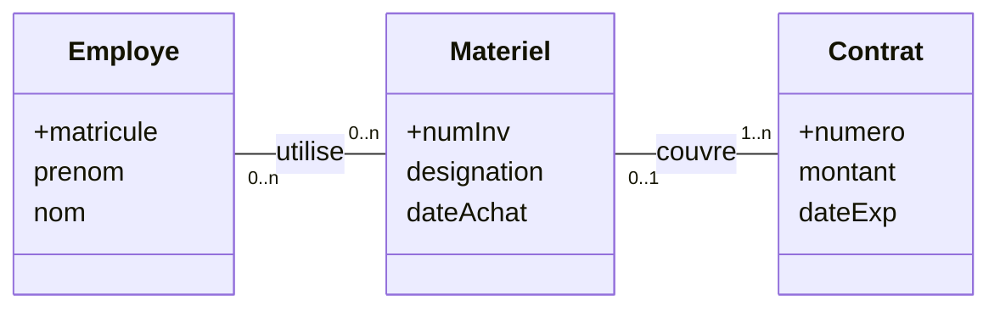
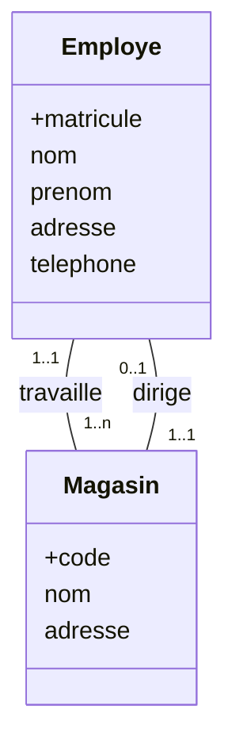
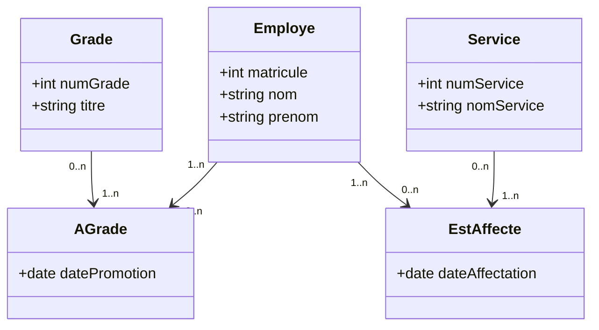
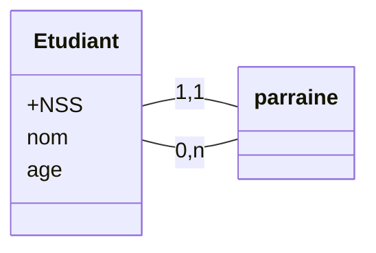
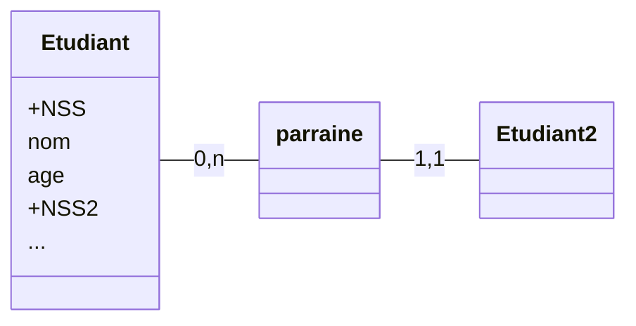

> [!info]
> TD présenté par **Aaron Boussidan**

# I - Feuille 1

## 1. Premier schema
### 1.1 Instance 1

#### Question 1

 - `joueur(+numLic, nom, prenom, age, pays)`
 - `equipe(+num, nom,pays)`
 - `appartient(+num,+numLicence, role)`
- FK `num` reference equipe
- FK `numLicence` fait reference a joueur.

#### Question 2

Dans le'équipe:
- 1 apparait deux fois bien qu'etant une clé primaire **ABSURDE**
- Dans joueur il y a une colonne pays qui n'est pas dans le schéma **ABSURDE**
- Dans appartient 999 999 est mentionné bien que ne faisant reference à aucune cle etrangere **ABSURDE**.

### 2. Instance 2

#### Question 1

- `joueur(+numLic, nom, prenom, age)`
- `equipe(+num, nom, pays)`
- `appartient(num, numLicence, role)`

#### Question 2
ouble cle primaire = probleme
- 6 n'apparient a aucune equipe (pas une erreur)

### 3. Instance

#### Question 2
263904 ≠ 363904
Ne pas mettre âge, utiliser plutôt la date de naissance. 

## 2. Deuxième schéma

### Instance 4

- joueur 2 fois cle primaire 63904 avec num different
- Dans partie, l'équipe 4 n'existe pas et 2 est une clef etrangere donc elle devrait apparaitre dans equipe

# II - Feuille 2

## Exercice 1 : 1ères traductions

## Question 1

- `employe(+matricule, prenom,nom)`
- `materiel(+numInv, designation, dateAchat, numero)`
- `contrat(+numero, montant, dateAchat)`
- `utilise(+matricule, +numInv)`
- FK numéro tous materiel fait referecne a numero dans conrtrat matricule dans utilise.

## Question 3

- `employe(+mat, nom, prenom, addresse,tel, code)`
- `magasin(+code, nom, adresse, mat)`
- FK : code dans employé $\to$ code dans magasin
- mat dans magasin $\to$ mat dans employé

## Exercice 2

> 1. Traduisez le schéma entité-association suivant vers le modele relationnel

- `grade(+numGrade, titre)`
- `employe(+mat, nom, prenom)`
- `Dateaffecte(+date)`
- `Service(+numService, nomServ)`
- `a grade(+nomGrade, +mat, datePromo)`
- `estaffecte(+mat, +dat, +numSer)`

> Quelle est la difference entre les relations produites par les asociations et a grade?

La difference c'est que la cle primaire est le triplet entier pour est affectee. On peut etre admis dans le meme service avec une date difference mais un employe n'est affecte a une cle qu'une fois (d'apres la cle primaire). 

- `departement(+numero, intitule`

# Exemple cours

- `groupe(*idGroupe)`
- `etudiant(*numEtud, nom, prenom)`
- `processeur(*numProf, nom, prenom)`
- `cours(*idCours, intitule)`
- `appartient(#numEtud, #idGroupe)`
	- FK `appartient` 
- `passeExamen(#numEtud, note, #idCours)`
- `supervise(#numProf, #numCours)`
- `requiert(*idCours, *idCoursRequis, noteMin)`

# Exemple - Association récursive

- `Etudiant(+NSS, nom, age, #NSS_parrain)`
	- FK `#NSS_parrain` fait référence à NSS dans étudiant.

> [!tips]
> Quand il y a récursivité, c'est comme si on « dédoublait » **voir schéma ci-dessous**

