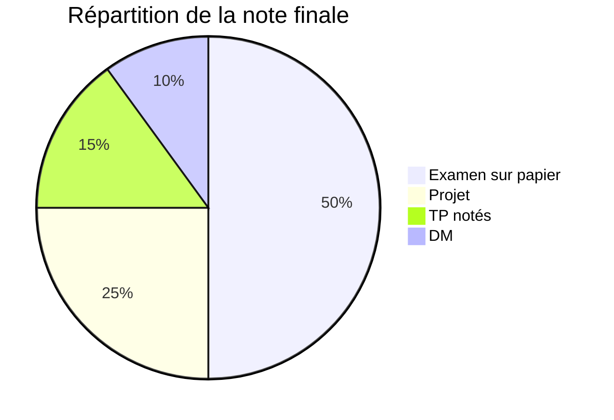

# Initiation à la programmation C

## I. Organisation du cours

> [!info]
> **Enseignants** : M. Bouillot et M. ?

- Chaque semaine
	- Un TD
	- Un TP
	- Un CM
- Difficulté par paliers, sujets cruciaux à l'examen et demandeurs en travail, respectivement:
	- Pointeurs et allocations dynamiques
	- Listes chaînés
		- Requiert beaucoup de visualisation
		- Expérience schématique indispensable
- Beaucoup de codage en direct

## II. Calcul de la moyenne

- Le DM (en binôme)
	- Très cadré
	- 10% de la note finale
- Projet (en binôme, beaucoup plus conséquent)
	- Très personnel au contraire
	- 20-25%
- TP notés
	- Fin novembre - début janvier
	- 2 voire 3 sur Platon
	- Les exercices ne sont pas notés également
- Examen sur papier (fin du semestre)
	- Pas de debugging
	- 50% de la note finale
	- Open-book mais interdiction de ramener des documents imprimés

Moyenne donnée par: $\max(\frac{\text{CC} + \text{Examen}}2, \text{Examen final})$ 

## III - Objectifs du cours

- Apprendre le langage C
- Produire du code propre
- Savoir manipuler des adresses pour comprendre les opérations se déroulant en mémoire
- Comprendre les forces et les faiblesses du langage C, prendre du recul pour mieux appréhender les autres langages (en particulier Python) et autres paradigmes.