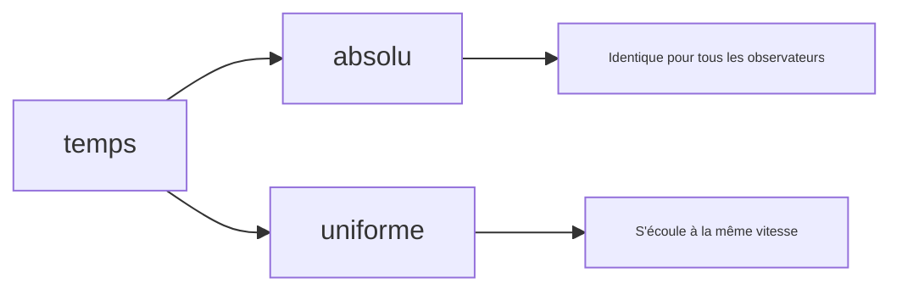
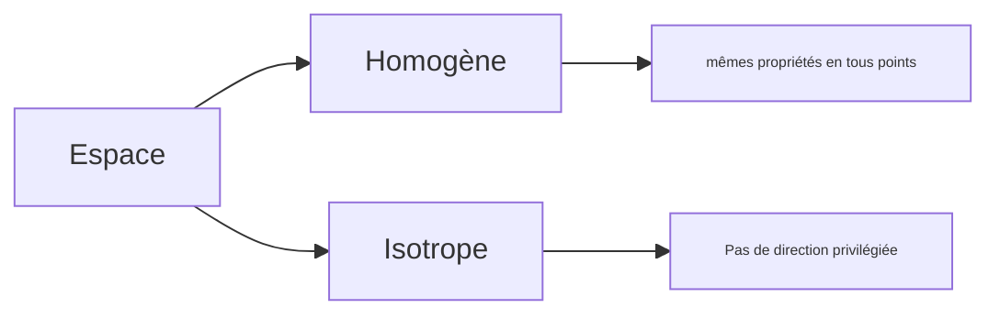

$\newcommand{\m}[1]{\begin{pmatrix}#1\end{pmatrix}}\newcommand{\lim}[1]{\underset{\begin{matrix}#1\end{matrix}}{\text{lim}}}\newcommand{\m}[1]{\begin{pmatrix}#1\end{pmatrix}}\newcommand{\R}{\mathbb{R}}\newcommand{\ub}[2]{\underset{#2}{\underbrace{#1}}}$

# 0 - Notions d'espace temps
$\renewcommand{\lim}[1]{\underset{\begin{matrix}#1\end{matrix}}{\text{lim}}}\newcommand{\cases}[1]{\begin{cases}#1\end{cases}}\newcommand{\ms}[1]{\ \text{m}\cdot\text{s}^{-#1}}\newcommand{\kg}{\ \text{kg}}$
## 1. Un peu d'histoire

**Zénon** - Achille et la tortue. Achille va à 10 m/s tandis que la tortue à 1 m/s. Achille se trouve à 10m de la tortue. Bien qu'Achille soit beaucoup plus rapide, il ne rattrapera jamais la tortue car à chaque fois qu'il se rend au dernier point connu de la tortue elle se déplace entretemps, donc il y a non-convergence.

Il lui faut d'abord une seconde pour atteindre sa position, puis 1/10ème de secondes etc... On peut exprimer le temps comme suit:

$t_0 = 1+0.1+0.01+0.001+...$ soit 
$\phantom{t_0} = \sum^{\infty}_{i=0}10^{-i}$
$\phantom{t_0} = \lim{n\to+\infty}\frac{1-10^{-(n+1)}}{1-10^{-1}} = \frac{1}{1 - 0.1} = \frac{10}9 = 1.1111....$

Soit $v_H$ la vitesse d'achille et $v_T$ la vitesse de la tortue.

$\cases{d_H(t) = v_H \times t \\ d_T(t) = v_T \times t}$
$t_0$ tel que :
- $\cases{d_H(t_0) = d_T(t_0)+10 \\ v_Ht_0 = v_Tt_0 + 10}$
- $(v_H-v_T)t_0 = 10$
- $t_0 = \frac{10}{v_H - v_T} = \frac{10}9 = 1,111...$

### Aristote
Aristote définit le temps comme un nombre de mouvements. 
- La première unité de temps était le mouvement du soleil
- Ensuite, il fut découper en fractions.
	- Les anciens égyptiens découpent en 12H selon le soleil, avec des heures relatives
- Cette notion de mesure par mouvement est donc naturelle.

### Marc-Aurèle
Empereur romain (26 avril 121 - 17 mars 180) connu pour ses écrits philosophiques, considéré comme le dernier des cinq bons empereurs romains, marquant la fin de la période de paix romaine. 

Il définit le temps comme un fleuve qui emporte toute chose, comme un torrent irresistible. On ne peut arrêter le fleuve. 

### Bergson
Bergson essayait d'avoir une vision non scientifique du temps donc a dit beaucoup de choses incorrectes et était déçu lors de sa rencontre avec Einstein.

Il définit quant à lui le temps comme: « Ce qui passe quand rien ne se passe ». 

### Einstein
Était très pragmatique et le définit simplement comme ce qui se mesure avec une horloge et l'espace quant à lui c'est ce qui se mesure avec une règle. 

## 2. Propriétés de l'espace-temps classiques

> Classiques par opposition à relativiste

### Temps

### Espaces

# I - Rappels de géométrie

## 1. Base orthonormée directe (BOND)

- **Base** : 3 vecteurs indépendants (on construit ensuite par combinaison linéaire)
- **Ortho** (de orthogonal) $\vec{e_1} \perp \vec{e_2}, \vec{e_1} \perp \vec{e_3}, \vec{e_2} \perp \vec{e_3}$
- **normé** : $\|\vec{e_1}\| = \|\vec{e_2}\| = \|\vec{e_3}\|$

> [!tips]
> **Moyen mnémotechnique** : règle de la main droite (pouce, index et majeur formant les différents axes)

Il y a un symbole pour représenter les plans en deux dimensions : $\otimes$, quand on symbolise en 2D un vecteur normal à la feuille, on utilise le symbole « $\odot$ ».

On appellera une **base indirecte** une base qui ne se conforme pas à la règle de la main droite. (assez souvent, indirecte signifie qu'on utilise un sens opposé quelque part).

## 2. Produit scalaire

> En base orthonormé)

$\vec{OA}\m{3 \\ -4 \\ 2}$ et $\vec{OB}\m{4 \\ 3 \\ 0}$ 
$\vec{OA} \cdot \vec{OB} = 3 \cdot 4 - 4 \cdot 3 + 2 \cdot 0$
$\phantom{\vec{OA} \cdot \vec{OB}} = 0$
On  en déduit que ces deux vecteurs sont orthogonaux.

Par ailleurs, le produit scalaire est applicable lorsqu'il s'agit de norme.

$\vec{OB} \cdot \vec{OB} = ||\vec{OB}|| \cdot ||\vec{OB}|| \cdot \cos(0)$
$\phantom{\vec{OB} \cdot \vec{OB}} = ||\vec{OB}||^2$
D'où $\vec{OB}^2 = \|\vec{OB}\|^2$

**Normalisation**
$\vec{e} = \frac{\vec{OB}}{||\vec{OB}||}$

### 1. Pythagore

$\|\vec{a}\| = \sqrt{a_x^2 + a_y^2}$
**Démonstration** - $\|\vec{a}\|^2 = \vec{a} \cdot \vec{a} = a_x^2 + a_y^2$

### 2. Théorème d'Al-Kashi

$c^2 = a^2+b^2 - 2ab\cos(\theta)$

**Démonstration**
$c^2 = \|\vec{AB}\|^2 = \vec{AB} \cdot \vec{AB}$
$\phantom{c^2} = (\vec{AC} + \vec{CB}) \cdot (\vec{AC} + \vec{CB})$ (par Chasles)
$= \vec{AC} \cdot \vec{AC} + \vec{CB} \cdot \vec{CB} + \vec{CB} \cdot \vec{AC} + \vec{AC} \cdot \vec{CB}$
$= \|\vec{AC}\|^2 + \|\vec{CB}\|^2 + 2\vec{AC}\cdot \vec{CB}$ 
$= b^2 + a^2 + 2\|\vec{AC}\| \times \cos(\langle \vec{AC}, \vec{CB}\rangle)$

### 3. Recherche d'angle

> Par utilisation des deux formules des produits scalaires, déterminer l'angle entre deux vecteurs.

Soit $\vec{A}\m{1 \\ 2 \\ 2}$ et $\vec{B}\m{2 \\ 2 \\ 1}$

$\vec{A} \cdot \vec{B} = 1 \cdot 2 + 2 \cdot 2 + 2 \cdot 1$
$\phantom{\vec{A} \cdot \vec{B}} = 8$

Par ailleurs,
- $||\vec{A}|| = \sqrt{1 + 4 + 4} = \sqrt{9} = 3$
- $||\vec{B}|| = \sqrt{4 + 4 + 1} = \sqrt{9} = 3$

$\vec{A} \cdot \vec{B} = ||\vec{A}|| \cdot ||\vec{B}|| \cdot \cos(\theta)$
$\phantom{\vec{A} \cdot \vec{B}} = 9 \cdot \cos(\theta)$
Or, $\vec{A} \cdot \vec{B} = 8$

$\cos(\theta) = \frac89$
$\theta = \arccos(\frac89) ≈ 27.27°$
## 3. Produit vectoriel

**Notation** - $\vec{w} = \vec{u} \wedge \vec{v}$
**Propriétés** - $\vec{w} \perp \vec{u}$ et $\vec{w} \perp \vec{v}$
**Le produit** est un vecteur.

Sa forme se définit par:
- $||\vec{A} \wedge \vec{B}|| = \|\vec{A}\| \|\vec{B}\| |\sin(\vec{A}, \vec{B})|$

**Direction** donnée par la règle de la main droite. 

$\vec{A} \wedge \vec{B} = \m{A_y B_z - B_y A_z \\ A_z B_x - B_z A_x \\ A_x B_y - A_y B_x}$

> **Moyen mnémotechnique** : Écrire les coordonnées de $\vec{A}$ et $\vec{B}$ côte à côte.
> - "Étendre" (ajouter une ligne de x et de y sous la ligne de z)
> - Barrer la première ligne
> - Faire un produit en croix en partant de la 1ère non barrée
> - Barrer la première ligne
> - Refaire jusqu'à ne garder qu'une ligne

- La norme du produit vectoriel est la surface du parallélogramme généré par $\vec{AB}$.

# II - Bases et définitions

> [!info]
> La cinématique est une partie de la mécanique qui s’intéresse à l’étude des mouvements, indépendamment des causes qui les ont produits. 
> Dans ce chapitre, on fixe le cadre de l’étude mécanique, on définit la notion de point en physique et on décrit les outils qui permettent de décrire géométriquement sa position, sa vitesse et son accélération au cours du temps.

## 1 - Référentiel

> [!check]
> - Aucun objet physique n'est rigoureusement ponctuel au sens mathématique du terme.
> - Pour étudier la mécanique du point, il faut donc préciser dans quelles conditions un objet mécanique peut être modéliser par un point.

**Un repère c'est:**
- Un point
- 3 vecteurs de base

On exprimera tous les autres vecteurs comme une combinaison linéaire de ces vecteurs de base.

En mécanique classique, on ne prend pas le temps comme constituant partant du principe qu'il s'écoule de la même façon dans tous les référentiel, ce qui n'est pas vrai en **mécanique relativiste**.

**Un référentiel**
- Repère considéré (arbitrairement) comme fixe

**Notations courantes pour les vecteurs de base**
- $\vec{i}, \vec{j}, \vec{k}$ 
- $\vec{e_x}, \vec{e_y}, \vec{e_z}$
- $\vec{u_x}, \vec{u_y}, \vec{u_z}$

> [!tips]
> **Remarques** : 
> - Ces vecteurs sont choisis unitaire (norme = 1)
> - Ils forment une base directe de l'espace (cf. la main droite)
> - Ils sont orthogonaux entre eux
> $\Rightarrow$ Base orthonormé directe (BOND)

### 1.1 Quelques référentiels

- **Référentiel terrestre**
	- Vecteurs fixes par rapport à la surface de la Terre
- **Référentiel géocentrique**
	- Point origine au centre de la Terre
	- Les vecteurs de base pointent vers des étoiles lointaines
		- Aujourd'hui on sait que les étoiles
- **Référentiel héliocentrique**
	- Idem

### 1.2 Définition d'un solide

Un solide est un système matériel dont les points restent à distance constante les uns des autres. 
Pour repérer un solide dans l'espace, il faut six paramètres:
- Les trois coordonnées d'un point du solide
	- *on considère souvent la position de son centre de gravité $G$*
- Les trois angles qui définissent l'orientation d'un repère lié au solide par rapport au référentiel d'étude.

> [!info]
> Dans le cadre de la cinématique, les solides sont supposés indéformables.
> On exclut toute déformation et toute rupture du solide de cette étude.

### 1.3 Définition d'un point

- Un point matériel est un solide dont on peut négliger l'extension spatiale et la rotation sur lui-même.
- Pour repérer complètement un point dans l'espace, il suffit de donner trois paramètre : **ses coordonnées**.

> [!info]
> En dynamique, on a besoin de définir sa masse.
> Cela mène à la notion de point matériel.
> Ce n'est pas nécessaire en cinématique.

## 2. Vecteur position

Dans ce cours, le système sera assimilé à un point $M$ de masse $m$. 
- On repère sa position à l'aide d'un vecteur position noté $\vec{OM}(t)=\vec{r}(t)$ (origine du référentiel)

**Trajectoire** : ensemble des points par lesquels passe l'objet. 

> [!warn]
> La trajectoire et le mouvement dépendent du référentiel.

Pour représenter le vecteur qui vient vers nous on utilise le symbole $\odot$. 

Prenons un vecteur position $M(t)$ et un vecteur $M(t+dt)$
(où $dt$ désigne un temps très petit).

On notera le vecteur de déplacement entre ces deux positions comme suit:
- $\Delta\vec{OM} = \Delta \vec{r} = \vec{OM}(t + dt) - \vec{OM}(t) = M(t)M(t+dt)$

### 2.1 En coordonnées cartésiennes

Quelques notations différentes:
- $\vec{OM}(t) = x(t)\vec{e_x} + y\vec{e_y} + z\vec{e_z}$
- $\vec{OM}(t)\m{x(t) \\ y(t) \\ z(t)}$
- $\vec{OM}(x,y,z)$

De même,
- $\Delta\vec{r}\m{\Delta x = x(t+dt) - x(t) \\ \Delta y \\ \Delta z}$

## 3. Vecteur vitesse

- **Collège**
	- $v=\frac{d}t$
- **Lycée**
	- $\vec{v}_\text{moy} = \frac{\Delta\vec{r}}{\Delta t}$ 
	- $\vec{v}_\text{inst} =\lim{\Delta t \to 0}\frac{\Delta \vec{r}}{\Delta t}=. \frac{d \vec{r}}{d t} = \frac{d \vec{OM}}{dt}$ 

> [!tips]
> **Rappel** : $f'(x) = \lim{h\to 0}\frac{f(x+h) - f(x)}{h}$

Notations $\vec{v}\m{x'(t) \\ y'(t) \\ z'(t)}$ ou $\vec{v}\m{\dot x \\ \dot y \\ \dot z}$
Par soucis de simplifier les notations, le `\dot` signifie dériver par rapport au temps.

- $\vec{v}$ est toujours tangent à la trajectoire.

**Depuis Dunod**,
- Le vecteur **vitesse moyenne** entre l'instant $t$ et l'instant $t + \Delta t$  est défini par le rapport du vecteur de déplacement et la durée de ce déplacement,
	- $\langle \vec{v} \rangle = \frac{\Delta \vec{OM}}{\Delta t}$ 
- Lorsque l'intervalle de temps devient infinitésimal, ce rapport devient le **vecteur vitesse instantanné**
	- $\vec{v}(t) = \frac{d\vec{OM}}{dt}$
- C'est la dérivée du vecteur position $\vec{OM}$. La norme de ces vitesses se mesure en $\ms1$.

### 3.1 Mouvement uniforme

Un mouvement est uniforme si $||\vec{v}||$ est constante.

#### Exemple

$\vec{OM}(t)\m{2t \\ t^2+1 \\ 0} \to \vec{v}\m{2 \\ 2t \\ 0} \to v = \sqrt{2^2 + (2t)^2} = 2\sqrt{1+t^2}$

> [!check]
> - Le **vecteur position** est donné par des coordonnées. Exprimées en fonction de $t$
> - Le **vecteur vitesse** est la dérivée du vecteur position
> - Le **vecteur accélération** est la dérivée seconde.

## 4. Vecteur accélération

- Par définition, dérivée du vecteur vitesse
	- $\frac{d\vec{v}}{dt}$

$\vec{a}\m{a_x \\ a_y \\ a_z}$ ou $\vec{a}\m{\dot v_x \\ \dot v_y \\ \dot v_z}$ ou alors $\vec{a}\m{\ddot x \\ \ddot y \\ \ddot z}$ (deux points pour dérivée seconde).

On peut noter:
- $\vec{a} = \vec{\dot{v}}$ 

L'unité de l'accélération est le $\ms{2}$ 
- Explication simple:
	- Combien de m/s par seconde?
	- ... de $\ms1$ par seconde
	- ... de $\ms2$

**Depuis Dunod**.
- Le vecteur accélération moyenne entre l'instant $t$ et un instant $t+\Delta t$ est défini par le rapport de la variation du vecteur vitesse à la durée $\Delta t$
	- $\langle \vec{a} \rangle = \frac{\vec{v}(t+\Delta t) - \vec{v}(t)}{\Delta t}=\frac{\Delta \vec{v}}{\Delta t}$
- Lorsque l'intervalle de temps devient infinitésimal, ce rapport devient le vecteur accélération instantanée:j
### Exemple

- $\vec{OM}(t)\m{t^2 + 2t + 1 \\ 0 \\ 0}$
- $\vec{v}\m{2t + 2 \\ 0 \\ 0}$
- $\vec{a}\m{2 \\ 0 \\ 0}$

- La trajectoire est rectiligne (selon $\vec{e_x}$)
- Le mouvement est uniformément accéléré 
	- par la constance des coordonnées du vecteur accélération

C'est une parabole qui s'annule en $t=-1$ (se factorise en $(t+1)^2$). Donc sur $\R^+$ strictement croissante.

### Exemple 2 - Inverse

> On suppose que l'accélération est constante.
> Trouver le vecteur vitesse et le vecteur position.
> **Données**
> $\vec{a}\m{0 \\ 0 \\ -10}, \vec{v}(0)\m{0 \\ 2 \\ 5}, \vec{r}(0)\m{0 \\ 0 \\ 5}$

$\to \vec{v}(t)\m{0 \\ 2 \\ -10t + 5}$ 
$\to \vec{r}(t)\m{0 \\ 2t \\ -5t^2 + 5}$

## 5. Critère pour savoir si la vitesse augmente

- Si $v \nearrow$, $v^2 \nearrow$
	- $\vec{v(t)}^2\nearrow$
	- **Maths** : donc la dérivée est positive
		- $(f^2(x)')=f'(x) \cdot 2f(x)$
	- Il suffit que $2\vec{v}\frac{d\vec{v}}{dt}>0$
		- Il suffit que $\vec{v}\cdot \vec{a}>0$
	- Dernier cas de figure
		- $\vec{v} \cdot \vec{a} = 0$
		- $\Rightarrow \vec{v}$ est constante.

# III - Lois de Newton

## 1. Principe d'inertie 

> Galilée - 1632 complété ensuite par Newton

- Dans les référentiels dits « galiléens ». 
	- Si le système n'est soumis à aucune force
	- Si soumis à des forces qui se compensent
	- La trajectoire est rectiligne uniforme
	- $\iff$ $\vec{v} = \vec{\text{const}}$

> [!tips]
> Dans ce cours, sauf mention explicite du contraire, le référentiel terrestre sera considéré comme galiléen. (approximatif)

Un satellite par exemple n'est pas à considérer comme dans un référentiel galiléen.

### 1.1 Exemple

![[mec1]]

> Déterminer $T_1$ et $T_2$ sachant que l'objet est équilibré.

Par principe d'inertie,
- 

Selon $(x):$
- $P_x+T_1x+T_2x = 0$ 
- Déterminons $T_1x$
	- On utilise la composante 
	- $T_1x = T_1\cos\alpha$ 
	- Par ailleurs, $\vec{T_2}$ constitue également un angle $\alpha$ mais orienté dans l'autre sens.
- $P_x + T_1x+T_2x=0$
- $0+T_1x\cos\alpha-T_2x\cos\alpha=0$
- On en déduit:
	- $T_1-T_2=0$
	- $T_1=T_2$
- (cf. plan de symétrie évident)

Selon $(z)$:
- $\ub{P_z}{m \cdot g}+\ub{T_1z}{T_1\sin\alpha}+\ub{T_2z=0}{T_2\sin\alpha}$
	- Notons $T=T_1=T_2$
- $2 \cdot T\sin\alpha = mg$
- $T=\frac{mg}{2\sin\alpha}=\frac{60 \cdot 9.81}{2\sin(10°)} = 1695$ N.

## 2. Principe fondamental de la dynamique (PFD)

> Newton 1687 / Aussi appelé 2nde loi de Newton

- Dans un référentiel galiléen.
	- $\sum\vec{F}_{/\text{syst}}=m_{\text{syst}} \cdot \vec{a}$ 
		- $\vec{F}$ en $N$
		- $m$ en $\kg$ 
	- **Par définition**
		- $1N \overset{\Delta}{=}1 \kg \cdot \ub{\frac{1 m}{1 s^2}}{1 \ms2}$ 

### 2.1 Exemple

> On pousse un caddie

![[caddie1]]
- **Système** : Chariot
- **Référentiel** : Terrestre (galiléen)
- **PFD** : $\vec{F} + \vec{R} + \vec{P} = m \cdot \vec{a}$

> [!check]
> On suppose $\vec{F}$ horizontale

*Comme dans l'exemple précédent*,
Suivant $(z)$:
- $F_z+R_z+P_z=m\cdot a_z$ 
- $0+R-mg = m \cdot 0$
	- Si $a_z$ n'était pas nul, le chariot décollerait ou s'enfoncerait dans le sol
	- Il n'y a pas de mouvement vertical
- $R = mg$

Suivant $(x)$:
- $F_x+R_x+P_x=ma_x$
- $F_x+0+0=ma_x$
	- $a_x=a=\frac{F}m$
	- AN: $a=\frac{20}5=4 \ms2$
- Corollaire: La vitesse augmente linéairement.

### 2.2 Autre écriture du PFD

$\sum \vec{F} = \frac{d\vec{p}}{dt}$
- $\vec{p}\overset{\Delta}{=}mv$ (quantité de mouvement)
- On peut généraliser cela à la relativité

## 3. Principe action réaction

> 3ème loi de Newton / Dans certains livres loi de l'action et de la réaction. 

![[caddie2]]
- $\color{red}\vec{F}$ : force exercée par la personne sur le chariot
- $\color{blue}\vec{F}$ : force chariot / personne

> $\color{red}\vec{F}$ $= \color{blue}-\vec{F}$

- Cette propriété est vraie quelque soit le mouvement de $P$ et de $C$. 
	- Même accéléré!
	- C'est vrai à tout instant et vrai dans tous les référentiels.
- Ce même principe d'action / réaction explique le mouvement des fusées. 
- De même, c'est la route qui fait avancer la voiture par réaction.

> [!warn]
> Un système est **isolé** lorsque aucune force ne s'applique sur lui.

> [!check]
> Un système est **pseudo-isolé** lorsque $\sum\vec{F}_{\text{syst}} = \vec{0}$.

# IV - Applications du PFD

**Méthode générale**
- Préciser le système,
- Le référentiel
	- terrestre ≈ galiléen sauf mention contraire
- Choix du repère
- PFD $\to$ Résolution mathématique
	- Bilan des forces
- Vérifier les conditions initiales

## 1. Chute libre rectiligne

# Brouillon - Repérage d'un point dans le plan (brouillon)

## a - Cordonnées cartésiennes

> [!info]
> Le repérage cartésien consiste à quadriller le plan à l'aide d'une grille carrée. Les points du plan sont repérés par leurs coordonnées sur deux axes orthogonaux.

**Systèmes de coordonnées**
- On place un point $O$ et deux vecteurs fixes $\vec{u_x}$ et $\vec{u_y}$ tels que le doublet $(\vec{u_x}, \vec{u_y})$ forme une base orthonormée directe de $\mathscr{P}$.
- Le point $M$ est repéré par deux paramètres géométriques $x$ et $y$ où:
	- $x$ est la coordonnée du projeté orthogonal de $M$ sur l'axe orienté $(O, \vec{u_x})$
	- $y$ est la coordonnée du projeté orthogonal de $M$ sur l'axe orienté $(O, \vec{u_y})$

Dans le plan $(Oxy)$, un point $M$ de **coordonnées cartésiennes** $x$ et $y$ est noté $M(x,y)$
Son vecteur position s'écrit:
- $\vec{OM} = x\vec{u_x}+y\vec{u_y}$
Où $x$ et $y$ sont les projections orthogonales de $\vec{OM}$ sur les vecteurs $\vec{u_x}$ et $\vec{u_y}$

> **Exemple**
> Chute libre, mouvement horizontal...

### a.1. Bilan uniforme

- Pour un mouvement rectiligne uniformément varié  d'axe.
	- $\vec{a} = a_0\vec{u_x}$
	- $\vec{v} = (a_0t+v_0)\vec{u_x}$
	- $\vec{OM} = \left(a_0\frac{t^2}2+v_0t+x_0\right)\vec{u_x}$

## b - Coordonnées polaires

> [!tips]
> Le repérage cartésien est le plus naturel pour les mouvements plans, amis il n'est pas toujours le plus pertinent. Il faut avoir à l'esprit le système de coordonnées polaires notamment dans le cas des mouvements circulaires.

**Description** 
- Le repérage polaire consiste à quadriller le même plan $\mathscr{P}$ à l'aide d'une grille centrée sur un point $O$ du plan. 
- Les points du plan sont alors repérés par leur distance à $O$ et un angle mesuré par rapport à un axe fixe. 

**Système de coordonnées** 
- En général on utilise le point $O$ et le vecteur $\vec{u_x}$ des coordonnées cartésiennes pour définir la droite orientée $(Ox)$ prise comme référence des angles.
- Le point $M$ est repéré par ses coordonnées polaires $r$ et $\theta$ où:
	- $\theta$ est l'angle orienté que fait le vecteur $\vec{OM}$ avec le vecteur $\vec{u_x}$
	- $r$ est la distance $OM$. C'est la norme du vecteur $\vec{OM}$ : $r = \|\vec{OM}\|$
- Un point $M$ de coordonnées polaires $r$ et $\theta$ est noté $M(r, \theta)$

> **Exemple**
> Satellite autour de la terre, objet attaché à une corde. 

### b.1. Écrire les coordonnées

$\vec{OM} = r(t)\vec{e_r}$
- $\vec{e_r} = \frac{\vec{OM}}{\|\vec{OM}\|}$

### b.2. Conversion polaire $\leftrightarrow$ cartésien

- Polaire à cartésien
	- $\cases{x = r\cos(\theta) \\ y = r\sin(\theta)}$
- Cartésien à polaire
	- $r = \sqrt{x^2+y^2}$
	- angle

## c - Repérage sphérique

> Le repérage sphérique permet de repérer un point dans l’espace 3D à l’aide de **trois coordonnées** adaptées aux **situations à symétrie sphérique** (planètes, champs gravitationnels, etc.).

- Le repérage sphérique d'un point $M$ consiste à repérer $M$ par la distance $OM$, puis sa position sur la sphère de rayon $OM$ par deux angles. 
- Comme il s'agit d'un repérage courant aux géographes, le vocabulaire qui suit est emprunté aux géographes.

**Vocabulaire**
- On appelle **équateur** le cercle marquant l'intersection avec le plan $(Oxy)$
- **Plan équatorial** le plan de l'équateur. 
- Un **parallèle** est un cercle de la sphère parallèle à l'équateur.
- On repère un parallèle par sa latitude.

**Les axes**
- L'axe $(Oz)$ est l'axe Nord/Sud. 
- Un méridien est un cercle qui contient l'axe nord/sud de la sphère.
- Le point $M$ est situé à l'intersection d'un parallèle et d'un méridien. On le repère par sa longitude et latitude. 

