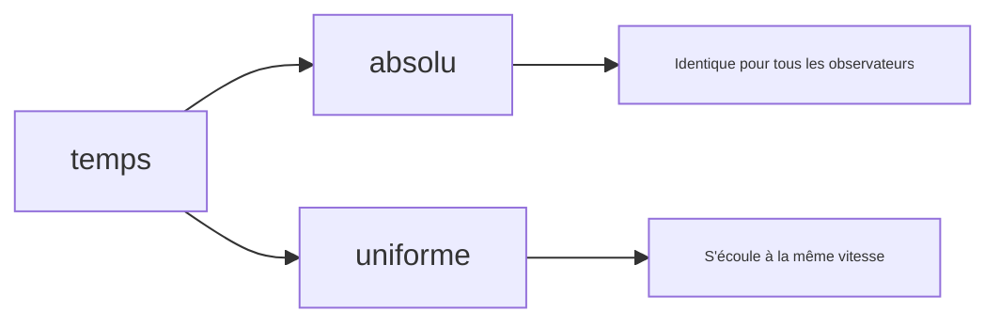
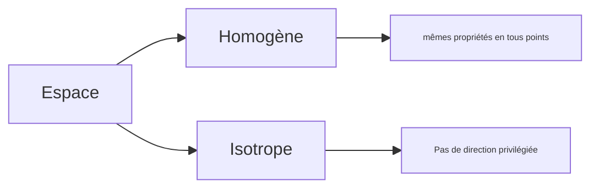

# 0 - Notions d'espace temps
$\renewcommand{\lim}[1]{\underset{\begin{matrix}#1\end{matrix}}{\text{lim}}}\newcommand{\cases}[1]{\begin{cases}#1\end{cases}}$
## 1. Un peu d'histoire

**Zénon** - Achille et la tortue. Achille va à 10 m/s tandis que la tortue à 1 m/s. Achille se trouve à 10m de la tortue. Bien qu'Achille soit beaucoup plus rapide, il ne rattrapera jamais la tortue car à chaque fois qu'il se rend au dernier point connu de la tortue elle se déplace entretemps, donc il y a non-convergence.

Il lui faut d'abord une seconde pour atteindre sa position, puis 1/10ème de secondes etc... On peut exprimer le temps comme suit:

$t_0 = 1+0.1+0.01+0.001+...$ soit 
$\phantom{t_0} = \sum^{\infty}_{i=0}10^{-i}$
$\phantom{t_0} = \lim{n\to+\infty}\frac{1-10^{-(n+1)}}{1-10^{-1}} = \frac{1}{1 - 0.1} = \frac{10}9 = 1.1111....$

Soit $v_H$ la vitesse d'achille et $v_T$ la vitesse de la tortue.

$\cases{d_H(t) = v_H \times t \\ d_T(t) = v_T \times t}$
$t_0$ tel que :
- $\cases{d_H(t_0) = d_T(t_0)+10 \\ v_Ht_0 = v_Tt_0 + 10}$
- $(v_H-v_T)t_0 = 10$
- $t_0 = \frac{10}{v_H - v_T} = \frac{10}9 = 1,111...$

### Aristote
Aristote définit le temps comme un nombre de mouvements. 
- La première unité de temps était le mouvement du soleil
- Ensuite, il fut découper en fractions.
	- Les anciens égyptiens découpent en 12H selon le soleil, avec des heures relatives
- Cette notion de mesure par mouvement est donc naturelle.

### Marc-Aurèle
Empereur romain (26 avril 121 - 17 mars 180) connu pour ses écrits philosophiques, considéré comme le dernier des cinq bons empereurs romains, marquant la fin de la période de paix romaine. 

Il définit le temps comme un fleuve qui emporte toute chose, comme un torrent irresistible. On ne peut arrêter le fleuve. 

### Bergson
Bergson essayait d'avoir une vision non scientifique du temps donc a dit beaucoup de choses incorrectes et était déçu lors de sa rencontre avec Einstein.

Il définit quant à lui le temps comme: « Ce qui passe quand rien ne se passe ». 

### Einstein
Était très pragmatique et le définit simplement comme ce qui se mesure avec une horloge et l'espace quant à lui c'est ce qui se mesure avec une règle. 

## 2. Propriétés de l'espace-temps classiques

> Classiques par opposition à relativiste

### Temps

### Espaces

# I - Référentiels d'observation

> La cinématique est une partie de la mécanique qui s’intéresse à l’étude des mouvements, indépendamment des causes qui les ont produits. 
> Dans ce chapitre, on fixe le cadre de l’étude mécanique, on définit la notion de point en physique et on décrit les outils qui permettent de décrire géométriquement sa position, sa vitesse et son accélération au cours du temps. 

## 1. Notion de point en physique

- Aucun objet physique n'est rigoureusement ponctuel au sens mathématique du terme.
- Pour étudier la mécanique du point, il faut donc préciser dans quelles conditions un objet mécanique peut être modéliser par un point.

### 1.1 Définition d'un solide

Un solide est un système matériel dont les points restent à distance constante les uns des autres. 
Pour repérer un solide dans l'espace, il faut six paramètres:
- Les trois coordonnées d'un point du solide
	- *on considère souvent la position de son centre de gravité $G$*
- Les trois angles qui définissent l'orientation d'un repère lié au solide par rapport au référentiel d'étude.

> [!info]
> Dans le cadre de la cinématique, les solides sont supposés indéformables.
> On exclut toute déformation et toute rupture du solide de cette étude.

### 1.2 Définition d'un point

- Un point matériel est un solide dont on peut négliger l'extension spatiale et la rotation sur lui-même.
- Pour repérer complètement un point dans l'espace, il suffit de donner trois paramètre : **ses coordonnées**.

> [!tips]
> En dynamique, on a besoin de définir sa masse.
> Cela mène à la notion de point matériel.
> Ce n'est pas nécessaire en cinématique.

### 1.3 Quand peut-on assimiler un système à un point?

La question n'a pas de réponse simple et on doit se référer à la définition : tout dépend si on peut négliger son extension spatiale et sa rotation sur lui-même.

## 2. Repérage d'un point du plan

### 2.1 Intérêt d'avoir plusieurs systèmes de coordonnées

- Lors d'expériences de mécanique, on repère le mouvement d'un point au cours du temps.
- La trajectoire suivie par le mobile peut prendre des formes très différentes.
- Si l'on considère trois mouvements plans vus au lycée, différents paramétrages géométriques sont utilisés, qui correspondent à différents systèmes de coordonnées.

> [!check]
> **En exemple** : un objet en chute libre (1 axe) un vol balistique (parabole / deux dimensions) et repérage polaire pour un mouvement circulaire uniforme.

