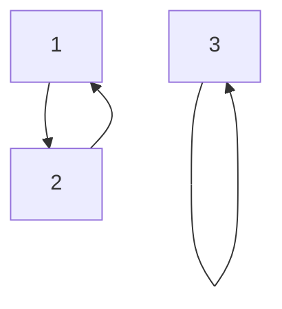
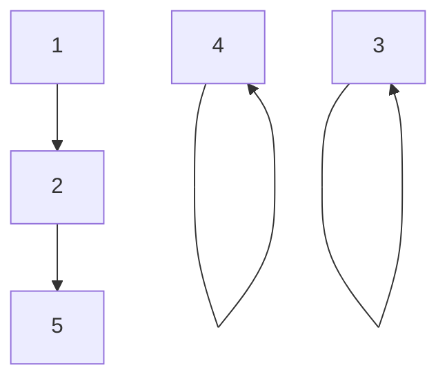

$\newcommand{\K}{\mathbb{K}}\newcommand{\m}[1]{\begin{pmatrix}#1\end{pmatrix}}\newcommand{\ub}[2]{\underset{#2}{\underbrace{#1}}}\newcommand{\R}{\mathbb{R}}\newcommand{\id}{\text{id}}\newcommand{\eps}{\varepsilon}$
> [!info]
> Cours présenté par **M. Déléaval**

Dans tout ce chapitre, $E$ désigne un $\K$-espace vectoriel de dimension finie non-nulle.

# I - Le groupe symétrique

## 1. Définition

Soit $n \in \N^*$. 
- On note $S_n$ l'ensemble des bijections de $\{1, ..., n\}$ dans $\{1, ..., n\}$
- Une telle bijection est aussi appelée **permutation**.

### 1.1. Restriction

Par ailleurs:
- Si $n=1, S_1=\{\id\}$.

Ainsi, dans toute la suite du chapitre, on supposera que $n≥2$.

### 1.2. Loi de composition

On note $\circ$ la loi de composition des fonctions.
- C'est une loi de composition interne sur $S_n$
- c'est-à-dire une application de $S_n \times S_n$ dans $S_n$

## 2. Proposition / Définition

$(S_n, \circ)$ est un groupe, de cardinal $n!$.
- On l'appelle **groupe symétrique.**

### 2.1. Preuve

*Fait en méthodologie*
**Moralement**:
- $« \circ »$ est associative,
	- $\forall f \in S_n, \forall g \in S_n, \forall h \in S_n$
	- $(f\circ g) \circ h = f \circ (g \circ h)$
- $S_n$ possède un **unique** élément neutre, $\id$
	- $\forall f \in S_n, f \circ \id = \id \circ f = f$
- Tout élément de $S_n$ possède un **unique** inverse.
	- $\forall f \in S_n$, $\exists g \in S_n (g = f^{-1})$
	- tel que $f\circ g = g \circ f = \id$

## 3. Exemples de permutations

Voici 2 exemples fondamentaux de permutations:

### 3.1. Transposition

Soit $i,j$ deux éléments distincts dans $\{1, ..., n\}$
- L'application $\tau$ donnée par: $\cases{\tau(i) = j \\ \tau(j) = i \\ \forall x \in \{1, ..., n\}\backslash \{i,j\}, \tau(x)=x}$
est une permutation.

> [!tips]
> C'est même une involution c'est-à-dire $\tau \circ \tau = \id$

Appelée **transposition** et elle est notée $(i,j)$.

### 3.1.1. Exemple

Exemple de transposition de $(1,2)$ sur $S_3$

### 3.2. Les $p$-cycles

> [!info]
> Les transposition sont un cas particulier de cette permutation.

Soit $p \in \{2, ..., n\}$
- Soit $a_1, ..., a_p$ $p$ éléments de $\{1, ..., n\}$ 2 à 2 distincts.
- L'application $\sigma$ donnée par : $\cases{\forall i \in \{1, ..., p-1\}, & \sigma(a_i)=a_{i+1} \\ & \sigma(a_p) = a_1 \\ \forall x \in \{1, ..., n\}  \backslash \{a_1, ..., a_p\}, & \sigma(x) = x}$
est une permutation. 
On l'appelle **$p$-cycle** (alternativement, **cycle de longueur $p$**) et on la note $(a_1, ..., a_p)$

> [!check]
> Un **2-cycle** est une transposition. On consacre quand même une terminologie spécifique pour la transposition.

### 3.3. Remarques

1.  La transposition $(i,j)$ est la même chose que $(j,i)$
	- La transposition $(1,2)$ est la même chose que $(2,1)$
2. $(i,j)^{-1} = (j,i) = (i,j)$ 
	- rejoint le fait qu'il s'agit d'une involution
3. $(a_1, ..., a_p) = (a_2, a_3, ..., a_p, a_1) = ... = (a_p, a_1, ..., a_{p-2}, a_{p-1})$ 
	- En d'autres terme, on peut décaler comme on veut.
4. $(a_1, ..., a_p)^{-1} = (a_p, a_{p-1}, ..., a_1)$

### 3.4. Exemples

1. $S_2 = \{\id, (1,2)\}$
2. $S_3 = \{\id, (1,2), (1,3), (2,3), (1,2,3), (1,3,2)\}$

> [!warn]
> On pourrait penser à tort que dans un groupe symétrique il n'y a que des $p$-cycles et l'identité. 
> Mais pour $n ≥ 4$ il existe des éléments autres que des $p$-cycles,
> - Par exemple, il y a des composées de $p$-cycles.

Dans $S_6$, la permutation:
- $\sigma(1) = 6$
- $\sigma(2) = 5$
- $\sigma(3) = 2$ n'est pas un $p$-cycle
- $\sigma(4)=4$ $(\sigma = (1,6) \circ (2,5,3))$
- $\sigma(5) = 3$
- $\sigma(6) = 1$

## 2. Quelques propriétés

... des groupes symétriques

> [!info]
> Dans toute la suite du chapitre, on adoptera la convention suivante:
> - Si $\sigma$ et $\tau$ sont deux éléments dans $S_n$
> 	- Leur composée $\sigma \circ \tau$ sera notée $\sigma \tau$
> 	- On parlera par ailleurs de produit des permutations $\sigma$ et $\tau$.

### 2.1. Proposition

$S_n$ est commutatif si et seulement si $n ≤ 2$.

#### 2.1.1 Preuve

- $S_1=\{\id\}$ et $S_2 = \{\id, (1,2)\}$ sont bien évidemment commutatifs.
- Si $n ≥ 3$
	- **D'une part**,
		- $(1,2)(1,3) = (1,3,2)$
	- **D'autre part** $(≠)$
		- $(1,3)(1,2)=(1,2,3)$

### 2.2. Propriété

**Remarquons la chose suivante**:
- Le $p$-cycle $(a_1, ..., a_p)$
- Il peut se décomposer comme suit en produit de $p-1$ transposition:
	- $(a_1, ..., a_p) = (a_1, a_2)(a_2, a_3)...(a_{p-2}, a_{p-1})(a_{p-1}, a_p)$

On a en fait un résultat plus général se trouvant dans la section suivante.

### 2.3. Théorème

Toute permutation de $S_n$ peut se décomposer en produit d'au plus $n-1$ transpositions.

#### 2.3.1. Preuve

On démontre ce résultat par récurrence sachant que pour $n=2$ c'est évident.
- On suppose que toute permutation de $S_n$ se décompose en produit d'au plus $n-1$ transpositions.

Soit $\sigma \in S_{n+1}$. Notons $i = \sigma(n+1)$
- Si $i = n+1,$ 
	- c'est-à-dire si $\sigma$ laisse fixe $n+1$,
	- Alors $\sigma\backslash\{1,...,n\}\in S_n$ et d'après H.R,
	- $\sigma$ se décompose en produit d'au plus $n-1 ≤ n$ transpositions.
- Si $i ≠ n+1$
	- Posons $\sigma' = (i, n+1)\sigma$
	- Alors $\sigma'(n+1) = n+1$ et comme précédement
	- $\sigma'$ se décompose en produit d'au plus $n-1$ transpositions
		- D'où $\sigma = (i, n+1)^{-1}\sigma' = (i, n+1)\sigma'$ se décompose en produit d'au plus $n$ transposition.

$\square$
#### 2.3.2 Exemple (à chercher)

L'application $\sigma: \cases{\{1, ..., n\} \to \{1, ..., n\} \\ i \mapsto n+1-i}$ 
- est une permutation
- *et une involution*

Une décomposition de produit de transpositions est:
- $\sigma = \cases{(1, n) ... (p, p+1) \text{ si }n=2p \\ (1,n) ... (p-1, p+1) \text{ si }n=2p-1}$

## 3. Signature

### 3.1. Définition

Soit $(i,j)$ deux éléments dans $\{1, ..., n\}$ et soit $\sigma \in S_n$. 
On dit que le couple $(i,j)$ est une **inversion de $\sigma$**.
- Si $i<j$ et $\sigma(i) > \sigma(j)$.
- Notons $I(\sigma)$ le nombre d'inversions de $\sigma$

> [!check]
> Remarquons que $I(\id)= 0$ 

Avant de donner un exemple de calcul du nombre d'inversions d'une permutation, introduisons une manière pratique de représenter une permutation et très commode pour déterminer le nombre d'inversions. 

Pour représenter une permutation de $S_n$, on peut écrire sur une ligne tous les entiers de $1$ jusqu'à $n$ et, sur une ligne dessous, l'image de chacun de ces entiers par $\sigma$.

Par exemple, dans $S_6$, la permutation donnée par:
- $\sigma(1) = 3$
- $\sigma(2) = 4$
- $\sigma(3) = 6$
- $\sigma(4) = 5$
- $\sigma(5) = 2$
- $\sigma(6) = 1$

Peut s'écrire:

$\sigma = \m{1 & 2 & 3 & 4 & 5 & 6 \\ 3 & 4 & 6 & 5 & 2 & 1}$ ($= (1,3,6)(2,4,5)$)

Pour déterminer le nombre d'inversions, il suffit de compter pour chacun des entiers de la seconde ligne le nombre d'entiers qui le suivent et qui sont strictement plus petits puis de sommer ces nombres. 

Ici, $I(\sigma)=2+\color{red}2+\color{blue}3+\color{orange}2+\color{green}1$ $=10$
- Les couples d'inversions étant:
	- $(1,5)(1,6)$
	- $\color{red}(2,5)(2,6)$
	- $\color{blue}(3,4)(3,5)(3,6)$
	- $\color{orange}(4,5)(4,6)$
	- $\color{green}(5,6)$

### 3.2. Définition - Signature

On appelle **signature de $\sigma$** le réel, noté $\eps(\sigma)$ donné par $\eps(\sigma) = (-1)^{I(\sigma)}$
- Toute permutation est dite **paire** si $\eps(\sigma)=1$ 
- et elle est dite **impaire** si $\eps(\sigma) = 1$

### 3.3. Proposition - Signature de transposition

Toute transposition dans $S_n$ a pour signature $-1$. 

#### 3.3.1. Preuve

Soit $i,j$ deux éléments distincts dans $\{1, ..., n\}$
- Sans faire de généralités, on peut supposer que $i<j$
Les inversions de la transposition $(i,j)$ sont les couples:
- $(i,j)$
- $(i,k)$ et $(k,j)$ avec $i<k<j$

> [!check]
> Entre $i < k < j$ il y a $j-i-1$ élément ($j-i+1$ si c'était des inégalités larges)

Au nombre de $1+2(j-i-1)=2(j-i)-1$

$\square$

## 3.4. Théorème

Soit $\sigma \in S_n$ et $\tau \in S_n$
- Alors $\eps(\sigma\tau)=\eps(\sigma)\eps(\tau)$

### 3.4.1. Remarques

1. La signature est un morphisme $(S_n, \circ)$ dans le groupe $(\{±1\}, \times)$
2. Soit $\sigma \in S_n$ alors $\eps(\sigma^{-1}) = \eps(\sigma)$.
	- En effet : on a $\sigma\sigma^{-1}=\id$ donc $\eps(\sigma \sigma^{-1}) = \sigma(\id)$ c'est-à-dire:
		- $\eps(\sigma)\eps(\sigma^{-1}) = 1$ d'où $\eps(\sigma)=\eps(\sigma^{-1})$

#### 3.4.2. Preuve

> [!check]
> À omettre en 1ère lecture

Notons $A = \{(i,j) \in \{1, ..., n\} \times \{1, ..., n\}:i<j\}$
- que l'on décompose en les 4 parties 2 à 2 disjoints suivants. 

$A_1 = \{(i,j) \in A : \tau(i) < \tau(j)$ et $\sigma(\tau(i))<\sigma(\tau(i))\}$ 
$A_2 = \{(i,j)\in A : \tau(i) < \tau(j)$ et $\sigma(\tau(i)) > \sigma(\tau(j))\}$
$A_3 = \{(i,j)\in A : \tau(i) > \tau(j)$ et $\sigma(\tau(i)) < \sigma(z(j))\}$
$A_4 = \{(i,j)\in A :\tau(i) > \tau(j)\}$ et $\sigma(\tau(i)) > \sigma(\tau(j))\}$

de cardinaux respectivement notés $n_1, n_2, n_3, n_4$
- Bien évidemment,
	- $I(\tau) = n_3+n_4$
	- $I(\sigma \tau) = n_2 + n_4$

Soit les applications:
- $f:\cases{A_2 \to f(A_2) \\ (i,j) \mapsto (\tau(i), \tau(j))} = \{(k,l)\in A : \tau^{-1}(l)$ et $\sigma(k)>\sigma(l)\}$
- $g:\cases{A_3 \to g(A_3) \\ (i,j) \mapsto (\tau(j)), \tau(i)} = \{(k,l)\in A : \tau^{-1}(k) > \tau^{-1}(l)$ et $\sigma(k)>\sigma(l)\}$

Les images de ces 2 applications bijectives sont 2 ensembles disjoints dont la réunion est l'ensemble des inversions de $\sigma$
- Donc $I(\sigma) = n_2 + n_3$
Par conséquent, 
- $\eps(\sigma)\eps(\tau)=(-1)^{I(\sigma)}(-1)^{I(\sigma)+I(\tau)} = (-1)^{2n_3+n_2+n_4}$
- $= (-1)^{2n_3}(-1)^{n_2+n4}$
- $= (-1)^{I(\sigma \tau)}$
- $= \eps(\sigma \tau)$

$\square$

### 3.4.3. Corollaire

Si $\sigma = \tau _1, ..., \tau_p$ est une décomposition de $\sigma$ en produit de $p$ transpositions, alors $\eps(\sigma) = (-1)^p$
- En particulier, la signature d'un $p$-cycle vaut $(-1)^{p-1}$.

> [!tips]
> On sait que la signature d'un produit est le produit de signatures et qu'un $p$-cycle est une composition de transpositions et que la signature d'une transposition est $-1$.
## 4. Le groupe alterné

### 4.1. Définition

L'ensemble des permutations paires de $S_n$ est appelé **groupe alterné**. 
- On le note $A_n$.

#### 4.1.1. Remarque

La terminologie **groupe** est justifiée car $A_n$ est le noyaux car $A_n$ est le noyau du morphisme signature.

#### 4.1.2 Exemples

1. $A_2 = \{\id\}$ 
2. $A_3 = \{\id, (1,2,3), (1,3,2)\}$

### 4.2 Proposition 

Soit $\tau \in S_n$ une permutation impaire.
- L'ensemble des permutations impaires est:
	- $A_n\tau = \{\sigma \tau, \sigma \in A_n\}$
	- En particulier, $A_n$ a pour cardinal $\frac{n!}2$

#### 4.2.1 Preuve

- D'une part, 
	- Soit $\sigma \in A_n$. 
		- Alors $\eps(\sigma \tau) = \ub{\eps(\sigma)}{=1}\ub{\eps(\tau)}{=-1}=-1$
		- Donc $\sigma \tau$ est impaire.
- Réciproquement, soit $\sigma$ une permutation impaire.
		- Écrivons $\sigma=\ub{(\sigma\tau^{-1})}{\in A_n (*)}\tau$
		- $(*)$ car $\eps(\sigma \tau^{-1})=\eps(\sigma)\eps(\tau)=1$

