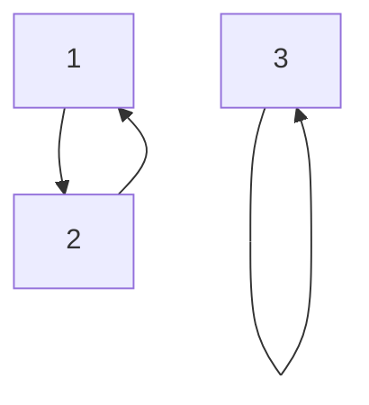
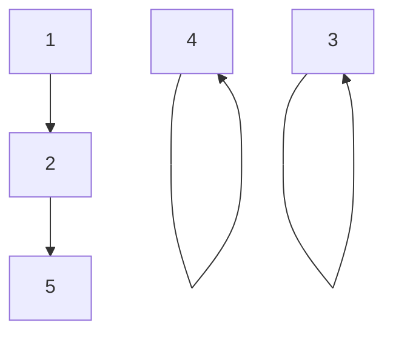

$\newcommand{\K}{\mathbb{K}}\newcommand{\m}[1]{\begin{pmatrix}#1\end{pmatrix}}\newcommand{\ub}[2]{\underset{#2}{\underbrace{#1}}}\newcommand{\R}{\mathbb{R}}\newcommand{\id}{\text{id}}\newcommand{\eps}{\varepsilon}\newcommand{\cases}[1]{\begin{cases}#1\end{cases}}\newcommand{\rcases}[1]{\begin{rcases}#1\end{rcases}}\newcommand{\N}{\mathbb{N}}\newcommand{\sun}[2]{\overset{#2}{\underset{\begin{matrix}#1\end{matrix}}{\sum}}}\newcommand{\mc}{\mathcal}\newcommand{\ms}{\mathscr}\newcommand{\Z}{\mathbb{Z}}\newcommand{\sub}{\subset}\newcommand{\pron}[2]{\overset{#2}{\underset{\begin{matrix}#1\end{matrix}}{\prod}}}\newcommand{\C}{\mathbb{C}}\newcommand{\align}[1]{\begin{array}{l}#1\end{array}}\newcommand{\tr}{\text{tr}}\newcommand{\dt}[1]{\left|\begin{array}{l}#1\end{array}\right|}\newcommand{\piv}[1]{\underset{\begin{array}{l}#1\end{array}}{=}}\newcommand{\ov}[2]{\overset{#2}{\overbrace{#1}}}\newcommand{\mb}[1]{\begin{matrix}#1\end{matrix}}\newcommand{\com}{\text{com}}$
 
 
> [!info]
> Cours présenté par **M. Déléaval**

Dans tout ce chapitre, $E$ désigne un $\K$-espace vectoriel de dimension finie non-nulle.

# I - Le groupe symétrique

## 1. Définition

Soit $n \in \N^*$. 
- On note $S_n$ l'ensemble des bijections de $\{1, ..., n\}$ dans $\{1, ..., n\}$
- Une telle bijection est aussi appelée **permutation**.

### 1.1. Restriction

Par ailleurs:
- Si $n=1, S_1=\{\id\}$.

Ainsi, dans toute la suite du chapitre, on supposera que $n≥2$.

### 1.2. Loi de composition

On note $\circ$ la loi de composition des fonctions.
- C'est une loi de composition interne sur $S_n$
- c'est-à-dire une application de $S_n \times S_n$ dans $S_n$

## 2. Proposition / Définition

$(S_n, \circ)$ est un groupe, de cardinal $n!$.
- On l'appelle **groupe symétrique.**

### 2.1. Preuve

*Fait en méthodologie*
**Moralement**:
- $« \circ »$ est associative,
	- $\forall f \in S_n, \forall g \in S_n, \forall h \in S_n$
	- $(f\circ g) \circ h = f \circ (g \circ h)$
- $S_n$ possède un **unique** élément neutre, $\id$
	- $\forall f \in S_n, f \circ \id = \id \circ f = f$
- Tout élément de $S_n$ possède un **unique** inverse.
	- $\forall f \in S_n$, $\exists g \in S_n (g = f^{-1})$
	- tel que $f\circ g = g \circ f = \id$

## 3. Exemples de permutations

Voici 2 exemples fondamentaux de permutations:

### 3.1. Transposition

Soit $i,j$ deux éléments distincts dans $\{1, ..., n\}$
- L'application $\tau$ donnée par: $\cases{\tau(i) = j \\ \tau(j) = i \\ \forall x \in \{1, ..., n\}\backslash \{i,j\}, \tau(x)=x}$
est une permutation.

> [!tips]
> C'est même une involution c'est-à-dire $\tau \circ \tau = \id$

Appelée **transposition** et elle est notée $(i,j)$.

### 3.1.1. Exemple

Exemple de transposition de $(1,2)$ sur $S_3$

### 3.2. Les $p$-cycles

> [!info]
> Les transposition sont un cas particulier de cette permutation.

Soit $p \in \{2, ..., n\}$
- Soit $a_1, ..., a_p$ $p$ éléments de $\{1, ..., n\}$ 2 à 2 distincts.
- L'application $\sigma$ donnée par : $\cases{\forall i \in \{1, ..., p-1\}, & \sigma(a_i)=a_{i+1} \\ & \sigma(a_p) = a_1 \\ \forall x \in \{1, ..., n\}  \backslash \{a_1, ..., a_p\}, & \sigma(x) = x}$
est une permutation. 
On l'appelle **$p$-cycle** (alternativement, **cycle de longueur $p$**) et on la note $(a_1, ..., a_p)$

> [!check]
> Un **2-cycle** est une transposition. On consacre quand même une terminologie spécifique pour la transposition.

### 3.3. Remarques

1.  La transposition $(i,j)$ est la même chose que $(j,i)$
	- La transposition $(1,2)$ est la même chose que $(2,1)$
2. $(i,j)^{-1} = (j,i) = (i,j)$ 
	- rejoint le fait qu'il s'agit d'une involution
3. $(a_1, ..., a_p) = (a_2, a_3, ..., a_p, a_1) = ... = (a_p, a_1, ..., a_{p-2}, a_{p-1})$ 
	- En d'autres terme, on peut décaler comme on veut.
4. $(a_1, ..., a_p)^{-1} = (a_p, a_{p-1}, ..., a_1)$

### 3.4. Exemples

1. $S_2 = \{\id, (1,2)\}$
2. $S_3 = \{\id, (1,2), (1,3), (2,3), (1,2,3), (1,3,2)\}$

> [!warn]
> On pourrait penser à tort que dans un groupe symétrique il n'y a que des $p$-cycles et l'identité. 
> Mais pour $n ≥ 4$ il existe des éléments autres que des $p$-cycles,
> - Par exemple, il y a des composées de $p$-cycles.

Dans $S_6$, la permutation:
- $\sigma(1) = 6$
- $\sigma(2) = 5$
- $\sigma(3) = 2$ n'est pas un $p$-cycle
- $\sigma(4)=4$ $(\sigma = (1,6) \circ (2,5,3))$
- $\sigma(5) = 3$
- $\sigma(6) = 1$

## 2. Quelques propriétés

... des groupes symétriques

> [!info]
> Dans toute la suite du chapitre, on adoptera la convention suivante:
> - Si $\sigma$ et $\tau$ sont deux éléments dans $S_n$
> 	- Leur composée $\sigma \circ \tau$ sera notée $\sigma \tau$
> 	- On parlera par ailleurs de produit des permutations $\sigma$ et $\tau$.

### 2.1. Proposition

$S_n$ est commutatif si et seulement si $n ≤ 2$.

#### 2.1.1 Preuve

- $S_1=\{\id\}$ et $S_2 = \{\id, (1,2)\}$ sont bien évidemment commutatifs.
- Si $n ≥ 3$
	- **D'une part**,
		- $(1,2)(1,3) = (1,3,2)$
	- **D'autre part** $(≠)$
		- $(1,3)(1,2)=(1,2,3)$

### 2.2. Propriété

**Remarquons la chose suivante**:
- Le $p$-cycle $(a_1, ..., a_p)$
- Il peut se décomposer comme suit en produit de $p-1$ transposition:
	- $(a_1, ..., a_p) = (a_1, a_2)(a_2, a_3)...(a_{p-2}, a_{p-1})(a_{p-1}, a_p)$

On a en fait un résultat plus général se trouvant dans la section suivante.

### 2.3. Théorème

Toute permutation de $S_n$ peut se décomposer en produit d'au plus $n-1$ transpositions.

#### 2.3.1. Preuve

On démontre ce résultat par récurrence sachant que pour $n=2$ c'est évident.
- On suppose que toute permutation de $S_n$ se décompose en produit d'au plus $n-1$ transpositions.

Soit $\sigma \in S_{n+1}$. Notons $i = \sigma(n+1)$
- Si $i = n+1,$ 
	- c'est-à-dire si $\sigma$ laisse fixe $n+1$,
	- Alors $\sigma\backslash\{1,...,n\}\in S_n$ et d'après H.R,
	- $\sigma$ se décompose en produit d'au plus $n-1 ≤ n$ transpositions.
- Si $i ≠ n+1$
	- Posons $\sigma' = (i, n+1)\sigma$
	- Alors $\sigma'(n+1) = n+1$ et comme précédement
	- $\sigma'$ se décompose en produit d'au plus $n-1$ transpositions
		- D'où $\sigma = (i, n+1)^{-1}\sigma' = (i, n+1)\sigma'$ se décompose en produit d'au plus $n$ transposition.

$\square$
#### 2.3.2 Exemple (à chercher)

L'application $\sigma: \cases{\{1, ..., n\} \to \{1, ..., n\} \\ i \mapsto n+1-i}$ 
- est une permutation
- *et une involution*

Une décomposition de produit de transpositions est:
- $\sigma = \cases{(1, n) ... (p, p+1) \text{ si }n=2p \\ (1,n) ... (p-1, p+1) \text{ si }n=2p-1}$

---
*Brouillon*

$\sigma(1)=n, \sigma(2)=n=1...$ 

**Montrons qu'il s'agit d'une involution**
$\sigma(i) \circ \sigma(i) = n+1 - (n+1 - i) = i$
Il s'agit bien d'une involution.

**Trouvons la décomposition**
$\sigma = \m{1 & \cdots & n \\ n & ... & 1}$

**Cas 1 - $n$ est pair**
Notons $n \equiv 0[2] \iff \exists p \in \N / n = 2p$
$(1,2p)(2,2p-1)...(2p,1)$
Par symétrie des transpositions, on peut supprimer la redondance (il y a symétrie)
- $(1,2p)(2,2p-1)...(p, p+1)$

**Cas 2 - $n$ est impair**
Notons $n \equiv 1[2] \iff \exists p \in \N / n = 2p+1$
$(1,2p)(2,2p-1)...(2p+1,1)$
Par symétrie des transpositions, on peut supprimer la redondance (il y a symétrie)
- $(1,2p)(2,2p-1)...(p-1, p+1)$

On retrouve:
- $\sigma = \cases{(1, n) ... (p, p+1) \text{ si }n=2p \\ (1,n) ... (p-1, p+1) \text{ si }n=2p-1}$

--- 

## 3. Signature

### 3.1. Définition - Inversion

Soit $(i,j)$ deux éléments dans $\{1, ..., n\}$ et soit $\sigma \in S_n$. 
On dit que le couple $(i,j)$ est une **inversion de $\sigma$**.
- Si $i<j$ et $\sigma(i) > \sigma(j)$.
- Notons $I(\sigma)$ le nombre d'inversions de $\sigma$

> [!check]
> Remarquons que $I(\id)= 0$ 

Avant de donner un exemple de calcul du nombre d'inversions d'une permutation, introduisons une manière pratique de représenter une permutation et très commode pour déterminer le nombre d'inversions. 

Pour représenter une permutation de $S_n$, on peut écrire sur une ligne tous les entiers de $1$ jusqu'à $n$ et, sur une ligne dessous, l'image de chacun de ces entiers par $\sigma$.

Par exemple, dans $S_6$, la permutation donnée par:
- $\sigma(1) = 3$
- $\sigma(2) = 4$
- $\sigma(3) = 6$
- $\sigma(4) = 5$
- $\sigma(5) = 2$
- $\sigma(6) = 1$

Peut s'écrire:

$\sigma = \m{1 & 2 & 3 & 4 & 5 & 6 \\ 3 & 4 & 6 & 5 & 2 & 1}$ ($= (1,3,6)(2,4,5)$)

Pour déterminer le nombre d'inversions, il suffit de compter pour chacun des entiers de la seconde ligne le nombre d'entiers qui le suivent et qui sont strictement plus petits puis de sommer ces nombres. 

Ici, $I(\sigma)=2+\color{red}2+\color{blue}3+\color{orange}2+\color{green}1$ $=10$
- Les couples d'inversions étant:
	- $(1,5)(1,6)$
	- $\color{red}(2,5)(2,6)$
	- $\color{blue}(3,4)(3,5)(3,6)$
	- $\color{orange}(4,5)(4,6)$
	- $\color{green}(5,6)$

### 3.2. Définition - Signature

On appelle **signature de $\sigma$** le réel, noté $\eps(\sigma)$ donné par $\eps(\sigma) = (-1)^{I(\sigma)}$
- Toute permutation est dite **paire** si $\eps(\sigma)=1$ 
- et elle est dite **impaire** si $\eps(\sigma) = 1$

### 3.3. Proposition - Signature de transposition

Toute transposition dans $S_n$ a pour signature $-1$. 

#### 3.3.1. Preuve

Soit $i,j$ deux éléments distincts dans $\{1, ..., n\}$
- Sans faire de généralités, on peut supposer que $i<j$
Les inversions de la transposition $(i,j)$ sont les couples:
- $(i,j)$
- $(i,k)$ et $(k,j)$ avec $i<k<j$

> [!check]
> Entre $i < k < j$ il y a $j-i-1$ élément ($j-i+1$ si c'était des inégalités larges)

Au nombre de $1+2(j-i-1)=2(j-i)-1$

$\square$

## 3.4. Théorème

Soit $\sigma \in S_n$ et $\tau \in S_n$
- Alors $\eps(\sigma\tau)=\eps(\sigma)\eps(\tau)$

### 3.4.1. Remarques

1. La signature est un morphisme $(S_n, \circ)$ dans le groupe $(\{±1\}, \times)$
2. Soit $\sigma \in S_n$ alors $\eps(\sigma^{-1}) = \eps(\sigma)$.
	- En effet : on a $\sigma\sigma^{-1}=\id$ donc $\eps(\sigma \sigma^{-1}) = \sigma(\id)$ c'est-à-dire:
		- $\eps(\sigma)\eps(\sigma^{-1}) = 1$ d'où $\eps(\sigma)=\eps(\sigma^{-1})$

#### 3.4.2. Preuve

> [!check]
> À omettre en 1ère lecture

Notons $A = \{(i,j) \in \{1, ..., n\} \times \{1, ..., n\}:i<j\}$
- que l'on décompose en les 4 parties 2 à 2 disjoints suivants. 

$A_1 = \{(i,j) \in A : \tau(i) < \tau(j)$ et $\sigma(\tau(i))<\sigma(\tau(i))\}$ 
$A_2 = \{(i,j)\in A : \tau(i) < \tau(j)$ et $\sigma(\tau(i)) > \sigma(\tau(j))\}$
$A_3 = \{(i,j)\in A : \tau(i) > \tau(j)$ et $\sigma(\tau(i)) < \sigma(z(j))\}$
$A_4 = \{(i,j)\in A :\tau(i) > \tau(j)\}$ et $\sigma(\tau(i)) > \sigma(\tau(j))\}$

de cardinaux respectivement notés $n_1, n_2, n_3, n_4$
- Bien évidemment,
	- $I(\tau) = n_3+n_4$
	- $I(\sigma \tau) = n_2 + n_4$

Soit les applications:
- $f:\cases{A_2 \to f(A_2) \\ (i,j) \mapsto (\tau(i), \tau(j))} = \{(k,l)\in A : \tau^{-1}(l)$ et $\sigma(k)>\sigma(l)\}$
- $g:\cases{A_3 \to g(A_3) \\ (i,j) \mapsto (\tau(j)), \tau(i)} = \{(k,l)\in A : \tau^{-1}(k) > \tau^{-1}(l)$ et $\sigma(k)>\sigma(l)\}$

Les images de ces 2 applications bijectives sont 2 ensembles disjoints dont la réunion est l'ensemble des inversions de $\sigma$
- Donc $I(\sigma) = n_2 + n_3$
Par conséquent, 
- $\eps(\sigma)\eps(\tau)=(-1)^{I(\sigma)}(-1)^{I(\sigma)+I(\tau)} = (-1)^{2n_3+n_2+n_4}$
- $= (-1)^{2n_3}(-1)^{n_2+n4}$
- $= (-1)^{I(\sigma \tau)}$
- $= \eps(\sigma \tau)$

$\square$

### 3.4.3. Corollaire

Si $\sigma = \tau _1, ..., \tau_p$ est une décomposition de $\sigma$ en produit de $p$ transpositions, alors $\eps(\sigma) = (-1)^p$
- En particulier, la signature d'un $p$-cycle vaut $(-1)^{p-1}$.

> [!tips]
> On sait que la signature d'un produit est le produit de signatures et qu'un $p$-cycle est une composition de transpositions et que la signature d'une transposition est $-1$.
## 4. Le groupe alterné

### 4.1. Définition

L'ensemble des permutations paires de $S_n$ est appelé **groupe alterné**. 
- On le note $A_n$.

#### 4.1.1. Remarque

La terminologie **groupe** est justifiée car $A_n$ est le noyaux car $A_n$ est le noyau du morphisme signature.

#### 4.1.2 Exemples

1. $A_2 = \{\id\}$ 
2. $A_3 = \{\id, (1,2,3), (1,3,2)\}$

### 4.2 Proposition 

Soit $\tau \in S_n$ une permutation impaire.
- L'ensemble des permutations impaires est:
	- $A_n\tau = \{\sigma \tau, \sigma \in A_n\}$
	- En particulier, $A_n$ a pour cardinal $\frac{n!}2$

#### 4.2.1 Preuve

- D'une part, 
	- Soit $\sigma \in A_n$. 
		- Alors $\eps(\sigma \tau) = \ub{\eps(\sigma)}{=1}\ub{\eps(\tau)}{=-1}=-1$
		- Donc $\sigma \tau$ est impaire.
- Réciproquement, soit $\sigma$ une permutation impaire.
		- Écrivons $\sigma=\ub{(\sigma\tau^{-1})}{\in A_n (*)}\tau$
		- $(*)$ car $\eps(\sigma \tau^{-1})=\eps(\sigma)\eps(\tau)=1$

# II - Applications $p$-linéaires

Dans cette section, $p$ désigne un entier naturel non-nul et $F$ désigne un $\K$-espace vectoriel (pas forcément en dimension finie).

## 1. Définition

Une application $f:\ov{E\times ... \times E}{p \text{ fois}} \to F$  est dite **$p$-linéaire** si pour tout $(u_1, ..., u_p) \in E^p$  et tout $i \in \{1, ..., p\}$ l'application $\align{E \to F \\ x \mapsto f(u_1, ..., u_{i-1}, x, u_{i+1}, ..., u_p)}$ est linéaire. 

### 1.1 Terminologie

Dans le cas où:
- $p=2$
	- on dira plutôt **bilinéaire**
- $p=3$
	- on dira plutôt **trilinéaire**
Dans le cas où $F=\K$
- On dira plutôt **forme $p$-linéaire**.

### 1.2 Exemples

1. Les applications $1$-linéaires sont les applications linéaires (vues en L1)
2. L'application : $f:\align{\R^2 \times \R^2 \to \R \\ ((x_1, y_1), (x_2, y_2)) \mapsto x_1x_2 + y_1y_2}$ est une forme bilinéaire
	- Pour montrer qu'il s'agit d'une forme bilinéaire,
		- $\forall \lambda \in \R, \forall (x_1, y_1) \in \R^2, \forall (x_1', y_1')\in\R^2, \forall (x_2, y_2) \in \R^2$
			- $f(\lambda(x_1, y_1)+(x_1', y_1'), (x_2, y_2)) = \lambda f((x_1, y_1), (x_2, y_2)) + f((x_1', y_1'), (x_2, y_2))$
		- $\forall \lambda \in \R, \forall (x_1, y_1) \in \R^2, \forall (x_2, y_2) \in \R^2, \forall (x_2', y_2') \in \R^2$
			- $f((x_1, y_1), \lambda(x_2, y_2)+(x_2', y_2')) = \lambda f((x_1, y_1), (x_2, y_2))+f((x_1, y_1), (x_2', y_2'))$
	- **Exemple**
		- L'application $f:\align{\mc{C}^0([0,1], \R) \times \mc{C}^0([0,1], \R) \to \R \\ (g,h) \mapsto \int^1_0 g(x)h(x) dx}$ est une forme bilinéaire

## 2. Expression d'une application $p$-linéaire en dimension finie

> [!info]
> **Rappel** - $E$ désigne un $\K$-espace vectoriel de dimension finie non nulle notée $n$. 
> Par définition, admet une base. Notons $(e_1, ..., e_n)$ une base de $E$.

### 2.1 Proposition

Soit $f:E^p \to F$ une application $p$-linéaire.
- Soit $u_1, ..., u_p$ $p$ vecteurs de $E$ tels que:
	- $\forall j \in \{1, ..., p\}, u_j=\sum^n_{i=1}a_{i,j}e_i$ (se décompose dans la base)
- Alors, on a:
	- $f(u_1, ..., u_p) = \underset{(i_1, ..., i_p)\in \{1, ..., n\}^p}\sum a_{i_1, 1}, ..., a_{i_p, p}f(e_{i_1}, ..., e_{i_p})$  

> [!tips]
> En d'autre terme, linéarisation selon une décomposition de la base.
#### 2.1.1 Preuve

On procède par récurrence sur l'entier $p ≥ 1$.

**Initialisation**
- Soit $f:E\to F$ une application $1$-linéaire (i.e une application linéaire)
	- Soit $u_1 = \sum_{i=1}^n a_{i,1}e_i$
	- Alors, $f(u_1) = f(\sum^n_{i=1}a_{i,1}a_{i,1}e_i) \ub{=}{*}\sum^n_{i=1}a_{i,1}f(e_i)$
		- $(*)$ : linéarité

**Hérédité**
On suppose la formule vérifiée pour un certain $p≥1$.
Soit $f:E^{p+1}\to F$ une application $(p+1)$-linéaire.
- Soit $u_1, ..., u_{p+1}$ $(p+1)$-vecteurs de $E$ tels que:
	- $\forall j \in \{1, ..., p+1\}, u_1 = \sum^n_{i=1}a_{i,j}e_i$
	- Écrivons alors,
		- $f(u_1, ..., u_p, \sum^n_{i_{p+1}=1}a_{i_{p+1}, i_{p+1}}e_{i_{p+1}}) \ub{=}{(*)}=\sum_{i_{p+1}}^n a_{i_{p+1}, p+1}f(u_1, ..., u_{p, e_{i_{p+1}}})$ 
			- $(*)$ : linéarité par rapport à la $(p+1)$-ième variable
		- Pour tout $i_{p+1}\in\{1, ..., n\}$ l'application $\align{E^p \to F \\ (x_1, ..., x_p) \mapsto f(x_1, ..., x_pe_{i_{p+1}})}$
			- est $p$-linéaire donc H.R assure que:
				- $f(u_1, ..., u_{p, e_{i_{p+1}}}) = \sum_{(i_1, ..., i_p) \in \{1, ..., n\}^p}=a_{1,p}...a_{i_p, p}f(e_1, ..., e_{i_p}, e_{i_{p+1}})$ 
			- En revenant à $(*)$, on peut alors écrire:
				- $f(u_1, ..., u_{p+1}) = \sum^n_{i_{p+1}=1}a_{i_{p+1}, p+1}\sum_{(i_1, ..., i_p) \in \{1, ..., n\}^{p}}a_{i, 1}... a_{i_p, p}f(e_{i_1}, ..., e_{i_{p+1}})$ 
				- $f(u_1, ..., u_{p+1}) = \sum_{(i_1, ..., i_{p+1}) \in \{1, ..., n\}^{p+1}}a_{i_1, 1} ... a_{i_{p+1}, p+1}f(e_1, ..., e_{i_{p+1}})$

$\square$

### 2.1.2 Information additionnelle

Notons réciproquement que si $\{y_{i_1, ..., i_p}\}_{(i_1, ...,i_p)\in\{1, ..., n\}^p}$ est une famille de vecteurs de $F$, alors l'application:
- $E^p \to F$

$\left(\sum^n_{i=1}a_{i,1}e_i, ..., \sum^n_{i=1}a_{i,p}e_i\right) \mapsto \sum_{(i_1, ..., i_p)\in \{1, ..., n\}^p}a_{i_1, 1}... a_{i_p, p}y_{i_1, ..., i_p}$ est une application $p$-linéaire.

## 3. Application $p$-linéaires alternées

### 3.1 Définition

Soit $f:E^p \to F$ une application $p$-linéaire. 
- Elle est dite **alternée** si pour tout $(u_1, ..., u_p)\in E^p$ et tout $i≠j$:
	- $u_i = u_j \Rightarrow f(u_1, ..., u_p) = 0_F$

### 3.2 Proposition

Soit $f:E^p \to F$ une application $p$-linéaire alternée. 
- Alors, $f$ est **antisymétrique**, c'est-à-dire:
	- Pour tout $(u_1, ..., u_p) \in E^p$ et pour tout $i<j$:
		- $f(u_1, ..., u_i, ..., u_j, ..., u_p) = -f(u_1, ..., u_j, ..., u_i,..., u_p)$

> [!check]
> La réciproque est vraie. (alternée $\iff$ antisymétrique)

### 3.2.1 Preuve

Notons $g:\align{E \times E \to F \\ (x,y) \mapsto f(u_1, ..., \ub{x}{(1)}, ..., \ub{y}{(2)}, u_p)}$
- $(1)$ : en $i$-ème position
- $(2) :$ en $j$-ième position.

Est une application linéaire.
- $\forall x \in E, g(x,x)=0$ car $f$ est alternée.

On va montrer que pour tout $(x,y)\in E^2, g(x,y) = -g(y,x)$

Soit alors, $x \in E, y \in E$. Écrivons:
- $0=g(x+y, x+y)\ub{=}{(*)}g(x, x+y)+g(y, x+y) = \ub{=}{(**)} g(x,x)+g(x,y)+g(y, x) + g(y, y)$
	- $(*)$ : linéarité par rapport à la première variable
	- $(**)$ : linéarité par rapport à la deuxième variable
- On obtient ainsi:
	- $g(x,y) + g(y,x) = 0$
	- $g(x,y) = -g(y,x)$

$\square$

### 3.3 Proposition

Soit $f:E^p \to F$ une application $p$-linéaire alternée. 
Soit $\{u_1, ..., u_p\}$ une famille liée de vecteurs de $E$.
- Alors, $f(u_1, ...,u_p)=0$

### 3.3.1 Preuve

Par hypothèse, il existe $i \in \{1, ..., p\}$ tel que:
- $u_i = \overset{n}{\underset{\begin{matrix}k = 1 \\ k ≠ 1\end{matrix}}{\sum}}\lambda_k u_k$  avec  les $\lambda_k$ scalaire . 
Alors, $f(u_1, ..., u_{i-1}, \sun{k = 1 \\ k ≠ 1}{p}\lambda_ku_k, u_{i+1}, ..., u_p) \ub{=}{(*)} \sun{k = 1 \\ k≠1}{p}f(u_1, ..., u_{i-1}, u_k, u_{i+1}, ..., u_p)$
- Or, pour tout $k \in \{1, ..., p\} \backslash \{i\}$ la famille $\{u_1, ..., u_{i-1}, u_k, u_{i+1}, u_p\}$
	- A (au moins) deux vecteurs identiques, donc puisque $f$ est alterné:
		- $f(u_1, ..., u_{i-1}, u_k, u_{i+1}, ..., u_p) = 0$
	- Et le résultat s'en déduit.

$\square$

> [!info]
> On en déduit le corollaire suivant.
### 3.3.2 Corollaire

Soit $f:E^p \to F$ une application $p$-linéaire alternée.
- Soit $(u_1, ..., u_p) \in E^p$.
- Le vecteur $f(u_1, ..., u_p)$ est inchangé si l'on ajoute à l'un des $u_i$ de combinaison linéaire des autres $\{u_k\}_{k≠i}$

#### 3.3.2.1 Preuve

Soit $x$ une combinaison linéaire des $\{u_k\}_{k≠i}$.
Alors:
- $f(u_1, ..., u_{i-1},u_i+x, u_{i+1}, ..., u_p) \ub{=}{(*)}=f(u_1, ..., u_p) + \ub{f(u_1, ..., u_{i-1}, x, u_{i+1}, ..., u_p)}{(**)}$
	- $(*)$ : linéarité par rapport à la première variable
	- $(**)$ : $= 0$ d'après la proposition précédente.

$\square$

## 4. Expression d'une application $n$-linéaire alternée en dimension $n$

Soit $f:E^n \to F$ une application $n$-linéaire alternée. 
- Soit $(u_1, ..., u_n) \in E^n$
- Puisque $f$ est en particulier antisymétrique, on peut écrire pour tout:
	- $\tau \in \mc{S}_n : f(u_{\tau(1)}, ..., u_{\tau(n)}) = -f(u_1, ..., u_n)$ 
	- $\phantom{\tau \in \mc{S}_n : f(u_{\tau(1)}, ..., u_{\tau(n)})} = \eps(\tau)f(u_1, ..., u_n)$ (signature)

> [!check]
> Puisque toute permutation se décompose en produit de transpositions et que la signature d'un produit est le produit des signatures, on en déduit alors immédiatement le résultat suivant. 

### 4.1 Proposition

Soit $f:E^n \to F$ une application $n$-linéaire alternée. 
Pour tout $\sigma \in S_n$ et tout $(u_1, ..., u_n) \in E^n$, on a:
- $f(u_{\sigma(1)}, ..., u_{\sigma(n)}) = \eps(\sigma)f(u_1, ..., u_n)$

> [!info]
> Rappelons qu'on a noté $\{e_1, ..., e_n\}$ une base de $E$

Soit $u_1, ..., u_n$ $n$ vecteurs de $E$ tels que:
- $\forall j \in \{1, ..., n\}, u_j = \sun{i=1}na_{i,j}e_i$

D'après la proposition de **II - 2**, on a:
$f(u_1, ...,u_n)=\sun{(i_1, ..., i_n) \in \{1, ..., n\}^n}{} a_{i_1, 1}....a_{i_n, n}f(e_{i_1}, ..., e_{i_n})$
 $\phantom{f(u_1, ...,u_n)} = \sun{\sigma \in \{1, ..., n\}^{\{1, ..., n\}}}{}a_{\sigma(1),1}...a_{\sigma(n), n}f(e_{\sigma(1)}, ..., e_{\sigma(n)})$
$\phantom{f(u_1, ...,u_n)} = \sun{\sigma \in S_n}{} a_{\sigma(1), 1} ... a_{\sigma(n), n}f(e_{\sigma(1)}, ..., e_{\sigma(n)})$ 

Cette dernière égalité, venant du fait que si $\sigma \in \{1, ..., n\} \to \{1, ..., n\}$ est non-bijective - (i.e $\notin \mc{S}_n$)

Venant du fait que si $\sigma \in \{1, ..., n\} \to \{1, ..., n\}$ est non-bijective alors $\{e_{\sigma(1), ..., e_{\sigma(n)}}\}$ a (au moins) deux vecteurs égaux, donc $f(e_{\sigma}(1), ..., e_{\sigma(n)}) = 0$

Par conséquent,
$f(u_1, ..., u_n) = \sun{\sigma\in \mc{S}_n}{}\eps(\sigma)a_{\sigma(1),1}... a_{\sigma(n), n}f(e_1, ..., e_n)$
$\phantom{f(u_1, ..., u_n)} = \boxed{\sun{\sigma \in \mc{S}_n}{}\eps(\sigma)\prod^n_{i=1}a_{\sigma(i), i}f(e_1, ..., e_n)}$

# III - Déterminant

Signalons pour commencer cette section que l'ensemble des applications $p$-linéaires est non-vide et stable par combinaison linéaire.
- C'est donc un sous-espace vectoriel des $\K$-espaces vectoriels $\mathscr{F}(E^p, F)$.

En particulier, l'ensemble des formes $p$-linéaires alternées sur $E^p$ est un $\K$-espace vectoriel 
- qu'on notera $\wedge^{*p}(E)$
## 1. Formes $n$-linéaires alternées sur un espace de dimension $n$

### 1.1 Théorème

Soit $B = \{e_1, ..., e_n\}$ une base de $E$
1. Il existe une unique forme $n$-linéaire alternée $\phi_0$ telle que $\phi_0(e_1, ..., e_n)=1$. 
	- On note $\phi_0(e_1, ..., e_n) = \phi_0(B)=1$
2. Toute forme $n$-linéaire alternée sur $E^n$ est proportionnelle à $\phi_0$.
	- En particulier, $\wedge^{*n}(E)$ est de dimension $1$.

### 1.1.1 Preuve

*En fin de semestre, vraisemblablement longue et difficile (45 min à prévoir)*
*Preuve admise provisoirement*

## 2. Diverses notions de déterminant

### 2.1 Déterminant de famille de vecteurs dans une base

#### 2.1.1 Définition

Soit $B$ une base de $E$. Notons $\phi_0$ l'unique forme $n$-linéaire alternée telle que $\phi_0(B)=1$.
Soit $\{u_1, ..., u_n\}$ une famille de vecteurs de $E$.

On appelle **déterminant de la famille $\{u_1, ..., u_n\}$** dans la base $B$ (ou par rapport à la base $B$)
- le scalaire $\phi_0(u_1, ..., u_n)$. 
- On le note $\det_B(u_1, ..., u_n)$

On note, $\det_B:\align{E^n \to \K \\ (u_1, ..., u_n) \mapsto \det(u_1, ..., u_n)}$

Puisque $\det_B$ est un élément non nul de $\wedge^{*n}(E)$ qui est de dimension $1$.
- C'en est une base.

Soit $B'$ une autre base de $E$ et donc:
- $\det_{B'}\in\wedge^{*n}(E)$.

Il existe donc $\lambda \in \K$ tel que:
- $\det_{B'}=\lambda \det_B$ i.e pour tout $(u_1, ..., u_n)\in E^n$
	- $\det_{B'}(u_1, ..., u_n) = \lambda \det_B(u_1, ..., u_n)$

En prenant en particulier, $(u_1, ..., u_n) = B$
- On a $\det_{B'}(B) = \lambda \det_B(B) = 1$
	- Donc pour tout $(u_1, ..., u_n) \in E^n$
- $\det_{B'}(u_1, ..., u_n)\det(B)\det_B(u_1, ..., u_n)$

En prenant, $(u_1, ..., u_n) = B'$ on obtient:
- $\boxed{\det_{B'}(B)\det_B(B')}$

### 2.2. Déterminant d'un endomorphisme

#### 2.2.1 Proposition / Définition

Soit $f \in \mc{L}(E)$. Il existe un unique scalaire $\lambda$ appelé **déterminant** de $f$ tel que:
- Pour toute base $B$ de $E$ et tout $(u_1, ..., u_n) \in E^n$:
	- $\det_B(f(u_1), ..., f(u_n)) = \lambda \det_B(u_1, ..., u_n)$
- On le note $\det(f)$ et il vérifie pour toute base $B$ de $E$:
	- $\det(f) = \det_B(f(B))$

##### 2.2.1.1 Preuve

**Unicité**
- Si $\lambda$ convient et si $B$ est une base de $E$,
	- on a **pour tout** $(u_1, ..., u_n) \in E^n$
		- $\det_B(f(u_1), ..., f(u_n)) = \lambda\det_B(u_1, ..., u_n)$
	- En prenant $(u_1, ..., u_n) = B$, on obtient $\lambda = \det_B(f(B))$
**Existence**
- Soit $B$ une base de $E$. 
	- L'application: $\align{E^n \to \K \\ (u_1, ..., u_n) \mapsto \det_B(f(u_1), ..., f(u_n))}$  
		- est une forme $n$-linéaire alternée sur $\wedge^{*n}(E)$.
		- Or, $\det_B$ est une base de $\wedge^{*n}(E)$
		- donc il existe $\lambda \in \K$ tel que pour tout:
			- $(u_1, ..., u_n) \in E^n$,
				- $\det(f(u_1), ..., f(u_n)) = \lambda \det_B(u_1, ..., u_n)$ $\color{blue}(*)$
- Soit $B'$ une autre base de $E$.
	- Puisque $\det_{B'} \in \wedge^{*n}(E)$  donc $\det_B$ est une base,
		- Il existe $\alpha \in \K$ tel qu $\det_{B'} = \alpha \det_B$.
			- En multipliant $\color{blue}(*)$ par $\alpha$ on obtient:
				- $\alpha \det_B(f(u_1), ..., f(u_n)) = \alpha \lambda \det_B(u_1, ..., u_n)$
				- c'est-à-dire,
					- $\det_{B'}(f(u_1), ..., f(u_n)) = \lambda \det_{B'}(u_1, ..., u_n)$

##### 2.2.1.2 Exemple

1. $\det(\id_E) = 1$
	- Se vérifie avec la formule précédente
	- $\det_B(f(u_1), ..., f(u_n))=\lambda \det_B(u_1, ..., u_n)$
	- $\det_B(u_1, ..., u_n)=\lambda \det_B(u_1, ..., u_n)$
	- $\lambda = 1$
2. Soit $\delta \in \mc{S}_n$  et $\{e_1, ..., e_n\}$ une base de $E$. 
	- On considère l'endomorphisme de $E$ suivant:
		- $f$ donné pour tout $i \in \{1, ..., n\}$
		- $f(e_i) = e_{\sigma(i)}$
	- Alors, $\det(f) = \det_B(f(e_1), ..., f(e_n))$
		- $\det(f) = \det_B(e_{\sigma(1)}, ..., e_{\sigma(n)})$
		- $\det(f) = \eps(\sigma) \det_B(e_1, ..., e_n)$
		- $\det(f) = \eps(\sigma)$

### 2.2.3  Déterminant d'une matrice carrée

#### 2.2.3.1 Définition

On appelle **déterminant** d'une matrice carrée de taille $n$ le déterminant de ses vecteurs colonnes dans la base canonique de $\K^n$. On le note $\det(A)$.

#### 2.2.3.2 Notation

Si $A = (a_{i,j})_{\align{1 ≤ 1 ≤ n \\ 1 ≤ j ≤ n}} \in \ms{M}_n(\K)$
- On notera: $\det(A) = \left| \align{a_{1,1} & \cdots & \cdots & a_{1, n} \\ \vdots & \ddots & a_{i,j} & \vdots \\ \vdots & & \ddots & \vdots \\ a_{n,1} & \cdots & \cdots & a_{n,n} }\right|$    

### 3. Proposition

Soit $A = (a_{i,j})_{\align{1 ≤ i ≤ n \\ 1 ≤ j ≤ n}} \in \ms{M}_n(\K)$  
- Alors $\boxed{\det(A) = \sun{\delta \in \mc{S}_n}{} \eps(\delta)\prod^n_{i=1}a_{\delta(i), i}}$ 

### 3.1 Preuve

Faite à la section précédente (II. 4)

### 3.2 Exemple

$\mb{a_{1,1} & a_{1,2} \\ a_{2,1} & a_{2,2}} = \sun{\delta \in \ms{2}}{}\eps(\delta)\prod^{2}_{i=1}a_{\delta(i), i}$
$\phantom{\mb{a_{1,1} & a_{1,2} \\ a_{2,1} & a_{2,2}}} = \eps(\id)a_{\id(1), 1}a_{\id(2),2} + \eps((1,2))a_{(1,2)(1),1}a_{(1,2)(2), 2}$
$\phantom{\mb{a_{1,1} & a_{1,2} \\ a_{2,1} & a_{2,2}}} = a_{1,1}a_{2,2} - a_{2,1}a_{1,2}$

> [!info]
> La proposition ci-dessus donne le corollaire immédiat suivant:

### 3.3 Corollaire

1. Soit $B$ une base de $E$ et $\{u_1. ..., u_n\}$ une famille de vecteurs de $E$. 
	- On note $A$ la matrice  des composants de $\{u_1, ..., u_n\}$ dans la base $B$.
		- Alors $\det_B(u_1, ..., u_n)= \det(A)$
2. Soit $f \in \mc{L}(E)$ et $B$ une base de $E$. 
	- On note $A$ la matrice de $f$ dans la base $B$.
		- Alors $\det(f) = \det(A) = \det_B(f(B))$

#### 3.3.1 Exemple

Soit $D \in \ms{M}_n(\K)$ une matrice diagonale,
- on note $\lambda_1, ..., \lambda_n$ les éléments diagonaux
	- $\det(D) = \prod^n_{i=1}\lambda_i$
- En effet,
	- $D$ est la matrice de la famille $\{\lambda_1e_1, ..., \lambda_ne_n\}$ dans la base $\{e_1, ..., e_n\}$
	- Donc,
		- $\det(D) = \det_B(\lambda_1e_1, ..., \lambda_n e_n)\ub{=}{(*)} \prod^n_{i=1}\lambda_i \ub{\det_B(e_1, ..., e_n)}{=1}$
		- $(*)$ :Par $n$-linéarité *(linéarité par rapport à toutes les variables)

## 4. Propriétés des déterminants

### 4.1 Théorème

Soit $B$ une base de $E$.
- Soit $u_1, ..., u_n$ $n$ vecteurs de $E$. 
- On a équivalence entre:
	1. $\{u_1, ..., u_n\}$ est une base de $E$
	2. $\det_B(u_1, ..., u_n) ≠ 0$

> [!check]
> Je suis une base ssi mon déterminant est non-nul.

#### 4.1.1 Preuve

$(\Rightarrow)$ Commençons par supposer que $B' = \{u_1, ..., u_n\}$ est une base de $E$. 
- D'après la formule:
	- $\det_B(B')\det_{B'}(B) = 1$ vue dans **III. 2**
	- On a alors $\det_B(B')≠0$

$(\cancel \Rightarrow)$ Supposons maintenant que $\{u_1, ..., u_n\}$ n'est pas une base de $E$.
- Cette famille de $n$ vecteurs est donc liée.
	- Donc d'après **II. 3**
	- $\det_B(u_1, ..., u_n) = 0$

$\square$
## 5. Proposition

### 5.1 Version endomorphisme

1. Soit $\lambda \in \K$ et $f \in \mc{L}(E)$.
	- Alors $\det(\lambda f) = \lambda^n \det(f)$
2. Soit $f \in \mc{L}(E)$ et $g \in \mc{L}(E)$.
	- Alors $\det(f \circ g) = \det(f)\det(g)$

### 5.2 Version matrice carrée

1. Soit $\lambda \in \K$ et $A \in \ms{M}_n(\K)$.
	- Alors $\det(\lambda A) = \lambda^n \det(A)$
2. Soit $A \in \ms{M}_n(\K)$ et $B \in \ms{M}_n(\K)$
	- Alors $\det(AB) = \det(A)\det(B) = \det(B) \det(A)$

### 5.3 Preuve

#### 5.3.1 Version endomorphisme

Soit $B = \{e_1, ..., e_n\}$ une base de $E$. 
1. On a $\det(\lambda f) = \det_B(\lambda f(e_1), ..., \lambda f(e_n)) \ub{=}{(*)}  \lambda^n \det_B(f(e_1), ..., f(e_n)) = \lambda^n\det(f)$
	- $(*)$ : Par $n$-linéarité on sort les $\lambda$
2. On a $\det(f \circ g) = \det_B(f \circ g(e_1), ..., f \circ g(e_n)) = \det_B(f(g(e_1)), ..., f(g(e_n)))$
	- $= \det(f) \det_B(g (e_1), ..., g(e_n))$
	- $= \det(f) \det(g)$

#### 5.3.2 Version matrice

1. Soit $f$ l'endomorphisme de $\K^n$ canoniquement associé à $A$.
	- Alors $\lambda A$ est la matrice de $\lambda f$ dans la base canonique de $\K^n$
		- on a alors $\det(\lambda A) = \det(\lambda f) = \lambda^n \det(f) = \lambda^n \det(A)$
2. Soit $f$, respectivement $g$ l'endomorphisme de $\K^n$ canoniquement associé à $A$, respectivement à $B$.
	- Alors $AB$ est la matrice de $f \circ g$ dans la base canonique de $\K^n$ et on a alors:
		 - $\det(AB) = \det(f \circ g) = \det(f) \det(g) = \det(A) \det(B)$

$\square$

## 6. Théorème

### 6.1 Version endomorphisme

Soit $f \in \mc{L}(E)$. Alors $f$ est bijectif (un automorphisme) ssi $\det(f) ≠ 0$
- Dans ce cas, on a:
	- $\det(f^{-1}) = (\det(f))^{-1}$

### 6.2 Version matrice

Soit $A \in \ms{M}_n(\K)$. Alors $A$ est **inversible** ssi $\det(A) ≠ 0$
- Dans ce cas, on a:
	- $\det(A^{-1}) = (\det(A))^{-1}$

### 6.3 Preuve

**Version endomorphisme**
Soit $B$ une base de $E$. 
- On sait que $f$ est bijectif si et seulement si $f(B)$ est une base de $E$.
- Donc d'après le 1er théorème de cette sous-section,
	- si et seulement si $\det_B(f(B)) ≠ 0$, 
		- c'est-à-dire si et seulement si $\det(f) ≠ 0$
	- Écrivons alors $\det(\id_E) = \det(f \circ f^{-1}) \ub{=}{(*)}\det(f)\det(f^{-1})$ et le résultat puisque $\det(\id_E)=1$ 
		- $(*)$ : Proposition précédente

**Version matrice**
Soit $f$ l'endomorphisme de $\K^n$ canoniquement associé à $A$. 
- On sait que $A$ est inversible ssi $f$ est bijectif. 
- On sait par ailleurs que $\det(A) = \det(f)$
	- Donc, d'après le 1er thèorème de cette sous-section,
		- $A$ est inversible ssi $\det(A) ≠ 0$
	- Dans ce cas, on écrit:
		- $\ub{\det(I_n)}{(*)} = \det(AA^{-1}) \ub{=}{(**)}\det(A)\det(A^{-1})$
		- $(*)$ : produit des coefficients diagonaux
		- $(**)$ : proposition précédente

$\square$

## 7. Proposition

Le déterminant d'une matrice carrée est une forme $n$-linéaire alternée des lignes de cette matrice. 

### 7.1 Preuve

Soit $A = (a_{i, j})_{\align{1 ≤ i≤n \\ 1 ≤ j ≤ n}} \in \ms{M}_n(\K)$.
La formule $\det(A) = \sun{\sigma \in \ms{S}_n}{} \eps(\sigma)\prod^n_{i=1}a_{\sigma(i), i}$
- prouve que le déterminant est une forme $n$-linéaire de lignes car dans les produits apparaît un seul et un unique terme de chaque ligne (car $\sigma \in \mc{S}_n$)

De plus, elle est alternée car si une matrice possède deux lignes identiques,
- elle est non-inversible et d'après le théorème précédent, son déterminant est nul.

$\square$

### 7.2 Corollaire

Soit $a \in \ms{M}_n{(\K)}$. $\det(A) = \det(^tA)$ 

#### 7.2.1 Preuve

Les applications suivantes:
- $\align{(\ms{M}_{n,1}(\K))^n \to \K \\ (c_1, ..., c_n) \mapsto \det(c_1, ..., c_k)}$  
et,
- $\align{(\ms{M}_{n,1})^n \to \K \\ (c_1, ..., c_n) \mapsto \det\m{^t c_1 \\ \vdots \\ ^t c_n}}$ 
sont toutes 2 $n$-linéaires alternées sur $(\ms{M}_{n,1}(\K))^n$.

Elles sont donc proportionnelles; on a alors l'existence d'un $\lambda \in \K$ tel que pour tout $A \in \ms{M}_n(\K)$:
- $\det(A) = \lambda \det(^t A)$
En posant $A = I_n,$ on obtient $\lambda = 1$

$\square$

#### 7.2.2 Remarque

Cette formule s'écrit:
- $\sun{\delta \in S_n}{}\eps(\sigma)\prod^n_{i=1}a_{\sigma(i), i} = \sun{\sigma \in \ms{S}_n}\eps(\sigma)\prod^n_{i=1}a_{i, \sigma(i)}$ 
on peut la redémontrer en prouvant que pour tout $\sigma \in \mc{S}_n$ on a (à l'ordre près des facteurs)
- $a_{\sigma(1), 1} \cdots a_{\sigma(n), n} = a_{1, \sigma^{-1}(1)} \cdots a_{n, \sigma^{-1}(n)}$

De plus, elle est alternée car si une matrice possède de deux lignes identiques, elle est non inversible et, d'après le théorème précédent, son déterminant.

$\square$

# IV - Applications aux calculs de déterminants

On a vu dans la section précédente que le calcul du déterminant d'une famille de vecteurs dans une base ou que le calcul du déterminant d'un endomorphisme peut se ramener au calcul du déterminant d'une matrice carrée qu'on appellera simplement déterminant.
## 1. Opérations élémentaires sur les lignes ou les colonnes d'un déterminant

Le déterminant d'une matrice carrée étant une forme $n$-linéaire alternée de ses lignes ou de ses colonnes, les propriétés vues sur les formes $n$-linéaires alternée permettant d'énoncer les règles suivantes:

> [!check]
> On a respectivement ligne ou colonne, pas les deux.

1. Si un déterminant a une ligne / colonne exclusivement composée de $0$, il est nul.
2. Si un déterminant a deux 2 lignes / colonnes identiques, il est nul
3. L'échange de deux lignes / colonnes d'un déterminant multiplie ce déterminant par $-1$.
4. Un déterminant dont une ligne / colonne est combinaison linéaire des autres lignes / colonnes est nul.
5. Si l'on ajoute à une ligne / colonne une combinaison linéaire des autres lignes / colonnes, la valeur du déterminant est inchangée.
6. Si l'on multiplie chaque coefficient d'une ligne / colonne d'un déterminant par un scalaire $\lambda$ le déterminant est multiplié par $\lambda$.

### 1.1 Exemple

**Combinaison linéaire**

$\dt{-1 & 3 & 1\\ -1 & 4 & 5 \\ -2 & 5 & 1} = 0$

car $C_3 = 2C_1 + C_2$ par $\fbox4$

## 2. Développement du déterminant suivant une ligne ou une colonne

> [!info]
> Dans cette sous-section, on suppose que $n \in \N \backslash \{0,1\}$.

### 2.1 Proposition

Soit $A=(a_{ij})_{\align{1 ≤ i ≤ n \\ 1 ≤ j ≤ n}} \in \ms{M}_n(\K)$ une matrice de la forme suivante:
- $A = \m{ & \vdots & 0 \\ \Huge{A'} & \vdots & \vdots \\ & \vdots & 0 \\ a_{n,1} & \vdots & a_{n,n}}$  alors $\det(A) = a_{n,n}\det(A')$

En particulier, si $A = (a_{i,j})_{1 ≤ i,j ≤ n} \in \ms{M}_{n}(\K)$  est triangulaire, alors $\boxed{\det(A) = \pron{i=1}n a_{i,,i}}$
#### 2.1.1 Preuve

Écrivons $\det(A) = \sun{\sigma \in \mc{S}_n}{} \eps(\sigma). \pron{i=1}n a_{\sigma(i), i}$
On a par hypothèse, pour tout $\sigma \in \mc{S}_n$ telle que $\sigma(n) ≠ n$
- $a_{\sigma(n), n} = 0$

On simplifie la somme de la manière suivante:
- donc $\det(A) = \left(\sun{\sigma \in \mc{S}_n : \sigma(n) = n}{}\eps(\sigma)\pron{i=1}na_{\sigma(i), i}\right)a_{n,n}$

Or, la restriction de $\{1, ..., n-1\}$ d'une permutation de $\mc{S}_n$ vérifiant $\sigma(n) = n$ est une permutation $s \in \mc{S}_{n-1}$.
- Réciproquement,
	- Toute permutation de $\mc{S}_{n-1}$ peut se prolonger en une permutation $\sigma \in \mc{S}_n$ en posant $\sigma(n) = n$.
- De plus, $\eps(\sigma) = \eps(s)$ car la décomposition en produit de transpositions de l'une donne la même décomposition en produit de transpositions de l'autre. 
- On peut donc écrire $\det(A) = \left( \sun{s \in \mc{S}_{n-1}} \eps(s) \pron{i=1}{n-1}a_{s(i), i}\right)a_{n,n}=a_{n,n}\det(A')$.

Soit $A$ une matrice triangulaire,
- Quitte à transposer et puisque $\det(A) = \det(^tA)$ on peut supposer que $A$ est triangulaire inférieure.
- Il suffit alors de faire une récurrence et d'utiliser le résuoltat que l'on vient de démontrer.

#### 2.1.2 Exemple

Soit $(a,b,c) \in \R^3$
Calculons le déterminant suivant:
- $\dt{1 & a & a^2 \\ 1 & b & b^2 \\ 1 & c & c^2} = \piv{L_2 \leftarrow L_2 - L_1}\dt{1 & a & a^2 \\ 0 & (b-a) & b^2 - a^2 \\ 0 & (c-a) & c^2 - a^2}$  
- $\ub{=}{*} (b-a)(c-a)\dt{1 & a & a^2 \\ 0 & 1 & b+a \\ 0 & 1 & c+a}$
	- $(*)$ : mise en facteur dans $L_2$ par $(b-a)$ et mise en facteur dans $L_3$ par $c-a$.
	- **Rappel** :  Ici, c'est 3 linéaire et on a $\det_B(L_1, \lambda L_2, L_3) = \lambda\det_B(L_1, L_2', L_3)$
- $\piv{L_3 \leftarrow L_3 - L_2} (b-a)(c-a)\ub{\dt{1 & a & a^2 \\ 0 & 1 & b+a \\ 0 & 0 & c-b}}{(**)}$
	- $(**)$ : triangulaire $= c-b$
- $= (b-a)(c-a)(c-b)$

### 2.2 Définitions - Mineur et cofacteur

Soit $A = (a_{ij})_{1 ≤ i,j ≤ n} \ms{M}_n(\K)$
Pour tout $(i,j)\in\{1, ..., n\} \times \{1, ..., n\}$, on appelle:
1. **Mineur** $a_{ij}$ le déterminant obtenu à partir de $A$ en supprimant sa $i$-ème ligne et sa $j$-ième colonne.
	- On le note $\Delta _{i,j}$
2. **Cofacteur** de $a_{ij}$ le scalaire 
	- $(-1)^{i+j}\Delta{i,j}$

#### 2.2.1 Exemple

Soit $A = \m{\color{red}a\color{0} & b & \boxed{c} \\ \boxed{\color{red}d} \color{0}& \boxed{e} & \boxed{f} \\ \color{red}g\color{0} & h & \boxed{i}]} \in \ms{M}_3(\R)$
- le mineur de $f$ est $\dt{a & b \\ g & h} = ah - gh$
- Le cofacteur de $(-1)^{2+1}\dt{b & c \\ h & i} = -(bi - ch)$

### 2.3 Théorème

#### 2.3.1  - Développement du déterminant suivant la $j$-ième colonne

Soit $A = (a_{ij})_{1 ≤ i,j ≤ n} \in \ms{M}_{n}(\K)$. 
- Pour tout $j \in \{1, ..., n\}$
- $\det(A) = \sun{i=1}{n}a_{i,j} \cdot (-1)^{i+j}\Delta{i,j}$

#### 2.3.2 - Développement du déterminants suivant la $i$-ème ligne.

Soit $A = (a_{ij})_{1 ≤ i,j ≤ n} \in \ms{M}_{n}(\K)$. 
- Pour tout $i \in \{1, ..., n\}$
- on a $\det(A) = \sun{j=1}{n}a_{i,j}(-1)^{i+j}\Delta_{i,j}$
Avant de prouver ce théorème, donnons un exemple.

#### 2.3.3. Exemple

On a $\dt{1 & 4 & -1 \\ -2 & 5 & 0 \\ 3 & 6 & 2} \piv{(*)} \dt{1^+ & 4^- & -1^+ \\ -2^- & 5^+ & 0^- \\ 3^+ & 6^- & 2^+}$  (on ajoute les $(-1)^{j+1}$ du cofacteur)
- $(*)$ : développement suivant $C_3$

$= \dt{-2 & 5 \\ 3 & 6} - 0\dt{-2 & 5 \\ 3 & 6} +2\dt{1 & 4 \\ -2 & 5} = 53$

> [!tips]
> On prend les cofacteurs respectifs multipliés par les coefficients et on somme. Utilisation immédiate de la colonne présédente.

#### 2.3.4 Preuve

On ne prouve que le 1er point du théorème.
Notons $B$ la base canonique de $\K^n$ et $C_1, ..., C_n$ les colonnes de $A$.
Pour tout $j \in \{1, .., n\}$ on a:
- $\det(A) = \det_B(c_1, ..., c_{j-1}, \sun{i=1}n a_{i,j_{e_i}}, c_{j+1}, ..., c_n)$
	- $\downarrow$ Par linéarité par rapport à la $j$-ème variable
- $= \sun{i=1}n a_{i,j}\det_B(c_1, ..., c_{j-1}, e_i, c_{j+1}, ..., c_n)$

Montrons alors que $\det_B(C_1, ..., C_{j-1}, e_i, C_{j+1}, ..., C_n) = (-1)^{i+1}\delta{i,j}$

Écrivons $\det_B(C_1, ..., C_{j-1}, e_i, C_{j+1}, .., C_n) = \dt{a_{1,1} & \cdots & a_{1, j-1} & 0 & a_{1, j+1} & \cdots & a_{1,n} \\ \vdots & & \vdots & \vdots & & & \vdots \\ a_{i-1, 1} & \cdots & a_{i-1, j-1} & 0 & a_{i-1, j+1} & \cdots & a_{i-1, n} \\ a_{i, 1} & \cdots & a_{i, j-1} & 1 & a_{i,j+1} & \cdots & a_{i,n} \\ \vdots & & \vdots & \vdots & \vdots & & \vdots \\ a_{n,1} & \cdots & a_{n, j-1} & 0 & a_{n, j+1} & \cdots & a_{n,n}}$   

On procède à $n-j$ échanges successifs de colonnes pour emmener la $j$-ième colonne en dernière position puis à $n-i$ échanges successifs de lignes pour emmener la $i$-ème ligne en dernière position et:

- $\det_B(C_1, ..., C_{j-1}, e_i, C_{j+1}, ..., C_n)$
- $= \ov{(-1)^{n-j}(-1)^{n-i}}{= (-1)^{i+j}}\underset{\color{blue}(*)}{\dt{a_{1,1} & \cdots & a_{1, j-1} & a_{1, j+1} & \cdots & a_{1, n} & 0 \\ \vdots & & & \vdots &  & \vdots & \vdots \\ a_{i-1, 1} & \cdots & a_{i-1, j-1} & a_{i-1, j+1} & \cdots & a_{i-1, n} & 0 \\ a_{i+1, 1} & \cdots & a_{i+1, j-1} & a_{i+1, j+1} & \cdots & a_{i+1, n} & 0 \\ \vdots & & \vdots & \vdots & & \vdots & \vdots \\ a_{n,1} & \cdots & a_{n, j-1} & a_{n, j+1} & \cdots & a_{n,n} & 0 \\ a_{i,1} & \cdots & a_{i, j-1} & a_{i, j+1} & \cdots & a_{i, n} & 1}}$      
	- $\color{blue}(*) : = 1 \cdots \Delta_{i,j}$ d'après la première proposition de cette sous-section.

$\square$
## 3. Comatrice

### 3.1  Définition

Soit $A = (a_{i,j})_{1 ≤ i,j ≤ n} \in \ms{M}_n(\K)$
- On appelle **comatrice** de $A$ la matrice des cofacteurs de $A$. 
- On la note $\com(A)$ 
Et donc $\com(A) = \left((-1)^{i+j}\Delta_{i,j}\right)_{\align{1 ≤ i ≤ n \\ 1 ≤ j ≤ n}} \in \ms{M}_n(\K)$

#### 3.1.1 Exemple

Soit $A = \m{1 & 2 & 3 \\ 4 & 5 & 6 \\ 7 & 8 & 9} \in\ms{M}_{3}(\R)$ 
- Alors $\com(A) = \m{+\dt{5 & 6 \\ 8 & 9} & -\dt{4 & 6 \\ 7 & 9} & +\dt{4 & 5 \\ 7 & 8} \\ -\dt{2 & 3 \\ 8 & 9} & +\dt{1 & 3 \\ 7 & 9} & -\dt{1 & 2 \\ 7 & 8} \\ +\dt{2 & 3 \\ 5 & 6} & -\dt{1 & 3 \\ 4 & 6} & +\dt{1 & 2 \\ 4 & 5}} = \m{-3 & 6 & -3 \\ 6 & -12 & 6 \\ -3 & 6 & -3}$
### 3.2 Proposition

Soit $A = (a_{ij})_{1 ≤ i,j ≤ n}\in\ms{M}_n(\K)$ 
- Alors $A^t(\com(A)) = {}^t(\com(A))A = \det(A)I_n$ 

En particulier, si $A$ est inversible alors:
- $A^{-1} = \frac1{\det(A)}{}^t(\com(A))$

> [!warn]
> Il faudrait déjà que la matrice soit inversible pour utiliser la formule de calcul d'inverse et elle se révèle souvent non optimale.
#### 3.2.1 Exemple

Soit $A = \m{a & b \\ c & d} \in \ms{M}_2(\R)$
- Alors $A$ est inversible ssi $\det(A) ≠ 0$
- c'est-à-dire, ssi $(ad-bc)≠0$
Dans ce cas,
- $A^{-1} = \frac1{ad - bc}{}^t\ub{\m{d & -c \\ -b & a}}{\com(A)} = \frac1{ad-bc}\m{d & -b \\ -c & a}$

> [!info]
> À l'exception des matrice $2\times2$ et de certaines matrices à paramètres, on utilisera rarement la formule (lorsque $A$ est inversible) $A^{-1} = \frac1{\det(A)}{}^t(\com(A))$

#### 3.2.2 Preuve

Notons $C = A{}^t\com(A) = (c_{i,j})_{1 ≤ i, j ≤ n} \in \ms{M}_n(\K)$
- Alors pour tout $(i,j)\in\{1, ..., n\} \times \{1, ..., n\}$
	- $\boxed{c_{i,j} = \sun{k=1}na_{i,k}(-1)^{j+k}\Delta{j,k}}$

Si $j=1$,
- alors $c_{i,i}=\sun{k=1}na_{i,k}(-1)^{i+k} \ub{=}{(*)} \det(A)$
	- $(*)$ : Formule du développement suivant la i-ème ligne.
Si $i ≠ j$
- Soit $A' = (a'_{i,j})_{\align{1 ≤ i ≤ n \\ 1 ≤ j ≤ n}} \in \ms{M}_n(\K)$ la matrice obtenue à partir de $A$.
	- En recopiant sa $i$-ème ligne dans la $j$-ième.
	- Alors, puisque $A'$ a deux lignes identiques, $\det(A') = 0$
	- En développant suivant la $j$-ième ligne, on a:
		- $c_{} = \sun{k=1}na_{j,k}(-1)^{j+k}\Delta'_{j,k}$
	- Par construction,
		- $a'_{j,k} = a_{i,k}$ et $\Delta'_{j,k} = \Delta_{j,k}$ car:
			- $A$ et $A'$ ont les mêmes lignes à l'exception de la $j$-ième.
	- D'où 
		- $0 = \sun{k=1}n a_{i,k}(-1)^{j+k}\Delta j,k = a_{i,j}$
		- On a montré que $A^t (\com(A)) = \det(A) I_n$

- On montre de même que $^t(\com(A))A = \det(A)I_n$ en utilisant:
	- des développements suivants des colonnes.

## 4. Formule de Cramer

« Rappelons » qu'un système à $n$ équations et $n$ inconnues et dit de Cramer. 
- Un système carré
- Disposant d'une unique solution.
Cela revient à ce que la matrice associée au système soit inversible. 

### 4.1 Proposition

Soit $(S)$ un système de Cramer d'écriture matricielle:
- $AX = B$
Si $(x_1, ..., x_n)$ est l'unique solution, 
- On a:
	- $\forall i \{1, ..., n\}, x_1 = \frac{\det(A_i)}{\det(A)}$
	- où $A_i$ est la matrice obtenue à partir de $A$ en remplaçant sa i-ème colonne par $B$

#### 4.1.1 Exemple

Avant de donner la preuve, faisons un exemple:

Soit $(S)$ le système linéaire:
- $\cases{ax+ by = e \\ cx + dy = f}$
Alors $(S)$ est de **Cramer** ssi:
- $\dt{a & b \\ c & d} ≠ 0$ et, dans ce cas:
La solution $(x,y)$ est donnée par:
- $x = \frac{\dt{e & b \\ f & d}}{\dt{a & b \\ c & d}} = \frac{ed - bf}{ad - bc}$
- $y = \frac{\dt{a & e \\ c & f}}{\dt{a & b \\ c & d}} = \frac{af-ec}{ad - bc}$

#### 4.1.2 Preuve

Notons $\ms{B}$ la base canonique de $\K^n$ et $c_1, ..., c_n$ les colonnes de $A$.
- Pour tout $i \in \{1, ..., n\},$ on a:
	- $\det(A_i) = \det_{\ms{B}}(c_1, ..., c_{i-1}, B, c_{i+1}, ..., c_n) \piv{(*)} \ub{\sun{j=1}n\det_{\ms{B}}(c_1, ..., c_{i-1}, c_j, c_{i+1}, ..., c_n)}{(**)}$
		- $(*) :$ linéarité par rapport à la i-ème variable
		- $(**) = 0$ si $j ≠ i$
	- $= x_i\ub{\det_{\ms{B}}(c_1, ..., c_{i-1}, c_{i}, c_{i+1}, ..., c_n)}{\det(A)}$

