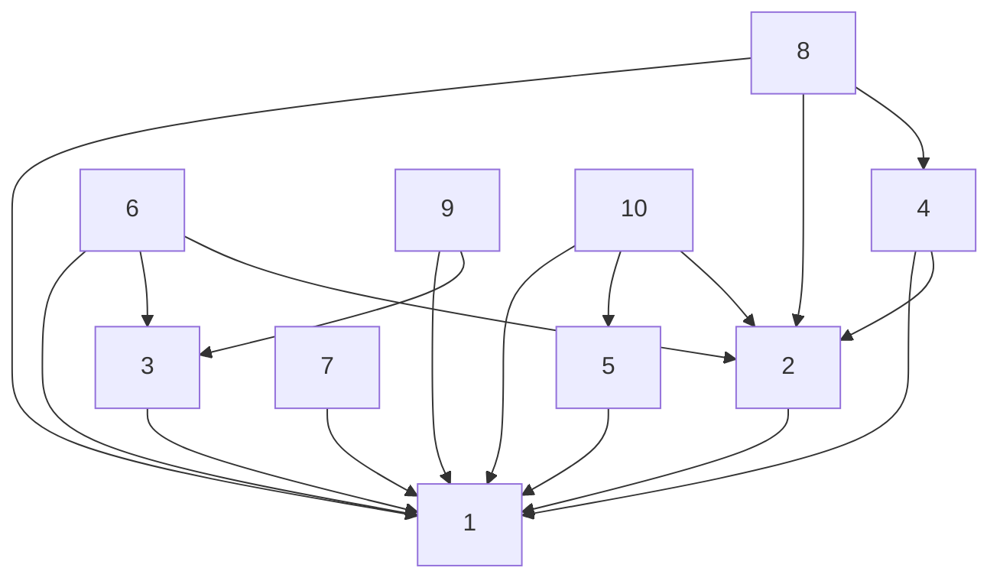

$\newcommand{\K}{\mathbb{K}}\newcommand{\m}[1]{\begin{pmatrix}#1\end{pmatrix}}\newcommand{\ub}[2]{\underset{#2}{\underbrace{#1}}}\newcommand{\R}{\mathbb{R}}\newcommand{\id}{\text{id}}\newcommand{\eps}{\varepsilon}\newcommand{\cases}[1]{\begin{cases}#1\end{cases}}\newcommand{\rcases}[1]{\begin{rcases}#1\end{rcases}}\newcommand{\N}{\mathbb{N}}\newcommand{\align}[1]{\begin{aligned}#1\end{aligned}}\newcommand{\sun}[2]{\overset{#2}{\underset{\begin{matrix}#1\end{matrix}}{\sum}}}\newcommand{\mc}{\mathcal}\newcommand{\ms}{\mathscr}\newcommand{\Z}{\mathbb{Z}}\newcommand{\sub}{\subset}\newcommand{\pron}[2]{\overset{#2}{\underset{\begin{matrix}#1\end{matrix}}{\prod}}}$
> [!info]
> Cours présenté par **M. Martinez**

# I - Propriété fondamentales de $\N$

## 1. Principe de récurrence

Soit $P$ une propriété portant sur $\N$ (entiers naturels). 
Soit $n_0$ un entier naturel. 
SI:
- i) $P(n_0)$ est vraie (initialisation)
- ii)  $\forall n \in \N$ avec $n ≥ n_0$. $P(n) \Rightarrow P(n+1)$
	- Alors, $\forall n ≥ n_0$ $P(n)$ est vraie. 

> [!check]
> Ce principe provient de l'axiomatique de $\N$, ainsi ne se démontre pas.

## 2. Théorème 1

Toute partie non-vide de $\N$ admet un plus petit élément. 

### 2.1. Preuve

Supposons que $A \sub \N$. 
- $A$ n'admet pas de petit élément $(*)$
- On va montrer que $A ≠ \varnothing$

Pour tout $n \in \N,$ on considère la propriété suivante:
- $P(n):\forall k ≤ n$, $k \notin A$
- On va démontrer que $\forall n \in \N$ $P(n)$ est vraie.

**Initialisation**
$P(0)$ est vraie car si $P(0)$ était fausse alors on aurait $0\in A$ et $0$ serait le plus petit élément de $A$ ce qui contredit l'hypothèse $(*)$.

**Hérédité**
Supposons que $P(n)$ est vraie. Montrons $P(n+1)$,
- Par l'absurde, supposons que $n+1 \in A$
- Supposons que $P(n+1)$ est fausse.
	- Alors, puisque $P(n)$ et vraie on aurait $\forall k ≤ n, k \notin A$ et,
	- $\exists k \in \N$ t.q $k ≤ n+1$ avec $k\in A$
	- Ce qui imposerait $n+1 \in A$
- On aurait alors que $n+1$ est le plus petit élément de $A$.
	- D'autre part, $n+1 \in A$
	- Et $\forall k ≤ n, k \notin A$
- Donc $n+1$ est un minorant de $A$ qui appartient à $A$. 
- Ceci est absurde car cela contredit l'hypothèse $(*)$ $(A$ n'a pas de plus petit élément$)$.
	- On a donc $P(n+1)$ nécessairement vraie.

**Conclusion**
$\forall n \in \N, P(n)$ vraie.
- $\forall n \in \N$, $\forall k ≤ n$ $k \notin A$
- D'où $\forall n \in \N, n \in A$
- et donc $A = \varnothing$

### 2.2. Corollaire

Toute partie non-vide et **majorée** de $\N$ admet un plus grand élément.

#### 2.2.1. Preuve

Soit $A \sub \N$, $A ≠ \varnothing$,
- Posons $\mathscr{M}=\{m \in \N / \forall k \in A, k ≤ m\}$
	- L'ensemble des majorants de $A$. 
- Puisque $A$ est une partie majorée, $\ms{M} ≠ 0$
	- Donc $\ms{M} ≠ \varnothing$ et $M \sub \N$
	- donc $\ms{M}$ admet un plus petit élément $m_0$
- Nous allons montrer que $m_0$ est le plus grand élément de $A$.
- Mq $m_0 \in A$
	- $m_0 - 1$ n'est pas un majorant de $A$ car s'il l'était $m_0$ ne serait pas le plus petit élément de $\ms{M}$
	- Donc il existe $k \in A$ tel que $k > m_0 - 1$
		- si ça n'était pas le cas $m_0-1\in\ms{M}$  ce qui est faux.
	- On aurait donc $m_0 - 1 < \ub{k ≤ m_0}{(*)}$
		- $(*)$ : car $m_0$ majorant de $A$ et $k \in A$
	- ce qui n'est possible que si $k = m_0$
		- Puisque $k \in A$ on a $m_0 \in A$.
	- $m_0 \in \ms{M}$ est un majorant de $A$.

**Conclusion**
$m_0$ est le plus grand élément de $A$ et A admet un plus grand élément
- En fait, le plus petit des majorants de $A$.
Toute partie non-vide de $\N$ majorée admet un plus grand élément.

## 3. Axiomes

- Il existe un ensemble qui est vide. On l'appelle $\phi$ (0).
	- Si $x$ est un ensemble alors $\{x\}$
	- Si $x$ et $y$ sont deux ensembles, on sait construire $x\cup y$. 
	    - C'est l'ensemble dont les éléments sont les éléments de $x$ et les éléments de $y$.
	- Axiome de l'infini. 
	    - On note $x\cup \{x\}=S(x)$
	    - Il existe un ensemble $N$ qui vérifie les propriétés suivantes. 
	        - $\phi \in N$
	        - Pour tout ensemble $x$, si
	            - $x\in N$ alors $S(x)=x\cup\{x\}$ 
## II - Division euclidienne dans $\Z$

## 1. Théorème

> [!info]
> On considère un ensemble qui est constitué dexu copies de l'ensemble des entiers et on muni ce nouvel ensemble.
> $\N_1 \cup \N_2^*$ 
> On muni ce nouvel ensemble 'dune structure d'ordre total compatible avec la structure d'ordre que l'on a sur $\N_1$.
> À partir de là, on est capable de retrouver $\Z$
> On note $(\Z, ≥)$ et $(\Z, +, \times)$

Pour tout $(a,b)\in\Z \times \Z^*$
- Il existe un **unique** couple d'entiers $(q,r)$ tels que:
	- $a = bq+r$ avec $0 ≤ r < |b|$
- des entiers $q$ et $r$ appelés respectivement le quotient et le reste de la division euclidienne (D-E) de $a$ par $b$. 
	- On dit alors que $(\Z, +, \times)$ est un **anneau euclidien**. (un joyau)

### 1.1 Démonstration

### 1.1.1 Existence

**1er cas**  - $(a,b)\in\N \times \N^*$
- Soit $E = \{k \in \N| kb > a\}$
	- $a+1 \in E$ (car $b > 1$) donc $E ≠ \varnothing$
	- $E \sub \N$ non-vide $E$ admet un plus petit élément noté $q^*$
	- Posons $q = q^* -1$ et $r = a-b(q^* - 1)$
	- On a $a = bq + r$
- Montrons que $0 ≤ r < b$
	- Par l'absurde, supposons que $r ≥ b$. On aurait,
		- $(q^*-1)b a-r$ et on aurait $q^* b = a+\ub{b - r}{< 0} ≤ a$ 
		- et $q*b ≤ 0$ **impossible** car $q*\in E$.

**2ème cas** - $b > 0$ et $a < 0$
- Si $a < 0$ et $b > 0$.
	- On applique le résultat précédent à $-a$. 
	- En effectuant la D-E de $(-a)$ par $b$,
		- Il existe un couple $(q', r') \in \Z \times \{0, ..., b-1\}$  tel que $-a = bq'+r'$
	- Si $r' = 0$ on pose $q = -q'$ et $r=r'=0$.
		- Le couple $(q,r)$ a les propriétés requises $(a=bq+r$ avec$r=0 \in \{0, ..., b-1\})$
	- Si $r' > 0$,
		- On a $a=b(-q')-r'$ (car $-a=bq'+r'$)
		- Posons $q=-q'-1$ et $r = b-r'$
		- On a bien $a = b(-q')-r' = b(-q'-1)+(b-r')$ et $r \in \{0, ..., b-1\}$
	- $0 ≤ r' ≤ b-1$
	- $b ≥ b-r' ≥ 1$
- Le couple $(q,r)$ a donc les propriétés requises.

**3ème cas**  - $b < 0$ et $a \in \Z$ quelconque.
- On applique la D-E précédente au couple $(a,-b)$
- Il existe $(q', r')$ tel que $a = -bq'+r' = b(-q')+r'$
- où $0 ≤ r' < -b = |b|$

### 1.1.2 Unicité

Supposons que 
- $a=bq+r$
- $a=bq'+r'$ 
- avec $0 ≤ r < |b|$
- et $0 ≤ r' < |b'|$
- d'où,
	- $r'-r = b(q-q')$
- et $|r' - r| = |b||q-q'|$
- D'où $|r' - r| ≤ \left| |r'| - |r|\right|$
- et,
	- $|r'-r| < |b|$
	- car,
		- $0 ≤ |r'| < b$
		- $0 ≤ |r| < |b|$
- $|b| > |b||q-q'|$
- Ce qui n'est possible que si $|q-q'| = 0$
	- Le seul multiple positif de $|b|$ inférieur strictement à $|b|$ est $0$.
- et $a-bq = r = a - bq' = r'$ d'où $r = r'$.

**Conclusion**
Unicité de la D-E. 

## 2. Divisibilité

### 2.1 Définition

Soit $a,b \in \Z, a ≠0$ 
- On dit que $a$ **divise** $b$ et on écrit $a|b$ s'il existe $k \in \Z$ tel que:
	- $b = k \cdot a$

**Terminologie**
- On dira que $a$ est un diviseur de $b$
- Et $b$ est divisible par $a$
- $b$ est multiple de $a$

On notera:
- $a\Z = \{ka | k \in \Z\}$ l'ensemble des multiples de $a$.

**Conséquence**
- $a|b$ si $b \in a\Z$

### 2.2 Propriétés

#### 2.2.1. Règles de calcul

Soit $(a,b,c,d) \in \Z^4$.
- $a ≠ 0$
On a:
1. $a|a, a|(-a), 1|a, a|0$
2. Si $a|b$ alors $-a|b, a|bc$ et $ac|bc$
3. Si $b ≠. 0$ et $a|b$ alors $|a| ≤ |b|$ donc chaque entier admet un nombre fini de diviseurs. 
4. Si $a|b$ et $b|a$ alors $(a=b$ ou $a=-b)$.
	- En particulier, $a|1$ si $a=±1$
5. **Transitivité** : $a|b$ et $b|c$ alors $a|c$
6. **avec l'addition** : si $a|b$ et $a|c$ alors $\forall (\lambda, \mu)\in\Z^2$,
	- $a|(\lambda b + \mu c)$ (combinaison linéaire)
7. **avec la multiplication**
	- Si $a|b$ et $c|d$ alors $ac|bd$
		- En particulier, si $a|b$ alors $\forall n \in \N, a^n | b^n$
##### 2.2.1 1 Preuves

1. $a=a \times 1 = (-a) \times (-1)$
	- $a|0$ car $0 = a \times 0$
2. SI $a|b$ il existe $q \in \Z$ tq $b=qa$
	- D'où $b=(-q)(-a)$ d'où $-a|b$
	- et, $bc = (qc)a$ d'où $a|bc$
	- et, $bc = q(ac)$ d'où $ac|bc$
3. Soit $q \in \Z$ tq $b = aq$ on a alors:
	- $|b| = |a| |q|$ comme $|b| ≠ 0$ on a $|q| ≥ 1$
	- et donc $|a| ≤ |b|$ $(|b| ≥ |a| \times 1)$

#### 2.2.2. Relation d'ordre partielle

La relation binaire « divise » est une relation d'ordre partielle sur $\N$ car:
- $\forall a \in \N, a|a$ (symétrie)
- anti-symétrie, par $\fbox4$ (section précédente)
- transitivité, $\fbox5$

Le **diagramme de Hasse** implique que tout doit être "connecté". 

# IV - Les nombres premiers

## 1. Définition

Un entier naturel $p$ est dit premier s'il possède **exactement** 2 diviseurs (positifs)
- À savoir $1$ et $p$
En particulier, $1$ n'est pas premier (car n'en possède pas 2).

### 1.1 Exemple

- $2$ est un nombre premier et c'est le seul nombre premier pair.

## 2. Théorème

1. Tout entier  différent de  admet un diviseur premier.
2. Si de plus, $n$ **n'est pas lui même un nombre premier,**
	- alors il admet un diviseur premier qui est plus petit que $\sqrt{n}$. 

### 2.1 Preuve

- Si $n$ est premier,
	- Il admet un diviseur premier de fait, lui-même
- Sinon, (à fortiori différent de $1$)
	- $n$ admet un diviseur dans $[|2, n-1|]$

> [!warn]
> $0$ n'est diviseur d'aucun nombre.

Soit $\ms{D}_n^s$ l'ensemble des diviseurs stricts de $n$. 
- $\ms{D}_n^5 = \ms{D}_n \backslash \{1, n\} = \{l \in \N | \exists k \in \N, lk = n\}\backslash \{1, n\}$
$P_n$ : $\ms{D}_n^5 ≠ \varnothing$ $\color{blue}(*)$

Montrons que $p$ est premier
- En effet, par l'absurde, si $p$ n'est pas premier
	- Il admettrait un diviseur $d \notin \{1, p\}$ 
	- Et donc, 
		- $d \in [|2, p-1|]$
		- $d | p$ avec $d < p$ 
		- Par transitivité,
			- on aurait $d|n$ 
				- Par transitivité
				- car $p|n$ et $d|p$
	- Or, on a supposé $p$ plus petit diviseur strict de $n$
		- On a $d<p$ et $d \in \ms{D}_n^5$
	- **ABSURDE** car contredit la minimalité de $p$.
		- On en déduit que $p$ est premier.

$\square$

**Conclusion**
SI $n≠1$ alors $n$ admet un diviseur premier.

### 2.2 Preuve

Il existe un diviseur e $m$ de $n$ tel que $m \in [|p, n-1|]$ tel que:
- $m = pm$ donc $n = pm ≥ p^2$ donc $p ≤ \sqrt{n}$
## 3. Théorème - Nombres premiers infinis

L'ensemble des entiers premiers est infini.

> [!info]
> [Erdös](https://fr.wikipedia.org/wiki/Paul_Erd%C5%91s), mathématicien hongrois qui voulait écrire un livre contenant les plus belles démonstrations des mathématiques, qu'il voulait nommait **The Book**, un projet qui n'a jamais abouti mais donna lieu à des livres annexes s'en inspirant, souvent osus le nom de **Proof from the Book**.

### 3.1 Preuve

> [!check]
> On doit cette preuve à Euclide

Par l'absurde, 
Supposons que l'ensemble $\ms{P}$ des entiers premiers soit fini.
- Posons alors $\ms{P} = \{p_1, p_2, ..., p_n\}$ (écriture en extension)
- Posons $n = p_1 \times p_2 \times p_3 \times ... \times p_n + 1$ 
	- Par application du théorème précédent
		- $n$ admet un diviseur premier $p$. 
		- **D'une part** $p|n$ donne le reste de la division euclidienne de $p$ paar $n$ vaut $0$.
		- **D'autre part**, $p \in \ms{P} = \{p_1, ..., p_n\}$. Posons $i_* \in \{1, ..., n\}$ tel que $p = p_{i_*}$
			- $n = p_{i_*}\left( \prod^{n}_{\align{i = 1 \\ i ≠ i_{*}}} p_i\right) + 1$  
			- qui donne la D-E de $n$ par $p_{i_{*}} = p$  dont le reste vaut $1$
		- **Impossible par unicité du reste de la D-E**.
- CCL : L'ensemble des entiers premiers est infini.

> [!tips]
> $i_*$ est l'indice d'un nombre premier divisant $n$. On l'isole.

## 4. Théorème - Décomposition en facteurs premiers

Soit $n ≥ 2$
- Il existe un unique entier $k$, un unique $k$-uplet de nombres premiers
	- $2 ≤ p_1 < p_2 < p_3 < ... < p_k$
- et un unique $k$-uplet $(\alpha_1, ..., \alpha_k)$ d'entiers naturels non-nuls tels que:
	- $n = p_1^{\alpha_1} \times p_2^{\alpha_2} \times ... \times p_k^{\alpha_k} = \pron{i=1}{k}p_{i}^{\alpha_i}$

### 4.1 Preuve

- **Existence de la décomposition**
	- Pour $n ≥ 2$
		- On pose $H_n : \forall m \in [|2, n|]$, 
			- $\exists k \in \N^*$ un $k$-uplet de nombres premiers $(p_1, ..., p_k)$ 
				- avec $p_1 < p_2 < ... < p_k$
			- et un $k$-uplet $(\alpha_1, ..., \alpha_k) \in (\N^*)^k$ tels que:
				- $m = p_1^{\alpha_1} \cdot ... \cdot p_k^{\alpha_k}$
		- Nous allons démontrer que $\forall n ≥ 2$, $H_n$ est vraie par récurrence
		- **Initialisation**
			- Posons $k=1, \alpha_1 = 1$ on a $2^1 = 2$
			- On a bien montré $H_2$ vraie.
		- **Hérédité**
			- Soit $n≥2$ un entier fixé.
				- Supposons que $H_n$ est vraie et montrons $H_{n+1}$.
				- Puisque $H_n$ est vraie, il suffit de démontrer qu'il existe $k \in \N^*$ tel que:
					- et les nombres premiers $(p_1, ..., p_k)$ tels que:
						- $p_1 < ... < p_k$
					- et,
						- $(\alpha_1, ..., \alpha_k) \in (\N^*)^k$ vérifiant $n+1 = p_1^{\alpha_1} ... p_k^{\alpha_k}$
			- Par application du théorème du cours, 
				- **Si $(n+1)$ premier**,
					- $H_{n+1}$ est vraie avec $k=1$ et $\alpha_k = 1$, $p_1 = n+1$
				- **Sinon**
					- $n+1$ admet un diviseur premier $p \in \ms{P}$
					- Il existe $m \in [|2, n|]$ tel que:
						- $n+1 = mp$
					- Puisque $H_n$ est vraie et $m \in [|2, n|]$ il existe $k' \in \N^*$
						- $(p_1', ..., p_{k'}') \in \ms{P}^k$
							- $p_1' < ... < p_k'$
						- et,
						- $(\alpha'_1, ..., \alpha'_{k'}) \in (\N^*)^{k'}$
							- $m = (p_1')^{'\alpha_1'} \cdot ... \cdot (p'_{k'})^{\alpha'_{k'}}$
						- et, $(n+1) = p \cdot (p_1')^{\alpha_1'} \cdot ... \cdot (p'_{k'})^{\alpha'_{k'}}$
					- $(*)$ : $(n+1) = p_1^{\alpha_1} ... p_k^{\alpha_k}$
					- $(*)$ fournit alors la décomposition recherchée en réorganisant les termes par ordre croissant.
		- **Conclusion**
			-  $\forall n ≥ 2, H_n$ est vérifiée
			- On a donc prouvé l'existence de la décomposition en facteurs premiers d'un nombre entier.
- **Unicité de la décomposition**
	- *Vue plus tard*

