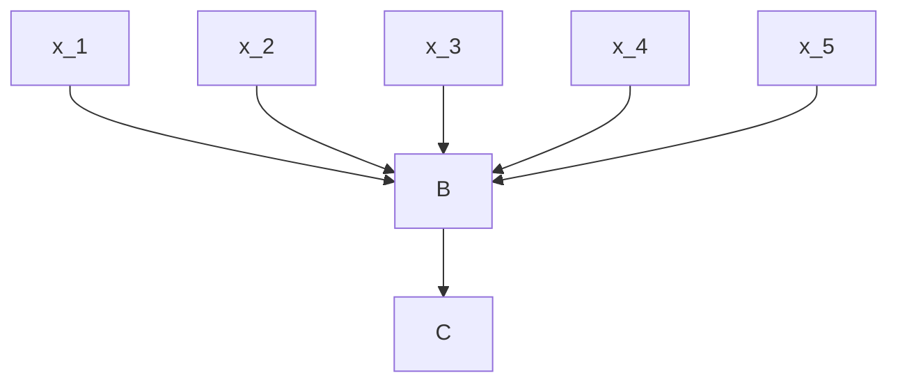
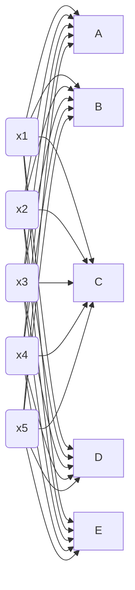
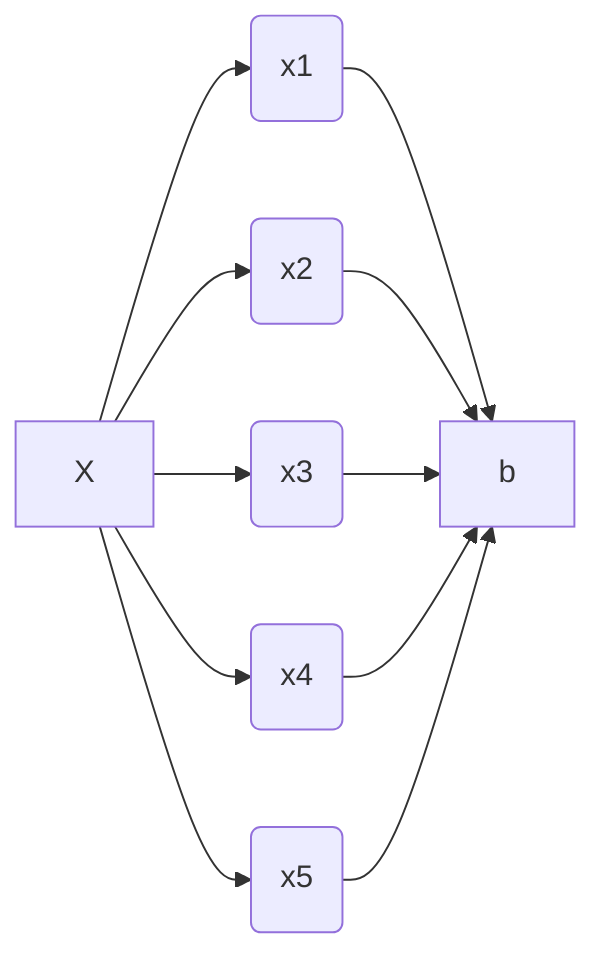
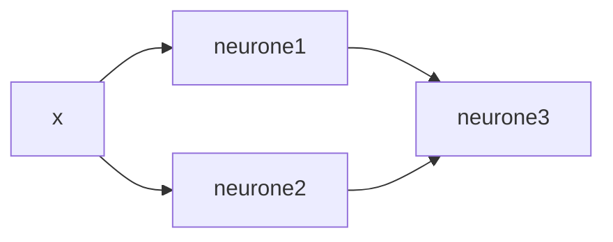
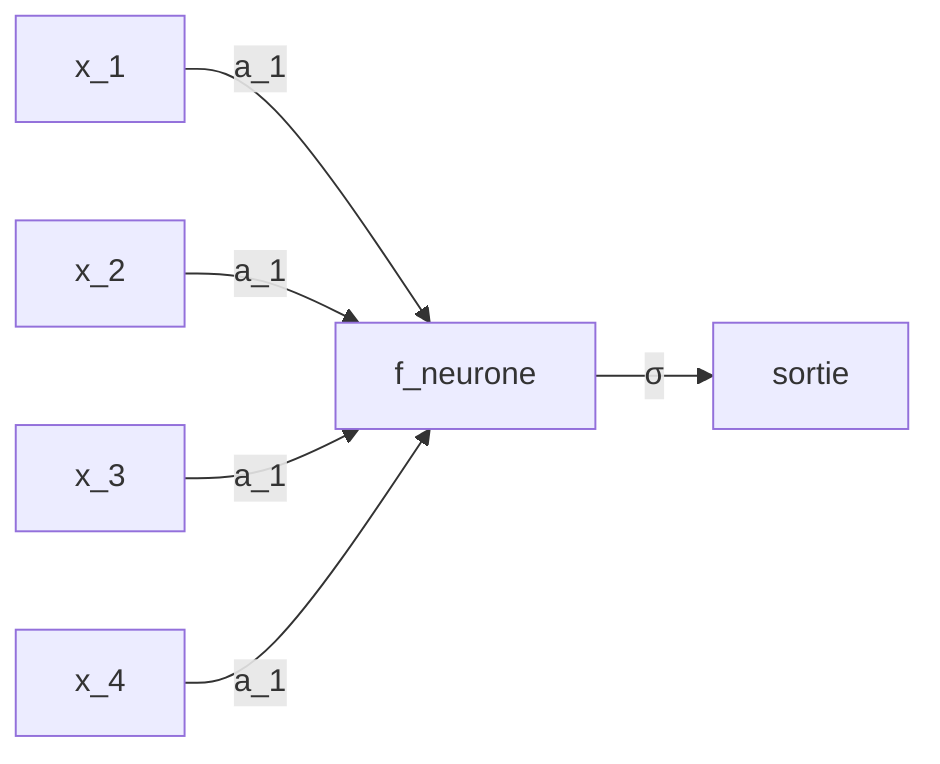
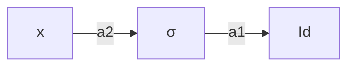
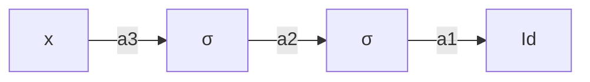
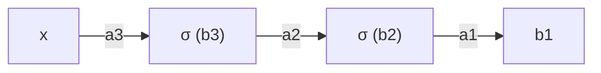
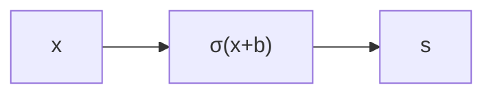
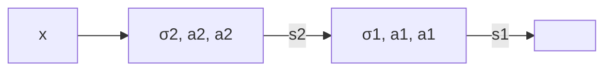

$\newcommand{\R}{\mathbb{R}}\newcommand{\id}{\text{id}}\newcommand{\argmin}{\text{argmin}}$
$\newcommand{\ub}[2]{\underset{#2}{\underbrace{#1}}}\newcommand{\ov}[2]{\overset{#2}{#1}}$
$\newcommand{\N}{\mathbb{N}}$
# I - Cadre de l'apprentissage supervisé

Quand il faut prédire, on dispose de $(X,Y)$ est un couple de variables aléatoires. 
- $X$ : features (description)
- $Y$ : label (étiquette)

**Objectif** - À partir de $X$, prédire $Y$. 
*Exemple* : Le Chat
- $X =$ un texte
- $Y =$  le prochain token $(≈ \text{mot})$ qui suit le texte.
**Remarque** - Pourquoi $(X,Y)$ aléatoire ?
Vraisemblablement les phénomènes quantiques sont les seuls à présenter un véritable aléatoire. 
$Y$ n'est pas entièrement défini par $X$. 
**Exemple:** hier, j'ai vu un __ (quel mot). 

**Question** - Que signifie prédire?
$\Rightarrow$ Construire $f:\mathcal{X} \to \mathcal{Y}$  
- $\mathcal{X}$: espace de $x$.
- $\mathcal{Y}$: espace de $y$. 

**Question** - LLM : $\mathcal{X}$ est un texte (chaîne de caractères) et $\mathcal{X}$ c'est l'ensemble des tokens ($≈$ mots)
- Reconnaissance d'image: $\mathcal{X}$ est l'ensmeble des images $(\R^{\text{nb de pixels}})$ et $\mathcal{Y}$ ce qu'il y a sur l'image. 
```python
("animal", "voiture", "piéton", "feu tricolore", "panneaux de signalisation" etc...)
```

**Question** - Qu'est-ce que c'est qu'une bonne prédiction ?
$\Rightarrow$ Si $f(x) ≈ Y$
$\Rightarrow$ On a une fonction d'évaluation $L(X,Y)$ et on regarde $E[L(X,Y)]$ avec $L(f(x), Y)$ un genre de distance entre $f(X)$ et $Y$.

**2ème cas** - $\color{green}(1)$ $Y$ est qualitatif (discret), i.e est composé de classes pas de nombres (pas de relation d'ordre entre les éléments)

**Exemple** - $\mathcal{Y}$ les numéros de département. 

$\Rightarrow$ Problème de **classification** (ex: les LLMs)
$\Rightarrow L(f(x),y) = f(x) = y = \cases{ 0 \text{ si } f(x) = y \\ 1 \text{ sinon}}$ 
1 - $E[L(f(x), y)] = Acc(f)$ (accuracy) (exemple: 75% de bons résultats)

$\mathbb{1}:$ fonctions indicatrice.

 $\color{green}(2)$ $\mathcal{Y} = \R^d$.
 $\Rightarrow$ Problème de régression
 $\Rightarrow L(f(x), y) = ||f(x) - Y||^2 = \sum(f(x) - y)^2$ (norme euclidienne)
**Exemple** - Élection du 1er tour $\mathcal{Y}$ le vecteur de % de votes pour les différents candidats.
Pourquoi : $||.||^2$ ?
- On peut prendre d'autres
- $||.||^2$ est une fonction convexe et donc optimisable
**Remarque** - $f(x)≠y$ n'est pas convexe.
- Si $u_1, ..., u_n \in \R^d$
- $\text{argmin}\sum||u_i-v||^2 = \frac{\sum u_i}{n}$
	- $v \in \R^d$
- élément $v$ qui minimise la fonction

# II - Régression linéaire

$\mathcal{X} = \R^D$
$\mathcal{Y} = \R$

Supposons $D = 1$
- $f_\theta:\R\to \R$ avec $\theta \in \R$ et $f_\theta : x \mapsto x\theta$
- On a un jeu de données $(X_1, Y_1), ..., (X_n, Y_n)$
**Objectif:**
- Trouver $f$ tq $\sum^n_{i=1}\underset{L(f(x_i), y_i)}{\underbrace{||f(x_i) -y_i||^2}}$  soit faible. 

**Problème**: $f:x \mapsto \cases{Y_i \text{ si }x=X_i \\ 0 \text{ sinon}}$
vérifie: $\sum^n_{i=1}L(f(X_i), Y_i) = 0$
Mais $E[L(f(X), Y)]$ peut être grand.
$\Rightarrow$ Surapprentissage  / Overfiting
**Question** - Comment savoir qu'on overfit.

On prend $(\tilde{X_1}, \tilde{Y_1}), ..., (\tilde{X_m}, \tilde{Y_m})$ et on calcule:
- $\frac{1}n\sum^n_{j=1}L(f(\tilde{x_j}), \tilde{y_j})$ et on le compare à $\frac{1}n\sum^n_{i=1}L[f(x_i), y_i]$

En pratique, 
- on parle d'un gros jeu de données, 
- On le coupe en train (75%) / test (25%)
- On entraîne le modèle sur le train et on vérifie les performances / overfitting sur le test.
- On réentraîne sur toutes les données.

**Remarque** - Entraîner = minimiser la perte i.e $\frac{1}n \sum L (f(x_i), y_i)$
**Question** - Comment ne pas overfitter?
$\Rightarrow$ On ne va pas prendre $f$ dans toutes les fonctions possibles de $\mathcal{X} \to \mathcal{Y}$ mais dans un espace plus simple / limité.
$\mathscr{F} \subset$ fcts $\mathcal{X} \to \mathcal{Y}$
On peut prendre un ensemble de fonctions indexées par un paramètre $\theta \in \R^{d_\theta},$ on le note $\mathcal{F}_\theta$. 
- **exemple** $f(x) = \langle X, \theta\rangle = \sum^{d_\theta}_{i=1}X_i\theta_i$
- $f_{\theta}(X) =$ Réseau  de neurones
On parle de **régression paramétrique.

**Remarque** - Plus $\mathscr{F}_\theta$ est « riche » plus on risque de l'overfitting. 
- Plus $n$ est grand, moins ...
$\Rightarrow$ Compromis entre $n$ et $\mathscr{F}_\theta,$ on parle de compromis biais / variance, biais / variance tradeoff. 

**Focus sur la régression linéaire avec $f_\theta(x) = \langle X, \theta \rangle$
- En dimension $1$ (sur l'entrée)
- $f_\theta(x) = x\theta$
**Problème**: On cherche $\theta\wedge =  \text{argmin}\frac{1}n\sum^n_{i=1}|\overset{= Xi\theta}{\overbrace{f(X_i)}}-y_i|^2$
$\phi$ est convexe: il suffit de dériver et voir quand la dérivée s'annule. 

On a
$\frac{1}{n}\sum^n_{i=1}2X_i(X_i\theta - Y_i)$
$\phi'(\theta) = \frac{1}n \cdot \sum^n_{i=1}2X_i^2\theta - 2X_iY_i$

$= \frac{2}{n}(\theta\sum^n_{i=1}X_i^2-\sum)$

Donc $\phi'(\theta) = 0$ ssi $\theta = \frac{\sum X_iY_i}{\sum X_i^2}$ (/!\ si $\sum X_i^2 ≠ 0$)

**En dimension $d$**
$ô$ vérifie $(\mathcal{X}_n\mathcal{X}_n)^T$. $ô = (\mathcal{X}_n\mathcal{Y}_n^T)$
$\mathcal{X}_n = \begin{pmatrix}... & X_1 & ... \\ ... & X_2 & ... \\ & i & \end{pmatrix},y_n = \begin{pmatrix}y_1 \\ .... \\ y_n\end{pmatrix}, (M_{ij}^T) = M_{j,i}$

ô est une solution d'un système linéaire.
- $A ô = B$

Une régression linéaire c'est très fort. 
- Permet: régression polynômiale $x \to \mathcal{X} = (1, x, x^2, x^3, x^3, ..., x^4)$
- Régression fréquentielle $x \to (\cos(2\pi x), \cos(\pi x), ...)$

---
*Rappel*
$(\underset{\in \R^d}{X}, Y)$, objectif: prédire $y$ à partir de $X$.
- Trouver $f$ tel que $f(x) ≈ Y$
**2ème cas**
- Si $y \in \R$
	- évaluation: $L(f) = \mathbb{E}[|y-f(x)|^2]$
	- $\Rightarrow$ On veut $L$ plus petit possible. 
- Remarque:
	- Il existe un $f^*$ qui minimise cette fonction $L(.)$
	- On considère $f(x)$ une fonction de perte
- Si $y$ est qualitatif, on parle de classification `(*)` 
	- (on reviendra là-dessus)

En pratique, on a pas accès $(X,Y)$ mais on observe $(X_1, Y_1), .., (X_n, Y_n)$ (et donc pas à $L$)
- Il n'y a pas de dépendance entre eux.
- Si on a deux images deux chats, la 1ère image de chat ne nous dit rien sur la deuxième
- On a dnc un cas d'indépendance et identiquement distribués

Par la loi des grands nombres:
- $L_n(f) = \frac1n\sum^n_{i=1}|y_i-f(X_i)|^2$
Idée naïve:
- On prend $\hat{f}$ le minimiseur de $L_n(.)$
- $\hat{f} \mapsto \cases{y_i \text{ si }x=X_i \\ 0 \text{ sinon}}$ vérifie $L_n(\hat{f}) = 0$
- mais on risque d'avoir très souvent, $L(\hat{f})$ grand. 
**Solution** - On va optimiser $L_n(.)$ sur une « petite » classe de fonctions
**Exemples** - On considère la classe
- $\{f_\beta : \overset{\in \R^d}{x} \mapsto \langle x, \beta \rangle | \beta \in \R^d\}$
- On peut calculer $\hat{\beta} = \underset{\beta \in \R^d}{\text{argmin}} \ L_n(f_\beta)$

**Problème** Les fonctions linéaires est un espace trop petit.
- **Solution 1**
	- Prendre un $\phi:\R^d \to \R^d$ et faire une régression linéaire sur
		- $(\phi(X_1), Y_1), ..., (\phi(X_n), Y_n)$
		- **exemple**: $\phi:\underset{\in\R}{\underbrace{x}} \mapsto (1,x,x^2, ..., x^k)$
		- $\langle \beta, \phi(x) \rangle = \beta_0 + \beta_1x+\beta_2x^2+...+\beta_kx^k$
			- C'est une base de l'ensemble des polynômes de degrés $k$.
		- Trouver le meilleur $\beta \iff$ trouver la meilleure fonction polynomiale de degré $k$.
- **Solution 2**
	- **Réseau de neurones.** 
		- Partir d'une structure simple, en mettre plein... ça donne une structure compliquée.
		- Un neurone, 

- On note $C = \underset{\text{régression linéaire}}{\underbrace{\langle a, x \rangle + b}}$
- $C \overset{\sigma}{\underset{\text{fct d'activation}}{\longrightarrow}} \sigma(\langle a, x \rangle +b)$
- $= x \in \R^c$
- La fonction d'activation est non-linéaire.
### Théorème

Les polynômes (sur $[-1, 1]$) sont denses dans l'espace des fonctions continues sur $[-1, 1]$. 
Dit autrement, $\forall f$ continue sur $[-1, 1],$ il existe $k \in \N$ et 
- $\phi : x \mapsto a_0+a_1x+...+a_kx^k$
- tel que $||f-\phi|| ≤ \epsilon$
	- $(\int^1_{-1}|f-\phi|^2dx)^{1/2}$ 
	- **Remarque** : $f^*$ qui minimise $L(.)$ peut s'approcher par une fonction continue. 
	- $\Rightarrow$ Si $k$ suffisamment grand, on aura $f_{\hat{\beta}} ≈ f^*$ si on ne fait pas de sur-apprentissage. ($n$ suffisamment grand).
		- ⚠️ En pratique, les polynômes c'est pas bof.


**Exemple**

$\sigma$
6 créneaux: $x \mapsto \cases{0 \text{ si }x ≤ 1 \\ 1 \text{ sinon}}$
6 sigmaïd : $x \mapsto \frac{1}{1+e^{-x}}=\frac{e^x}{1+e^x}$

6 $ReLU$ (Rectified Linear Unit) : $x\mapsto \max(0,x)$
Une couche de neurones c'est plein de neurones mis en parallèle de la sorte:


## Théorème d'approximation universel

Soit $\mathcal{F}_n$ l'ensemble des réseaux de neurones à deux couches, c'est-à-dire.


sort $\langle a,x \rangle + b$

Alors $\cup^{+\infty}_{n=1}\mathcal{F}_n$ est dense dans les fonctions continues sur $[-1, 1]$

**Idée**
$2$ neurones peuvent approcher des fonctions $x \mapsto \cases{1 \text{ sur }[a,b] \\ 0 \text{ sinon}}$

À noter que $x$ c'est l'entrée


neurone 1:
	$\begin{rcases}a = 1 \\ b = -x_1\end{rcases} \sigma(ax+b) = \cases{1 \text{ si }ax+b ≥ 0 \\ 0 \text{ sinon}}$
	$ax+b = 0 \iff -x + x_1 ≥ 0 \iff x ≥ x_1$
neurone 2:
	$\begin{rcases}a =1 \\ b = -x^2\end{rcases}\sigma(ax+b) = \cases{1 \text{ si }x ≥ x_2 \\ 0 \text{ sinon}}$
neurone 3:
	$\begin{rcases}a = (h, -h) \\ b = 0\end{rcases}$ sortie (neurone 1 - neurone 2)$(x) = \cases{1 \text{ si }x_1 ≤ x < x_2 \\ 0 \text{ sinon}}$ 
	
En agrandissant la couche du milieu,
- je peux faire plusieurs créneaux. 
- $\Rightarrow$ On put approcher n'importe quelle fonction continue
![[Pasted image 20250321151718.png]]

---

$(X,Y)\in\R$
$Y = f(X)+\epsilon$ (fonction de prédiction)
Une bonne fonction de prédiction $\mathbb{E}[\|Xf(X)\|^2]$
$(X_1, Y_1), ..., (X_n, Y_n)$
$L_n(\ub{f}{\text{prédicteur}}) = \frac1n\sum^n_{i=1}|Y_i-f(X_i)|^2$
Pour vérifier si l'élève a "bien appris", on note: (entraînement des TD)
$(X', Y'), ..., (X_n', Y_m')$ (le test)
$L_n' = \sum^n_{k=1}|Y_i' - f(X_i')|$ (Examen)

Si ça marche pas, qu'est-ce que je fais?
- ... on remet en question notre façon d'apprendre
$\Rightarrow$ chercher $f$ dans $\mathcal{F}$ (classe de fonctions / pas trop grosse)
À terme, je veux pouvoir retrouver $f'$.

**Exemple** 
Réseau de neurone = certaine structure. 
La structure est la suivante (graphe mermaid d'entrée / sortie)

$\Rightarrow$ $f(\ub{x}{\text{neurone}},a,b) = \sigma(\ub{\langle a,x \rangle}{\sum a_ix_i}+b)$
$\sigma$ = fonction d'activation

Donc on utilise à la place un des trois.
- ReLu (nulle parce que non dérivable)
- Sigmoide
- Créneau (très méchante fonction)

Un neurone, ça fait pas grand chose. Par contre quand on en fait plein ça prend sens.
Il y a plusieurs types de neurones.
Toutes mes entrées sont connectées à tous mes neurones.

**Théorème** L'espace des réseaux à deux couches (1 grosse couche + 1 neurone de sortie)
est dense dans les fonctions continues de $[a,b]\to\R$

**Question** - comment trouver 
$(\hat{A_1}, \hat{B_1}), ..., (\hat{A_n}, \hat{B_n})= \text{argmin}$  $\ub{\frac1n \sum^n_{i=1}f_{NN}([A_1, B_1], [A_2, B_2],...,[A_n, B_n])(X_i)-Y_i)^2}{L_n((A_1, B_1), ..., (A_n, B_n))}$
$A_1, ..., A_n$
$B_1, ..., B_n$

... $A_1$, $B_1$ sont le paramètre de la première couche. 

$\frac{\delta f_{NN}}{\delta A_n}$ et $\frac{\delta f_{NN}}{\delta B_k}$ sont écrivables mais on ne peut pas résoudre $\cases{\forall i,j,k \frac{\delta L_n}{\delta A_i,j,k}=0\\ \forall i,k \frac{\delta L_n}{\delta Bi, k} = 0}$

- En cours, on a vu le théorème de Bolzano mais la dichotomie se révèle peu efficace en plusieurs dimensions.

**Solution** descente de gradient

## Descente de gradient

La descente de gradient c'est un algorithme.

**Objectif** minimiser une fonction $f:\R \to \R$. 
**Entrée** : $f'$ et $x_0 \in \R$ un point de départ.

$\text{while True}$
	$x_{n+1} = x_n - \lambda f'(x_n)$

### Théorème

On prend $f'$ continue.
- Si $x_n$ converge vers $l \in \R$ (1)
	- Alors $f'(l) = 0$
	- $f$ est deux fois dérivable et:
		- $f$ convexe. 
			- La tangente est en dessous de la courbe
			- $B ≤ f'' ≤ A$
			- Avec $B$ strictement positive
			- (convexe $\iff$ dérivée seconde positive)
- $f$ admet un unique argmin $x_{\min} \in \R$ 
- $\forall n \in \N, |x_n - x_\min| ≤ k^n |x_0 - x_\min|$
- avec $k=\frac{A-B}{A+B}$ si $\lambda = \frac2{A+B}$

**Preuve**
$\newcommand{\lim}[1]{\underset{#1}{\text{lim}}}$

(1)
Puisque $\ub{\lim{n\to+\infty}x_n+1}{= \lim{n\to+\infty} x_n - \lambda f'(x_n)} = \lim{n\to+\infty}x_n=l$
... D'après la caractérisation séquentielle de la limite,
- Or, $f'$ continue en $l$ donc $0 = \lim{n\to+\infty}f'(x_n) = f'\left(\lim{n\to+\infty}x_n\right) = f'(l)$

(2) supposons $0=B≤f''≤A$
- Montrons que $f$ admet un unique minimiseur
	- $f' \nearrow$ strict donc injective
	- Donc l'équation $f'(x) = 0$ admet au plus une unique solution. 
	- Donc, s'il existe un minimum local c'est le minimum global
- Montrons que $\lim{x\to+\infty}f(x) = +\infty$
	- On utilise le théorème des accroissements finis
	- Mq il existe $b > 0$ tq $f'(b) ≥ 1$
		- On applique le théorème des accroissements finis (TAF) à $f'$ (la vitesse)
		- entre $0$ et $x \in \R$
		- $\frac{f(x)-f(y)}x = f''(c)$ avec $y \in [0;x]$
		- i.e $f'(x) - f'(0) = xf''(y) ≥ xB$
	- Donc $f'(x) ≥ f'(0) + xB$
- Si $f(0) ≥ 1$
	- $b=0$
- Sinon
	- $b= \frac{1-f'(0)}B,$ on a
	- $f'(b) ≥ f'(0) + \frac{1-f'(0)}{B} \cdot B = 1$
- Soit $x ≥ b,$ on a d'après le TAF sur $f$,
	- $f(x) 0 f(b) = (x-b)\ub{f'(c)}{\in [k,x]}≥(x-b)$
	- Donc $f(x) ≥ (x-b)+f(b)$
- par encadrement, $\lim{x\to+\infty}f(x) = +\infty$
- De même $\lim{x\to-\infty}f(x) = +\infty$
Donc d'après [[DLMI - L1/maths/suites/td/TD 4|TD 4]] - Ex 6 de S et F (T. valeurs atteintes), $f$ admet un minimum.
Donc $f$ admet un unique minimiseur $x_\min$
- Mq $g:x\mapsto x - \lambda f'(x)$ (de façon $x_{n+1} = g(u_n)$) et $\ub{k}{\frac{A-B}{A+B}}-\text{Lipschitzienne}$
- ie $\forall x,y \in \R, |g(y)-g(x)| ≤ k|y-x|$
- i.e $x<y$. D'après le TAF
	- $g(y)-g(x) = g'(z)(y-x)$
Donc $|g(y)-g(z)|≤|g'(z)||y-x|$
avec $z \in ]x,y[$

On a $g'(z) = 1-\lambda f''(z) = 1-\frac2{A+B}f''(z)$
- On a $g'(z) ≤ 1-\frac2{A+B}B$
- De même, $g'(z) ≥ -\frac{(A-B)}{A+B}$
- Donc $|g'(z)|≤\frac{A-B}{A+B}$
Soit $n \in \N^*$. Montrons que:
- $|x_{n+1}-x_{\min}|≤k|x_n - x_\min|$
i.e $|g(x_n)-x_\min| ≤ k|x_n - x_\min|$

**Remarque** : $g(x_\min) = x_\min$
On a $|x_{n+1}-x_\min| = |g(x_n)-g(x_\min)|$
	$≤ |x_n - x_\min|$
Par récurrence, $\forall n \in \N^*, |x_n - x_\min| ≤ k^n|x_0 - x_\min|$

$\square$

## Descente de gradient si $f:\R^d \to \R$

$\text{While True}$
	$x_{n+1} = x_n - \lambda \nabla f(x_1) \begin{pmatrix}\frac{\delta}{\delta x_1} \\ \frac{\delta f}{\delta x_2} \\ . \\ .. \\ .. \\ \frac{\delta f}{\delta x_d}\end{pmatrix}(x_n)$
	




$f_{a_1, a_2}(x) = a_1\sigma (a_2x)$


$\newcommand{\pa}{f_{a_1, a_2, a_3}(x)}$
$\pa = a_1 \sigma (a_2 \sigma (a)3x)$
$\phantom{\pa} = f_{a_1, a_2}(\sigma(a_3x))$
$\phantom{\pa} = \ub{f_{a_1}}{a_1x}\left(f_{a_2}\left(f_{a_3}(x\right)\right)$
$\frac\sigma{\sigma a_1}f_{a_1, a_2, a_3}(x) = f_{a_2, a_3}(x) = \sigma(a_2\sigma(a_3x))$
$\frac\sigma{\sigma a_2}f_{a_1, a_2, a_3}(x) = a_1\sigma(a_3x) \sigma ' (a_2\sigma(a_3 x))$
$\frac\sigma{\sigma a_3}f_{a_1, a_2, a_3}(x) = a_1\frac{\sigma a_2 \sigma(a_3x)}{\sigma a_3} a_1\sigma'(a_2 \sigma(a_3x))$
$\phantom{\frac\sigma{\sigma a_3}f_{a_1, a_2, a_3}(x) } = a_1a_2 x \sigma'(a_3x)\sigma'(a_2\sigma(a_3x))$


#### Cas un peu plus compliqué



$\frac{d_f}{\sigma a_1} = S_2$ (comme avant)
$\frac{d_f}{\sigma a_2} = \frac{\sigma a_1 \sigma(a_2 \sigma(a_3x+b_3)+b_2)+b_1}{\sigma a_2}$
$= a_1 \times S_1 \times \sigma'(a_2S_1+b2)$ (ou $S_1$ est la 1ere couche)

**Par récurrence**
$\frac{\sigma f}{\sigma a_k} = H_k \times S_{n-(k+1)}$
et $H_k = \prod _{i=1}^{n-(k+1)}a_i\sigma_{n-(i+1)}\left(a_{i+1}S_{n-i}+b_{i+1}\right)$
$H_k = \prod_{couche d'apres}a_{couche}\sigma_{couche}(a_{couche precedente} \times \text{entree precedente}+b_{\text{couche}}+b_{\text{couche prec}})$
$\frac{\sigma_f}{\sigma b_1} = 1$
$\frac{\sigma_f}{\sigma b_2} = \frac{\sigma a_1 \sigma \left(a_2S_1+b_2\right)}{\sigma b_2}$
$= a_1\sigma'(a_2S_1+b_2)$
- **Par récurrence** : $\frac{\sigma f}{\sigma b_k} = H_k$

$\frac{d_f}{d_{A_k}} = \pmatrix{\frac{df}{d(A_k)_{1,1}}\frac{d_f}{d(A_k)_{1,2}} \cdots \\ \vdots & \ddots}$

$\frac{d_f}{d_{A_k}} = H_k \cdot \ub{S_k}{vecteurs}$
$f=A_1\sigma(A_2X+B_2)+B_1$
$\frac{d_f}{d B_1} = \pmatrix{1 \\ 1 \\ 1 \\ 1 \\ 1 \\ \vdots}\frac{d_f}{dA_1} = \sigma(A_2X+B_2)$
$\frac{d_f}{d(A_1)_{1,1}} = \sigma(A_2 X + B_2)_1$
$\frac{d_f}{d(A_1)_{1,2}} = \sigma(A_2+B_2)_2$
$\frac{d_f}{d_{A_1}} = (\text{entrée}_1,\text{entrée}_2)$
$\sigma(A_2x+B_2) = \pmatrix{\sigma((A_2x+B_2)_1) \\ \sigma((A_2x+B_2)_2) \\ \vdots}$
$(A_2x+B_2)j = \sum_i(A_2)_{i,j}x_i + (B_2)j$
Donc $\frac{d \sigma((A_2x+B_2)j)}{\sigma(A_2)_{1,1}} = \frac{\sigma(A_2x)j}{\sigma(A_2)_{1,1}}\sigma'((A_2x+B_2)j)$
$\frac{d \sigma ((A_2x+B_2)j)}{\sigma(A_2)_{1,1}} = \pmatrix{\cases{x_1 \text{ si }j=1 \\ 0 \text{ sinon}}}\times \sigma'((A_2x+B_2)j)$
$\frac{d \sigma(A_2x+B_2)_k}{d(A_2)_{jj,i}} = \pmatrix{\cases{...}}$
$\frac{d\sigma(A_2x+B_2)}{\sigma A_2} = \pmatrix{x_1\sigma(A_2x+B_2)x_2\sigma(A_2x+B_2)_1 & \cdots \\ x_1\sigma(A_2x+B_2)_2x_2\sigma(A_2x+B_2)_2 & \cdots\\ \vdots}$

...

$\frac{d\sigma(A_2x+B_2)}{dA_2} = \sigma(A-2x+B-2)x^T$

$\frac{d_F}{d{A_2}} = A_1 \sigma'(A_2x) = \pmatrix{...}^{\pmatrix{...}}$

$\frac{d\sigma(A_2x+B_2)}{dA_2} = \sigma(A-2x+B-2)x^T$

$\frac{d_f}{\sigma A_1} = \pmatrix{1 \\ 1 \\ 1 \\ 1} \times$ entrée de la couche $^T$

## Concept de Jacobienne
$g:\R^d\to\R^d$
**Question** qu'est-ce qu'une généralisation de la dérivée?
- Si $d_1 = d_2,$ on regarde $g'$
- Si $d_2 = 1$, on regarde $\nabla g = \pmatrix{\frac{d_g}{d_{x_1}} \\ \vdots \\ \frac{d_g}{d_{xd_1}}}$
- Sinon, $g' = \pmatrix{\frac{dg_1}{dx_1} & \frac{dg_2}{dx_1} & \cdots \\ \frac{dg_1}{dx_2} \\ \vdots}$
- $\frac{d_f}{dA_2} = (A_1 \ub{\odot}{Hadamard} \ov{\sigma_2 (A_2c_2+B_2)}{Jacobienne})$ entrée de la ocuche 2.
- $\ub{\frac{df}{dA_k} = (A_1 \odot \sigma_2'(A_2 e_k + B_2))(A_2 \odot \sigma_3'(A_3e_{k-1}+B_3))+...+(A_{k-1}\odot \sigma_k (A_ke_k+B_k))}{H_k}$
$\frac{d_f}{dA_k} = H_ke_k$
$\frac{d_f}{dB_k} = H_k\pmatrix{1 \\ 1 \\ 1 \\ 1 \\ 1 \\ 1}$
$\cases{H_0 = \id \\ H_k = H_{k-1} \cdot (A_{k-1} \odot \sigma_k'(A_ke_k+B_k))}$

Donc  $\sigma\frac{L_n(f)}{\sigma A_K} = \frac{\sigma \sum |y_i - f(X_i)|^2 }{\sigma A_k} = \sum 2 \frac{d_f}{dA_k}(X_i)(y_i - f(x_i))$

- fonction d'activation + dérivée
- fonction qui calcule $H_k$ à partir de $H_{k-1}$, de $A_{k-1}$ de $\sigma_k$ et de $(A_k;B_k)$ et de $e_k$
- un algo de descente de graidnet
	- on calcule tous les $e_k$
	- En partant de la dernière couche, on fait $A_k = A_k - \lambda \cdot \frac{dL_n}{dA_k} / B_k = B_k - \lambda\frac{dL_n}{\sigma B_k}$


---
Pour la semaine prochaine, faire un reseau

# III - Backpropagation

$f_0$ est un réseau de neurone de paramètre $\theta$
On veut trouver $\theta \in \ub{\argmin}{\theta}(\ub{L_n(f_\theta)}{\text{fct de perte}}) = \ub{\argmin}{\theta}\sum^n_{i=1}\left|Y_i - f_{\theta}(X_i)\right|^2$
$\Rightarrow$ On a besoin de dériver $L_n(f_{\theta})$ par rapport aux paramètres

## Exemple



deux paramètres: $a$ et $b$.

$\frac{\sigma L_nf(a,b)}{\sigma b} = \sum^n_{i=1}\frac{\sigma \left| Y_i - f_{a,b}(x_i)\right|^2}{\sigma b} = \sum^n_{i=1}-2(Y_i-f_{a,b}(X_i))\frac{\sigma f_{a,b}}{\sigma b}$
$\frac{\sigma L_n(f(a,b))}{\sigma a} = ... \frac{\sigma f_{a,b}}{\sigma a}$

Donc,
- $\frac{\sigma L_n(f_{a,b})}{\sigma b} = \sum^n_{i=1}-2(Y_i - f_{a,b}(x_i))\sigma'(aX_i+b)$
- $\frac{\sigma L_nf_{(a,b)}}{\sigma a} = \sum^n_{i=1}-2(Y_i - f_{a,b}(X_i))\sigma'(aX_i+b)X_i^T$

### Exemple 2


### Remarque

$\frac{\sigma L_n(f_{i\theta})}{\sigma a_1}$ et $\frac{\sigma L_n(f\theta)}{\sigma b_1}$ sont calculés au-dessus.

$\frac{\sigma L_n(f_{a,b})}{\sigma a_2} = \sum \frac{\sigma |Y_i - f_\theta(X_i)|^2}{\sigma f_\theta(X_i)} \times \frac{\sigma f_\theta(X_i)}{\sigma a_2} =$ Neurone 1 $a_1,$ $b_1$ (Neurone 2 $a_2, b_2$)
$= \sum\frac{\sigma |Y_i - f_{\theta}(X_i)|}{\sigma f_\theta(X_i)} \cdot \frac{\sigma \text{Neurone 1}a_1, b_1 (\ov{s_2}{\text{sortie neurone}})}{\sigma s_2} \cdot \frac{\sigma \text{Neurone 2}a_2, b_2(X_i)}{\sigma a_2}$

#### Quesiton

> Quelle est la dérivée?

$\frac{\sigma|Y_i - f_\theta(X_i)|^2}{\sigma f_\theta(Y_i)} \cdot \frac{\sigma \text{Neurone1}a_1, b_2(s_2)}{\sigma s_2} = ?$ 
$= -2(Y_i - f_\theta(X_i))\frac{\sigma b_1(a_1 s_2+b_1)}{d s_2}$
$= a_1\sigma_1'(a_1s_2+b_1)$

---
On continue
$N$ neurones
$\circ \to \circ \to \circ \to ... \to_{s_2} \circ_{\text{Neur. 2}} \to_{s_1}$
$n \in \{1, ..., N\}$

$\frac{\sigma L_n(f_\theta)}{\sigma a_n} = \frac{\sigma |Y_i - f_\theta(X_i)|^2}{\sigma f_\theta(X_i)} \times \frac{\sigma \text{Neurone 1}a_1b_1(s_2)}{\sigma s_2} \times ... \times \frac{\sigma \text{Neurone}}{\sigma s_n}$
$= \ub{-2(Y_i - f_\theta(X_i))\times a_1\sigma1'(a1s_2+b_1)\times ... \times a_{n-1}\sigma_{n - 1}}{H_n}$

### Pour terminer

La notation naturelle

$\cases{H_0(X_i, Y_i) = -2(Y_i - f_\theta(XY)) \\ \forall n \in \{1, ..., N\}, H_n = (A_{n-1}^T(H_n \odot \sigma_{n-1}(A_{n-1}s_n + B_{n-1}))A_{n-1})}$


# IV - Classification

Cas où $Y \notin \R$ mais est une catégorie
- exemple: couleurs, chiffres
On a besoin de revoir la fonction de perte.

> [!info]
> Comment comparer une prédiction et une étiquette.

L'opération $« - »$ n'existe pas dans les catégories.
Ainsi, la perte naturlle est donnée pr:
- $L_{0-1}(f(x), Y) = \cases{ 1 \text{ si }f(X) = Y \\ 0 \text{ sinon }}$

> [!warn] 
> $L_{0 - 1}(f(x), Y)$ n'est pas dérivables car la dérivée est 0 partout (descente de gradient impossible).

Optimiser pour cette perte est $NP-$dur. La complexité est exponentielle.
La solution est de remplacer la perte par une autre perte
- $L_\varphi (f(X), Y) = \varphi(-f(x)Y)$ ($f$ est une fonction convexe)
	- avec $Y \in \{0,1\}$
	- et $f(x) \in \{0,1\}$
On prédit une seule catégorie.
- $f(x) ≈$ probabilité que la ortie soit $Y$
Pour avoir plusieurs catégories: 1 sortie du réseau par catégorie.
1
Sortie finale: la catégorie que le réseau pense être le plus probable. 

> [!check]
> En général: on prend $\varphi:x \mapsto \log(1+e^x)$

## Remarque

On veut $f(X)\in[0,1]$
$\Rightarrow$ Remplacer la fonction d'activation de la dernière par sigmoïde au lieu de l'identité.

